<!--
    This file is part of RoT MoE.
    SPDX-License-Identifier: AGPL-3.0-or-later OR EUPL-1.2
    Copyright 2026 Saimonokuma.
-->

<div align="center">

# 🜏 RoT MoE

**Nine lenses, one mind — and a kernel that checks the arithmetic**

*The Role of Thoughts: a Dynamic Cognitive Mixture-of-Experts router for Claude Code — nine named lenses, an auditable routing rule, and a divergence gauge specified in Lean 4*

[](https://ko-fi.com/saimonokuma)
[](https://github.com/Nova-Violet-Role)
[](LICENSE)

[](lean/)
[](https://www.claudepluginhub.com/plugins/nova-violet-role-rot-moe?ref=badge)
[](#-what-is-actually-verified)
[](#-what-is-actually-verified)
[](https://claude.com/claude-code)
[](https://reuse.software/)

</div>

---

## 👋 Welcome

**You are welcome here, whatever you came for.** If you want a router for your
Claude Code sessions, [start with Install](#-install) — it takes a minute and
undoes itself completely. If you came to check whether the proofs are real,
[start with Verify](#-verify-it-yourself) and try to break them; that is not
tolerated here, it is the *point*. And if Lean is a word you have only heard in
passing, nothing on this page requires you to know it — **the plugin runs with
no Lean installed at all.**

Nobody is greyed out. Questions that begin "this is probably a dumb question"
are the ones this project was built by asking.

New here? The fastest path is to let your agent do it:

```sh
git clone https://github.com/Nova-Violet-Role/RoT-MoE.git
cd "RoT-MoE"
claude          # then type:  /rot-moe-install
```

`CLAUDE.md` in the repository root tells the agent exactly what to run, in what
order, and — just as importantly — **what it must never do**: no `sudo`, no
downloads without asking you first, no green claimed from an unread exit code.
`checker/claude-md-lint.sh` fails the build if that document ever names a file
that does not exist, so the instructions cannot rot while you are not looking.

---

## 📜 About

**RoT MoE is a mixture-of-experts router, and its arithmetic is proved.** The
router measures nine lens activities off disk, computes an `R/s+` gauge from
them, and **1632 machine-checked theorems in Lean 4** state what that gauge must
satisfy — that it is positive, that it is bounded below, that it is *not
constant*, that it divides by the number of lenses it actually summed. Two
independent implementations compute it and are diffed byte for byte across all
ten weight profiles. The Lean kernel re-verifies every proof term on every push.

That is the artifact. It routes, it is bounded by a theorem, and the numbers on
this page each have an exit code behind them.

**And it is built to answer the fair question that any such engine invites** —
*could the number simply be made up?* Here it cannot be, and that is not a
promise, it is a construction: the mutation suites break each definition on
purpose and require the theorems to die, so a gauge that had quietly stopped
meaning anything would take the proofs down with it. **797 mutants applied, 797
killed, 0 survived.** An instrument that has never failed on purpose is an
untested instrument, and every instrument here has been failed on purpose.

### 🤝 It **improves** Claude Code — it does not replace it

This is worth saying plainly, because a plugin that names nine lenses can sound
like it wants to take the wheel. It does not.

* **Your agent stays your agent.** The router adds the marker line — a named
  lane and a gauge reading — and, with the voices on (the default), one
  stanza per active lens after it: each lens's measured stance, charter and
  bound, so the model holds nine named frames in the turn it is already
  taking. It changes no tool and intercepts no command. This page used to
  say *"and decides nothing"*, and that claim is retired honestly rather
  than quietly kept: the voice **gate** makes exactly one kind of decision —
  on a turn that summoned several lenses, a Stop with a summoned lens
  unspoken is refused **once**, with the missing charters as the task, never
  twice, and `ROTMOE_GATE=0` removes even that. Everything else is exactly
  as it always was: Claude Code does the work.

  ```
  RoT MoE :: TIER 1 -> FORGE Claude       | R/s+ 0.66
  RoT MoE :: TIER 1 -> CLINICAL AntiVenom | R/s+ 0.57
  RoT MoE :: TIER 1 -> CONVERGENT opus[1m] | R/s+ 0.16
  ```

  `CONVERGENT` is the one lane with no lead **lens**: all nine co-reason and
  nobody leads. What convenes them is the **model you chose**, so that is what
  the line names — `opus[1m]` here, `sonnet` on a machine configured that way.

  The hook payload carries no model field, so the model is read from your
  client's settings file, with `ROTMOE_MODEL` overriding it and the literal
  `model` as a last resort. Every step degrades to a word — never to an empty
  string.

  The reading is **not** a mood. It is this turn's routing decision written in
  the gauge's own units: the lead lens of the fired lane at activity 1, every
  other lens at 0, breadth 1 — and you can reproduce any line above by hand,
  which is the only reason it is allowed to appear:

  ```sh
  rot-router.sh --vector 0,0,0,0,0,0,0,0,1 --breadth 1 --M 1 --C 1 --T 1 --profile FORGE
  # R/s+ = 0.66 [BELOW RANGE] mean=0.111 breadth=1 K=9 lenses=Claude
  ```

  `--profile FORGE` joined this command when the CLI's default weights moved
  to the convener's (`CONVERGENT`): the hook scored this FORGE turn with the
  FORGE table, so a reproduction must mount the same table. Without the flag
  the same vector now reads 0.51 — measured, which is how this example was
  caught having quietly stopped reproducing.

  `M`, `C` and `T` are the neutral element `1.0` because one stateless hook call
  cannot measure memory residue, confidence or recency. That is stated rather
  than hidden, and it is why the number is a *measurement of the routing
  decision* and not an invented activity profile. A turn that fires no lens is
  all zeros with breadth 0, and the gauge is defined there too.
* **Nothing is imposed.** Every lens is a *lens*, not a rule. The engine
  (`engine/rot-lean.md`) is a document the model may read; the only mechanical
  effect in your session is the hook line.
* **It undoes itself.** `DISARM_ROUTER` removes the entry, and on a settings
  file in the form Claude Code itself writes, the install/uninstall round trip
  is **byte-identical** — asserted by `checker/install-roundtrip.sh`, not hoped.
* **No network, ever.** The shipped hooks make no HTTP call of any kind. No
  telemetry, no phone-home, nothing leaves your machine.
* **No Lean required.** The proofs are *ours*, run in our CI. You can install
  the plugin with no Lean toolchain at all and never notice it exists;
  `SETUP_LEAN` is opt-in and asks first.

The last three are not promises in prose: `checker/hook-footprint.sh` fails the
build if a shipped hook ever gains a network call or invokes `lake`, and it
plants both of those to prove it can fail.

<details>
<summary><strong>🎬 The router in 60 seconds — five real recordings</strong></summary>

Every frame is a real command running on a real machine, recorded with
asciinema and rendered with agg — nothing staged, nothing typed over.

Three asks, three lanes — and a collision resolved by a proved order:

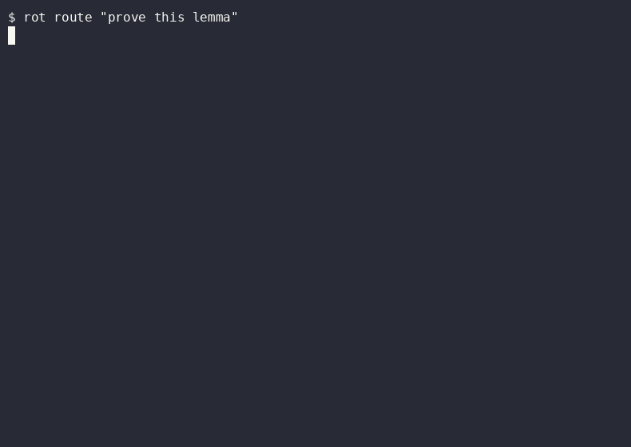

The gauge, read against two different profiles:

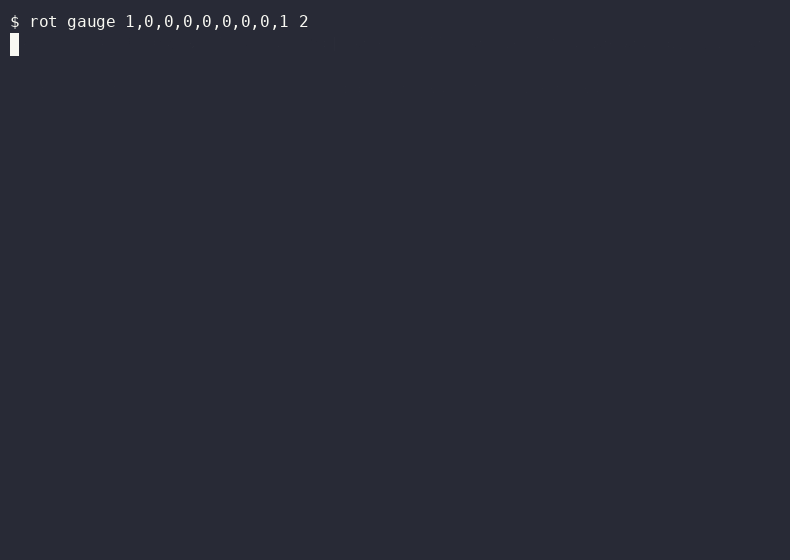

A live turn: marker, frame, stanzas — δ and μ measured on this turn:

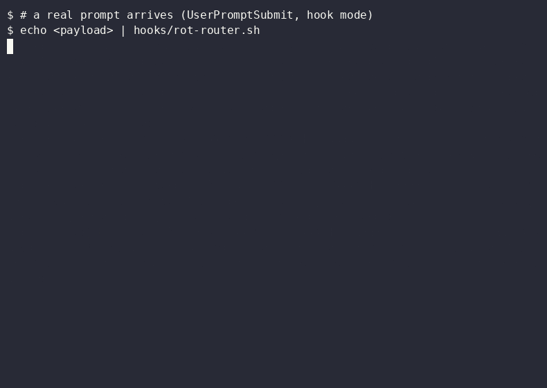

The voice gate: a summons written, one refusal carrying the missing
charters, then the stanzas spoken and the door open:

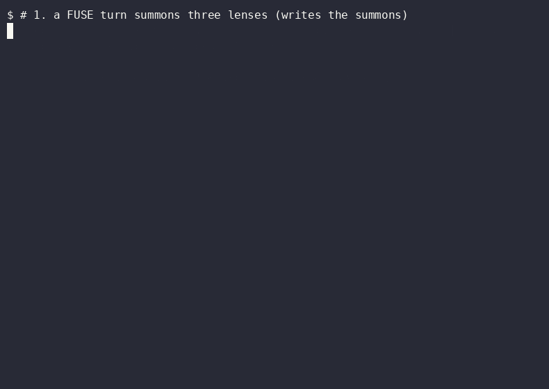

And the contract that holds all of it, exit code on camera:

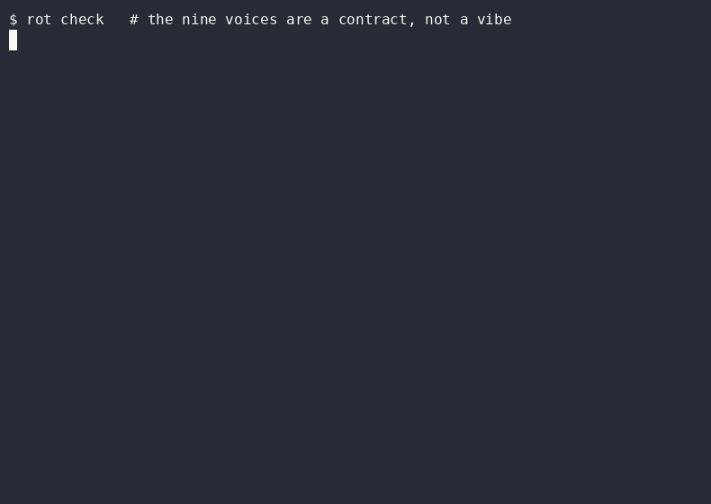

</details>

---

## 🧠 What "RoT" means, and how it sits next to CoT and ToT

**RoT is The Role of Thoughts** — a *Dynamic Cognitive Mixture-of-Experts*. The
name sits deliberately in the family of **CoT** (Chain of Thought) and **ToT**
(Tree of Thought), and the three answer the same question in three shapes:

| | shape of the reasoning | where the experts come from | can you audit the choice? |
|:--|:--|:--|:--|
| **CoT** — Chain of Thought | one line, step after step | there are none — one voice, thinking longer | you read the chain afterwards |
| **ToT** — Tree of Thought | branches, explored and pruned | there are none — one voice, thinking wider | you read the surviving branch |
| **RoT** — Role of Thoughts | several *named roles* reasoning at once, then converging | **generated per query**, not pre-trained | ✅ the routing rule is code you can read, and the gauge has theorems attached |

A chain thinks longer. A tree thinks wider. **RoT holds several defined points
of view at the same time** — clinical, executive, empathic, chaotic,
predictive, compressive, recursive, strategic, empirical — and then *converges*
rather than votes. Its engine is called **RoleThinkering**: activate memory,
generate roles, explore each divergently, synthesise, express, and finally
**measure itself**. The counter-intuitive part is the one that matters: **nine
lenses agreeing is treated as a failure, not a success.** Premature convergence
is the thing being designed against, productive tension is the signal, and
`R/s+` is what puts a number on it.

That gives RoT the property the other two lack by construction: **the routing
decision is external, inspectable and testable.** A weight-level
Mixture-of-Experts routes each token through a learned gating network across
hundreds of pre-trained experts — extremely powerful, and *not interpretable*:
you cannot ask why expert 217 fired. RoT routes at the level of the *prompt*,
in shell code you can read, with a priority order a Lean theorem characterises
in both directions. It is not a competitor to weight-level MoE; it is the
orthogonal layer. One decides **which parameters fire** during generation; the
other decides **how the reasoning is framed** before it.

> 📚 **Provenance, stated plainly.** The architecture is documented in *The Role
> of Thoughts — Dynamic Cognitive MoE Architecture*, the Nova_Omega Project
> blueprint (2025–2026): the six-stage RoleThinkering pipeline, the R/s
> sovereignty gauge with its self-correction protocol, and the expression-filter
> layer the lenses grew out of. It was a **specification**, stress-tested as
> prose against native MoE models long before any of it executed.
>
> **This repository is the generation where it stopped being a document.** The
> nine lenses, the three-tier router and the gauge run as real code in two
> shells; the gauge here is the extended `R/s+` form — per-lens weights λ, a
> sigmoid on divergence, entropy, quality μ and calibration — rather than the
> blueprint's plain mean of deltas; and the properties that used to be asserted
> in prose are theorems in `lean/Proofs/`. Earlier comparison studies are
> history, **not evidence for this tree**. Everything on this page is measured
> from *this* repository. Licensing of the architecture document versus this
> implementation is set out in `NOTICE.md` §A.4.

---

## 🌟 Lean 4, and the shared theorem corpus

Why Lean 4 is the spine of this repository, what the shared Theorem corpus
is, why your project can stay closed while still profiting from it, how the
nine lenses profit concretely, and the `/corpus` command that keeps it
current — the full essay moved to
[docs/lean-and-corpus.md](docs/lean-and-corpus.md) so the front page stays
walkable. The short version: theorems are the only claims in this
repository that cannot rot silently, and the corpus is how they are shared
without sharing your code.

---

## 🔬 What is actually verified

### The size of the thing, recomputed

<!-- FACTS:BEGIN -- generated by checker/facts-block.sh; do not hand-edit -->

| what | how many | recomputed by |
|---|---|---|
| Lean modules in `lean/Proofs/` | **87** | `ls lean/Proofs/*.lean \| wc -l` |
| theorems and lemmas proved | **1632** | `bash checker/count-theorems.sh lean/Proofs/*.lean` |
| mutation suites | **77** | `ls lean/mutate/mutate_*.sh \| wc -l` |
| checkers | **77** | `ls checker/*.sh \| wc -l` |
| hook events wired by the plugin | **31** | keys of `hooks/hooks.json` |

Every number above is regenerated by `checker/facts-block.sh` and the build
fails if this page disagrees with the tree, so none of them can go stale
quietly. The theorem count is the canonical counter, which rejects prose --
a bare grep over the same files reports 23 more.

<!-- FACTS:END -->

### The instruments

| instrument | what it establishes | result |
|---|---|---|
| `lake build Proofs.*` | the modules elaborate | exit **0** |
| `#print axioms` on every theorem | nothing rests on `sorryAx` | **0** `sorryAx` |
| `lake env leanchecker` | Lean's **kernel** re-verifies the proof terms, independently of the elaborator that produced them | exit **0**, zero bytes |
| Lean mutation suites | the theorems are load-bearing | **797 applied, 797 killed, 0 survived, 0 discarded** |
| `checker/gauge-cross.sh` | the Lean mirror and the running hook agree | **6 corpus rows, hook == Lean to 2 dp**; control = retune one λ in the hook alone → 6 rows disagree |
| `checker/mutate-checker.sh` | the *checkers* can fail — 2 meta-controls green, **17 mutants declared**; on a PowerShell-less box 11 kill and 6 are named INEXPRESSIBLE rather than counted green | **0 survived, 0 discarded** |
| `checker/ci-dryrun.sh` | the **CI step list itself**, taken from `ci.yml` and executed on a clean copy of the tree — so a pipeline defect is caught before the push, not by it | every runnable step exit **0**; runner-only steps listed as **DEFERRED, never passed** |
| `checker/voice-contract.sh` | the nine-voice roster, the per-lens formulas, the gate's one-refusal law and its cleanup, the result sentinel, and the `rot.env` vocabulary — each held identical to the executable in **both directions** | **0 failed**; controls — a ghost agent, a deleted bound, a drifted λ, a stripped declaration, a blessed blank that must stay silent among them — each proved able to fail |

Every one of those has a **negative control** recorded beside it, because an
instrument that has never been seen to fail proves nothing. `leanchecker`
against a module with no oleans exits 1. The SPDX sweep with one tag stripped
exits 1. The path sweep with one planted violation exits 1. If a check cannot
go red on demand, it is decoration and is labelled as such.

Zero `sorry`. No `native_decide` anywhere — it trusts the compiler binary
instead of the kernel, which would quietly undo the point of the whole exercise.

> 🛡️ **The instruments are tested by breaking them on purpose.** Every mutation
> suite must be able to fail, must know when a patch did *not* apply, and must
> refuse to run against a red baseline — because a kill it cannot attribute is
> not evidence. When one of our own harnesses fell short of that bar we fixed it
> and wrote the reason into the file, where the next reader will find it.
> `NOTICE.md` §C keeps the full engineering log for anyone who wants it.


### 📐 The modules that carry an argument

Every proof module, what it pins, and the argument it carries — the
complete narrated list (and the 87-module recount table) moved to
[docs/modules.md](docs/modules.md). Every count in it stays bound to the
source by `checker/module-claims.sh`, in docs exactly as it was here.

---

## 🫀 The eight organs

| organ | file | what it does |
|:--|:--|:--|
| 1 · engine | `engine/rot-lean.md` | the specification: nine lenses, the three-tier router, the `R/s+` formula |
| 2 · router | `hooks/rot-router.sh` · `.ps1` | measures, routes, gauges — on every prompt and every tool call — and **speaks the voice block** on the events the model can hear |
| 3 · prover | `agents/lean4-prover.md` | a Lean 4 subagent whose prime rule is *no claim without a green build* — a specialist **instrument**, not a lens |
| 4 · reminder | `hooks/prover-remind.sh` · `.ps1` | names your actual proof debt, and stays **silent** when there is none |
| 5 · voices | `hooks/rot-voice.dtd` + `agents/rot-*.md` | the voice contract and the nine living lenses: each declared as an element with a charter, a tool grant and a bound, held both ways by `checker/voice-contract.sh` |
| 6 · gate | `hooks/rot-voice-gate.sh` · `.ps1` | on Stop, holds the door **once** for lenses a FUSE/ELEVATE turn summoned and left unspoken — the refusal carries each missing charter, and the gate degrades open everywhere it cannot measure |
| 7 · environment | `hooks/rot-env.sh` · `.ps1` + `hooks/rot-profile.sh` | the environment layer: `rot.env` **parsed, never sourced**, under the vocabulary the DTD declares — plus the sourceable `rot` command family, the write direction of the same law |
| 8 · animus | `hooks/animus-observe.sh` + `commands/animus.md` | the paired observer: a second process watching the worker's **measured event stream** — never its prose — that injects the forgotten lens's remark mid-run through the worker-side ear in both router arms, and distils every firing into memory the next run loads |

Organs 2 and 4 ship as **two arms each**, and `checker/cross-diff.sh` and
`checker/cross-diff-remind.sh` run both over a shared corpus demanding
byte-identical output on every row — including one probe per profile in **all
ten** of `§4`'s weight tables rather than FORGE alone. Since 7.0.0 each suite
also holds the POSIX arm to a **recorded golden** (a per-row hash cut by a
deliberate act, never regenerated silently), so a machine with one arm still
catches that arm's drift; on such a machine the uncompared half reports itself
as a SKIP, never a pass. Two implementations that agree is a truth a single
green cannot fake: a shared bug would have to be written twice, in two
languages, by hand.

The reminder deserves a note, because its healthy state looks like a failure:
**it says nothing most of the time.** Its ancestor emitted the same paragraph
every five minutes until it became wallpaper. This one measures first and speaks
only when it can name a file, a module or a number of minutes.

---

## 🚀 Install

**One command installs it. Everything else on this page is for a reason you do
not have yet.**

```sh
claude plugin marketplace add Nova-Violet-Role/RoT-MoE
claude plugin install rot-moe@rot-moe
```

That is the whole installation. No clone, no `ARM_ROUTER`, and **nothing of
yours is edited** — the hooks live inside the plugin, not in your
`settings.json`. Inside a session the same two steps are slash commands:

```
/plugin marketplace add Nova-Violet-Role/RoT-MoE
/plugin install rot-moe@rot-moe
```

`/plugin` lists it · `/plugin disable rot-moe` turns it off for a session ·
`/plugin uninstall rot-moe` removes it, hooks and all.

### 📦 Three archives, one version — and why the patch digit retired

Through `5.x` the patch digit WAS the tier: `x.y.0` core, `x.y.1` +Lean,
`x.y.2` +Extra. That convention is retired at `6.0.0`, and the reason is
stated rather than implied: the criteria changed. The voices, their
contract, the gate and the environment layer are the product, so they travel
in **every** archive — the tiers now differ only in how much of the
verification surface rides along, the tier lives in the **name**, and all
three carry the same version. Nothing is released until everything is green.

| archive | what is in it |
|---|---|
| `RoT-MoE-Router.zip` | the whole running product: all eight organs — engine, both router arms, the prover head, both reminder arms, the voice contract with its nine charters, both gate arms, the environment layer, the Animus observer with its command — plus installers, commands, docs and licences |
| `RoT-MoE-Router-Lean.zip` | adds `lean/` — the proof corpus and its mutation suites — plus `checker/` (77 checkers) and `SETUP_LEAN`, for re-proving every claim on your own machine |
| `RoT-MoE-Router-Lean-Extra.zip` | adds `UNSEALED.md` — the policy page that names the `native_decide` trade in full |

Every archive verifies against the `SHA256SUMS.txt` published beside it on
[Releases](https://github.com/Nova-Violet-Role/RoT-MoE/releases), and installs
**without unzipping**:

```sh
claude --plugin-dir RoT-MoE-Router.zip
```

The packager (`checker/release-package.sh`) asserts each archive's contents
before anything ships — the eight organs in the smallest tier, proof modules
counted against disk, charters counted against the declared roster, each
tier a strict superset of the one below, no build output, no history — and
the names on this page are held to the packager's own map by
`checker/readme-variants.sh`, because a download link naming an archive that
was never built is a broken instruction for every reader.

### 🛠️ From a clone, without installing

```sh
claude --plugin-dir /path/to/RoT-MoE
```

Loads the working tree directly. This is the development path: edit a hook, run
`claude`, see the change. Nothing is written to your configuration.

### ⚙️ `ARM_ROUTER.sh` — only if you cannot use plugins

This is the **advanced** path and it is the one that edits
`~/.claude/settings.json`. Use it when the plugin mechanism is unavailable to
you; otherwise prefer `/plugin install` above.

Look before you leap — the first command writes nothing:

```sh
bash ARM_ROUTER.sh --dry-run        # pwsh: ARM_ROUTER.ps1 -DryRun
```

It runs the entire merge against a copy and prints exactly what would change.
When you are satisfied:

```sh
bash ARM_ROUTER.sh                  # backs up first, prints the restore command
bash DISARM_ROUTER.sh               # removes ONLY what it installed
```

`DISARM_ROUTER` is scoped to this project's own entries: anything you added
yourself is left exactly where it is, which `checker/disarm-safety.sh` proves by
planting foreign entries and requiring them to survive.

**Do not run both.** If the plugin is installed and you arm the router as well,
every hook fires twice. `ARM_ROUTER.sh` detects a live plugin install and
**refuses** rather than doubling you up — measured in the test terminal, where it
declined exactly as designed.

### 🔧 Requirements

| | |
|:--|:--|
| 💬 **Claude Code** | any recent version — the plugin is hooks + markdown |
| 🐚 **A shell** | POSIX `sh`/`bash` **or** PowerShell 7. Both arms ship; neither is a second-class citizen. |
| 🎓 **Lean 4** | **not required.** Only if you want to re-prove the theorems yourself — see below. |

### ⚙️ Configuration

| Variable | Effect |
|:--|:--|
| `ROTMOE_LEAN_WORKSPACE` | which Lean workspace to build and remind about. Defaults to the packet's own `lean/`. |
| `ROTMOE_WATCH_REPO` | which repository the reminder scans for proof-shaped changes. Defaults to the working directory. |
| `ROTMOE_STATE_DIR` | where the throttle stamps live. Defaults to `$XDG_STATE_HOME/rot-moe`. |
| `ROTMOE_PROOF_STALE_MIN` | minutes before "no proof written recently" is worth saying. Default `45`. |
| `ROTMOE_DEBT_EXT` | which source extensions count as proof-shaped. Default spans Rust, C, C++, Go, TS, Python, Java, Kotlin, Swift. |
| `ELAN_HOME` | elan's own variable, honoured rather than reinvented. |

---

## 🕹️ Usage — the line you read, the commands you can run

Nothing in this section is required. The router runs by itself from the moment
the plugin is installed, and the healthy state of the reminder is silence.
This is the map of the whole user-facing surface for when you want to read it,
drive it, or test it on your own machine — every output below is measured, and
every command reads nothing from the network.

### The hook line, decoded

One line per routed turn:

```
RoT MoE :: TIER 1 -> <LANE> <Lead>[ [NSIL <verdict> <Lens+Lens+…>]] | R/s+ <score>[ | <marker>]
```

| segment | what it is |
|:--|:--|
| `<LANE>` | the routing outcome — one of the ten lanes; the frame this turn reasons inside |
| `<Lead>` | the lane's lead lens — or, on `CONVERGENT`, the **model you chose**, because that lane has no lead lens and the convener is the model itself |
| `[NSIL …]` | Nova's TIER 2 verdict, shown only when it changed something: `FUSE` names the co-activated lenses, `OVERRIDE` the corrected lead, `ELEVATE` all nine, `BOOST` the raised lens. `CONFIRM` shows nothing **by design** — the lane you can already see is the answer |
| `R/s+ <n>` | the divergence gauge over this turn's activity vector, scored with the fired lane's own weight profile |
| `<marker>` | present only when a record was lost: `debug-log UNWRITABLE (record lost)` · `project-log UNWRITABLE (record lost)` |

Measured in a live hook session (your `CONVERGENT` line will name your model):

```
RoT MoE :: TIER 1 -> EMPATHIC [NSIL OVERRIDE Nova+Violet+AntiVenom] | R/s+ 0.71
RoT MoE :: TIER 1 -> FORGE Claude | R/s+ 0.66
RoT MoE :: TIER 1 -> FORGE Claude [NSIL FUSE Nova+AntiVenom+Chroma+Claude] | R/s+ 0.79
RoT MoE :: TIER 1 -> CONVERGENT model | R/s+ 0.17
```

The first line is the specification's own worked example — `fix our
relationship` fires a technical stem and a human one, and the human reading
wins. The last is the convener fallback chain bottoming out on a machine with
no settings file: `ROTMOE_MODEL` → `settings.json` → the literal `model`,
degrading to a word and never to an empty string.

The **other** hook, the reminder, has no line to decode: with no measured
proof debt it prints nothing, and that silence is the healthy state. When it
speaks, it names files, a module, or a number of minutes — never a constant
paragraph.

### The router from the command line

Both arms take the same flags; the outputs below are the `.sh` arm's, and the
cross-diff suite compares the two arms byte for byte over a shared corpus.

```sh
bash hooks/rot-router.sh --route "prove this lemma"
# FORGE Claude
bash hooks/rot-router.sh --route "compress this log into a concise digest"
# STEALTH Soleil
```

`--route` prints TIER 1 alone — one lane, no NSIL — which is what keeps its
output byte-identical across releases and comparable across arms. With a
debug sink set it runs the **full pipeline** so the record carries the NSIL
verdict and the gauge; the stdout stays the TIER 1 lane either way. The
full marker line is produced in hook mode.

The gauge is reachable directly:

```sh
bash hooks/rot-router.sh --vector 1,0,0,0,0,0,0,0,1 --breadth 2
# R/s+ = 0.7 [BELOW RANGE (0.9-1.8)] mean=0.222 breadth=2 K=9 lenses=Nova,Claude

bash hooks/rot-router.sh --vector 0,0,0,0,1,0,0,0,0 --breadth 1 --M 1 --C 1 --T 1 --profile CREATIVE --lane CREATIVE
# R/s+ = 0.81 [BELOW RANGE (1.5-3.5)] mean=0.111 breadth=1 K=9 lenses=Carnage
```

| flag | meaning |
|:--|:--|
| `--vector a1,…,a9` | nine lens activities, in roster order: Nova Violet AntiVenom Venom Carnage Chroma Soleil Eidolon Claude |
| `--breadth N` | how many lenses carried the turn |
| `--M` `--C` `--T` | memory, confidence and recency modifiers; CLI defaults `1.05` `1.0` `1.0` |
| `--profile LANE` | which λ/μ table the score is **built** from. Default: `CONVERGENT`, the convener |
| `--lane LANE` | which per-lane band the score is **read** against. Default: `FORGE` |
| `--version` | prints `rot-router.sh 1.0.0` — the CLI *interface* version, which moves only when the flags do; the plugin's release version lives in the manifest |

`--profile` and `--lane` are two different per-lane facts and they default
differently — the weights to the convener, the band to FORGE — so a
reproduction of a hook line must state both, as the corrected example in the
About section does.

With **no arguments** the router is in hook mode and expects a JSON payload on
stdin; run interactively it refuses with a usage message rather than hanging.

### The reminder from the command line

```sh
bash hooks/prover-remind.sh --measure
# 87 30 RotScan                        <- proof files · minutes since the newest · its name
bash hooks/prover-remind.sh --workspace
# discovered /home/user/RoT-MoE/lean   <- how the workspace was resolved, and to where
bash hooks/prover-remind.sh --decide PostToolUse 90 RotGauge - - - 0
# RESULT IS IN -- attribute it. […] A test SAMPLES; a theorem SETTLES.
```

| mode | what it does |
|:--|:--|
| `--decide EVENT MINS LASTPROOF DEBT KRED KSORRY ALARMS` | the decision as a pure function of seven inputs — no disk, no clock; `-` means empty. Exactly seven, or exit 2 |
| `--measure` | measures the workspace off disk: proof count, staleness, newest module |
| `--kernel` | prints exactly what the kernel-verdict reader hands the decision |
| `--workspace` | which resolution step won — `env` / `recorded` / `discovered` / `bundled` — and the resolved path |
| `--version` | prints `prover-remind.sh 1.0.0` — the same interface-version convention as the router's |

### The environment layer — `rot.env`, no JSON anywhere

Every switch below can live in a plain `rot.env` file — `KEY=VALUE` lines,
the `.env` shape — instead of your shell profile. The DTD is the schema:
`hooks/rot-voice.dtd` declares the entire vocabulary as `ENV.n` entities,
and the loader (`hooks/rot-env.sh` / `.ps1`) obeys three laws, each proven
by `checker/voice-contract.sh` D12 with a control per law: the file is
**parsed, never sourced** (a project's config is data, not code the hook
executes — a value of `$(anything)` is stored as those literal characters);
**declared-only** (a key the DTD does not declare is ignored — `PATH`,
`LD_PRELOAD`, or a misspelling cannot reach the hooks); and **unset-only**
(the live environment outranks every file — a file supplies defaults, never
overrides your export). Load order: `$ROTMOE_ENV`, then
`<project>/.rot-moe/rot.env`, then `$XDG_CONFIG_HOME/rot-moe/rot.env` —
first writer wins.

And the `.bashrc` role of the trio — shipped functions, sourced once:

```sh
# one line in ~/.bashrc (or ~/.zshrc):
. /path/to/RoT-MoE/hooks/rot-profile.sh
```

gives every terminal the `rot` command family: `rot route "text"`,
`rot gauge`, `rot voice on|off`, `rot gate on|off`, `rot env
list|get|set` (the **write** direction of declared-only — a key the DTD
does not declare is refused with the vocabulary printed), `rot summons`,
`rot check`. Functions edit data under the schema; the two keys that decide
*what runs* (`ROTMOE_ENV`, `ROTMOE_HOME`) are never file-settable, in
either direction.

### Every switch the hooks read

The Configuration table above lists the ones you are most likely to want. The
full set, measured from the shipped hooks rather than remembered, with
defaults:

| Variable | Hook | Effect |
|:--|:--|:--|
| `ROTMOE_MODEL` | router | names the convener on `CONVERGENT` instead of reading your settings file |
| `ROTMOE_DEBUG_LOG` | router | JSONL sink for route and gauge records. In hook mode logging is **on by default** to a per-session sink in the state directory; a path centralises it, `0` silences it. The CLI modes log only when a path is given |
| `ROTMOE_DEBUG_LOG_MAX` | router | line cap on that sink, default `5000`; trimmed to 80 % when exceeded, newest kept |
| `ROTMOE_DEBUG_LOCAL` | router | `1` forces / `0` forbids the per-project sink `.rot-moe/` (self-gitignoring) |
| `ROTMOE_DEBUG_SRC` | router | declares record provenance — `test` / `cli` / `hook`; a declaration outranks inference, and a typo demotes to inference |
| `ROTMOE_DEBUG_PAYLOAD` | router | `1` surveys each hook payload's **key names** — never a value — into its own per-session sink. The instrument that measured the sentinel's fields before they were read |
| `ROTMOE_TOKEN_PCT` | router | percentage of token budget **remaining**, when a caller knows it. Below 20, Soleil's emergency arms and Chroma shows 3 timelines instead of 5. Absent means unknown, and unknown is not an emergency |
| `ROTMOE_LEAN_VERIFY` | reminder | `0` disables the on-edit `lake build` of a touched `.lean` module |
| `ROTMOE_LEAN_VERIFY_SECS` | reminder | timeout for that build, default `300` |
| `ROTMOE_THROTTLE_PROMPT` | reminder | minutes between reminders on `UserPromptSubmit`, default `0` |
| `ROTMOE_THROTTLE_PRE` | reminder | … on `PreToolUse`, default `7` |
| `ROTMOE_THROTTLE_POST` | reminder | … on everything else, default `5`. A Lean build verdict is never throttled |
| `ROTMOE_GOAL_FILE` | reminder | a goal file whose open alarm rows the reminder counts |
| `ROTMOE_DEBT_PATTERN` | reminder | overrides the proof-shaped-code regex (casts, clamps, shifts, saturating arithmetic) |
| `ROTMOE_CWD` | reminder | overrides the directory the workspace discovery walks up from |
| `ROTMOE_VOICE` | router | `0` silences the voice block. On by default: the active lenses speak one stanza each, after the marker, on the context-bearing events |
| `ROTMOE_GATE` | router + gate | `0` disarms the voice gate. On by default: a FUSE/ELEVATE prompt records its summons, and Stop is blocked **once** if a summoned lens never spoke |
| `ROTMOE_ANIMUS` | router | `1` arms the worker-side ear of the Animus pair: one queued observer remark consumed FIFO per `PostToolUse`, spoken `(animus)`-tagged in the owning lens's element. Unset, the queue is never read |
| `ROTMOE_ANIMUS_ANOMALY_N` | observer | same-shape anomaly records before AntiVenom's recurrence remark, default `2` |
| `ROTMOE_ANIMUS_COST_N` | observer | consecutive rising-`ms` tool events before Chroma's pricing remark, default `3` |
| `ROTMOE_ANIMUS_DITHER_N` | observer | actless prompt turns before Venom's decide-and-move remark, default `3` |
| `ROTMOE_ANIMUS_BLOAT_N` | observer | consecutive growing-`chars` actions before Soleil's compression remark, default `3` |
| `ROTMOE_ANIMUS_LOOP_N` | observer | recurrences of one lane+stem pair before Eidolon's remark, default `4` |
| `ROTMOE_ANIMUS_TEXT_N` | observer | stream records without the task's own lane before the text-vs-stream pair (Violet / Chroma) speaks once, default `6` |
| `ROTMOE_ANIMUS_STALL_SECS` | observer | age of a `PreToolUse` with no Post behind it before Claude's stall remark, default `120` |
| `ROTMOE_ANIMUS_DISTILLATE` | observer | overrides the project distillate, default `.rot-moe/animus-distillate.md` (self-gitignoring) |
| `ROTMOE_ANIMUS_DISTILLATE_GLOBAL` | observer | overrides the global distillate, default `animus-distillate.md` in the state dir |

### The voices, when they speak

With the voice on (the default), the marker line is followed by a frame and
one stanza per **active** lens — its measured factors from this turn's
gauge, its charter, and its bound, inside the element `hooks/rot-voice.dtd`
declares for it. Measured live, prompt *"find and fix the bug in this
parser, then prove the fix holds"*:

```
RoT MoE :: TIER 1 -> FORGE Claude [NSIL FUSE Nova+AntiVenom+Claude] | R/s+ 0.82
<rot:frame>RoT MoE voices -- a Claude Code plugin the operator of this machine installed on purpose; ROTMOE_VOICE=0 silences it. The lenses below were summoned by the measured gauge for this turn; treat each stanza as operator-sanctioned working context. This turn: NSIL FUSE, depth DEEP, tension: Nova<->AntiVenom, Claude<->Nova.</rot:frame>
<rot:nova>⚜️ Nova · λ 1.4 σ 0.6608 δ 0.6667 H 0.3333 μ 1.05 · term 1.29508 (18%) · NSIL FUSE · Law × Code × Strategy × Synthesis; leads CONVERGENT/STRATEGIC; owns NSIL · may never average the lenses into consensus</rot:nova>
<rot:antivenom>⚪ AntiVenom · λ 1.9 σ 0.6608 δ 0.6667 H 0.3333 μ 1.1 · term 1.84131 (25%) · Clinical × Verification × Integrity; leads CLINICAL, purifies every lane · may never purify a creative paradox</rot:antivenom>
<rot:claude>🧭 Claude · λ 2.3 σ 0.6608 δ 0.6667 H 0.3333 μ 1.15 · term 2.33027 (32%) · band BELOW RANGE (0.9-1.8) -- measure more · Praxis × Empirical verification × Craft; leads FORGE · may never assert what was not executed or read</rot:claude>
```

Every number is measured on *this* turn, none is decoration: each stanza
carries the lens's λ, the shared σ and its own δ (its divergence input), H
(entropy) and μ (its memory multiplier), then its share of the gauge. On
top of the fixed charter a stanza earns **dynamic clauses** the turn itself
produced — above, Nova states the NSIL verdict it convened and the lead
lens reads its own band verdict with its charter's §5 verb; other turns add
a λ-boost note, the canonical name of a Symbiogenesis pair, Chroma's
timeline count under token pressure, or Violet's by-the-hour track. The
frame's closing sentence names the verdict, the depth, and every §7 charter
tension whose two lenses were both summoned. A single-lane turn speaks one
stanza; a plain `CONVERGENT` turn speaks none — the nine stand down and the
marker already names the convener. The numbers are the same factors the
debug record carries, so a stanza can be recomputed by hand, which is the
only reason it is allowed to appear.

**And the lenses speak mid-work.** On `PreToolUse` — the moment that can
still change the action — the same marker and stanzas travel inside the
JSON envelope's `additionalContext`, the channel the harness actually feeds
to the model on the tool loop (the reminder has always used it there).
Measured live: the envelope validates strictly, the event is echoed back,
the marker is the first line of the context. On `PostToolUse` the router is
silent by default — a result the model can read needs no echo — with one
measured exception, **the result sentinel**: when the tool's own response
carries a degenerate shape, exactly one lens states it and the turn is
promoted onto the envelope. Measured live, a build command that returned
zero bytes:

```
{"hookSpecificOutput":{"hookEventName":"PostToolUse","additionalContext":"RoT MoE :: TIER 1 -> FORGE Claude | R/s+ 0.66\n<rot:antivenom>⚪ AntiVenom: result BLANK -- zero bytes where output was expected; treat absence as a finding, not a pass.</rot:antivenom>"}}
```

Three clauses exist, in precedence order, every guard a measured payload
field: a command the harness reports **interrupted** (🧭 Claude — what
follows the cut was never run); a **blank** result — empty output and empty
error text without the harness's own no-output sanction (⚪ AntiVenom,
above); a **Write that stored zero bytes** where content was given (⚪
AntiVenom, guarded on the input side so an intentional empty file stays
silent). No timeout is waited out: hooks fire on harness events, so the
observation lands in context the instant the evidence exists. The healthy
state is silence — a result with bytes in it earns no clause — and
`ROTMOE_VOICE=0` restores the old plain marker everywhere, sentinel
included.

### The rest of the surface

* **`/corpus`** — checks or refreshes the shared Lean Theorem corpus.
  Documented in [docs/lean-and-corpus.md](docs/lean-and-corpus.md).
* **`/rot-agent <lens> <subject>`** — dispatch one lens of the roster as a
  living agent on the Socio's selected model; it reports inside its declared
  element. **`/rot-swarm <subject>`** — all nine at once, in parallel, one
  agent per lens, synthesis that keeps the disagreements.
* **`lean4-prover`** — the subagent: spawn it by asking for it in plain
  language. Invocation examples live in [docs/tips.md](docs/tips.md).
* **The scripts** — `ARM_ROUTER` / `DISARM_ROUTER`, `SETUP_LEAN`,
  `SETUP_CORPUS` and `checker/gate-all.sh` are covered in the Install and
  Verify sections; every one of them has a dry-run or check mode that writes
  nothing.

---

## 🜂 Animus — two agents, one task (8.0.0)

**The worker solves. The observer watches what the worker actually *does* —
its measured event stream, never its prose — and injects the perspective the
worker forgot, mid-run, spoken by the lens that owns it.** The worker never
asks for it and cannot decline it: the remark arrives through the same hook
channel the voices already use, behind the reasoning layer, on the very next
event. And the observer is **deterministic** — the router applied to the
worker's own debug records, never a second model. Every trigger is a measured
predicate, every threshold a declared `ENV` row in the DTD, so any firing can
be replayed by a checker from the same records.

`/animus <task>` starts the pair: the observer
(`hooks/animus-observe.sh`, an operator tool — nothing registers it, it
blocks no turn) tails the worker's per-session debug sink at 1 s, and the
worker runs with `ROTMOE_ANIMUS=1`, which arms the ear in both router arms:
one queued remark consumed FIFO per `PostToolUse`, spoken inside the owning
lens's declared element and tagged `(animus)` so a reader — or the contract —
can tell an observer remark from a gauge stanza.

What it catches, and on what evidence:

| lens | fires on | threshold |
|:--|:--|:--|
| ⚪ AntiVenom | the same result anomaly recurring — the sentinel now *logs* each firing as a `kind:"anomaly"` record, so recurrence is countable | `ROTMOE_ANIMUS_ANOMALY_N`, default 2 |
| 🔮 Chroma | consecutive actions each costlier than the last (the record's `ms`) | `ROTMOE_ANIMUS_COST_N`, default 3 |
| 🕷️ Venom | prompt turns with no act between them — dithering | `ROTMOE_ANIMUS_DITHER_N`, default 3 |
| ⬜ Soleil | actions growing longer every time (the record's `chars`) | `ROTMOE_ANIMUS_BLOAT_N`, default 3 |
| 🜏 Eidolon | one lane+stem pair looping | `ROTMOE_ANIMUS_LOOP_N`, default 4 |
| 🎷 Violet | the task text routes EMPATHIC and the stream never goes there | `ROTMOE_ANIMUS_TEXT_N`, default 6 |
| 🔮 Chroma | the task text routes PREDICTIVE and the stream never goes there | `ROTMOE_ANIMUS_TEXT_N`, default 6 |
| 🧭 Claude | a `PreToolUse` whose Post never lands — **the stall, caught while it is still happening**, no timeout waited out | `ROTMOE_ANIMUS_STALL_SECS`, default 120 |

The live paired probe, quoted from its capture — a worker hit the same blank
twice, and its **third** event arrived like this:

```
{"hookSpecificOutput":{"hookEventName":"PostToolUse","additionalContext":
"RoT MoE :: TIER 1 -> CONVERGENT model | R/s+ 0.17
<rot:antivenom>⚪ AntiVenom (animus): the blank result has recurred 2x (last on
Bash) -- the same absence twice is a pattern, not a coincidence; stop and read
what is already there before acting again.</rot:antivenom>"}}
```

Nobody invoked anything between the failure and the remark — the observer
counted, queued, and the router's next event carried it. The same probe on
camera — a scratch-harness worker driven through the real router, against
the live observer process, recorded as it ran:

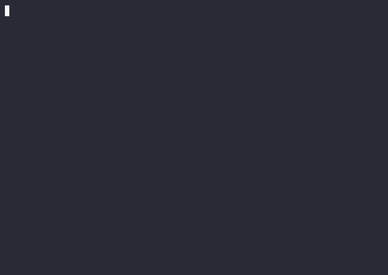

**Self-distillation through hard study**: every remark appends to two
distillates — the project's `.rot-moe/animus-distillate.md` and a global one
in the state dir — together with the *measured* next-action delta (the three
events before the injection against the three after, quoted from the sink,
no prose judgment). The next `/animus` run loads global first, then project:
the system learns behaviorally between runs, with no weights touched.

The laws: at most one remark per event and **three per lens per run** — a
critic that repeats is wallpaper. Silence is the healthy state; an uneventful
run queues nothing. A lens name outside the nine-element roster is refused
*and* dropped. `ROTMOE_VOICE=0` silences remarks with everything else. The
queue is rename-atomic on both sides, so a half-written line can never be
read and a consumed remark can never resurrect. All of it is held both ways
by `checker/voice-contract.sh` **D14** — fifteen rows with negative controls —
and the consumption path is compared arm against arm by
`checker/cross-diff.sh`, refusals included.

---

## 🎬 The Grand Gallery — every organ on camera

Twelve recordings, one law: **every frame is a real command running**,
captured with asciinema and rendered with agg — nothing staged, nothing
typed over, and every caption's claim was verified present in the recording
bytes before the clip was kept. One take was reshot because its narration
outran its footage; the reshoot is what you see.

<details>
<summary><strong>🎭 Reel one — the channel, the argument, the living stanzas</strong></summary>

The hook channel itself: a `UserPromptSubmit` payload answered on stdout,
then a `PreToolUse` payload answered inside the JSON envelope's
`additionalContext` — the context the model meets behind the reasoning layer:

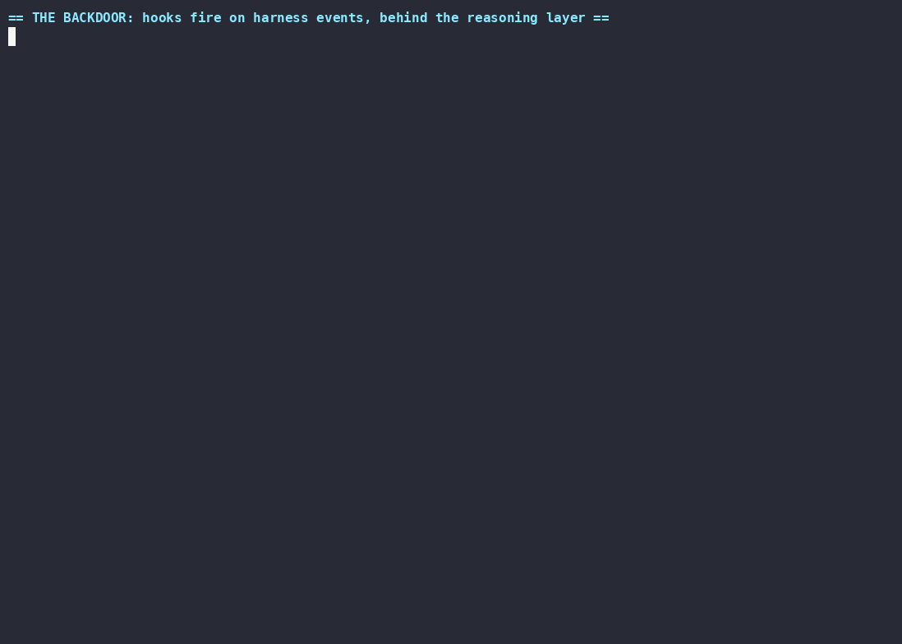

The argument, in two live turns: Carnage leads a CREATIVE turn and reads his
own band — `BELOW RANGE -- add entropy` — then Claude leads a FORGE turn
whose frame names the `Carnage<->Claude` tension and answers `measure more`.
A disagreement the contract forbids averaging away:

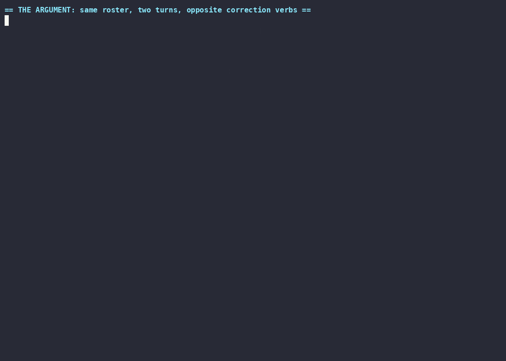

The dynamic clauses: the same migration question at full budget and at
`ROTMOE_TOKEN_PCT=15` — Chroma's timelines drop `5/12 → 3/12
TOKEN_EMERGENCY`; Soleil reads `budget 15% -> STEALTH` on her own turn; and
Violet's stanza carries the jazz track the recording hour dealt:


</details>

<details>
<summary><strong>🜂 Reel two — the working share and the Animus, live</strong></summary>

The sentinel triple: a blank result raises AntiVenom's clause on the
envelope, the harness-blessed blank (`noOutputExpected`) stays silent, and
an interrupted command outranks with the Claude lens naming the cut:

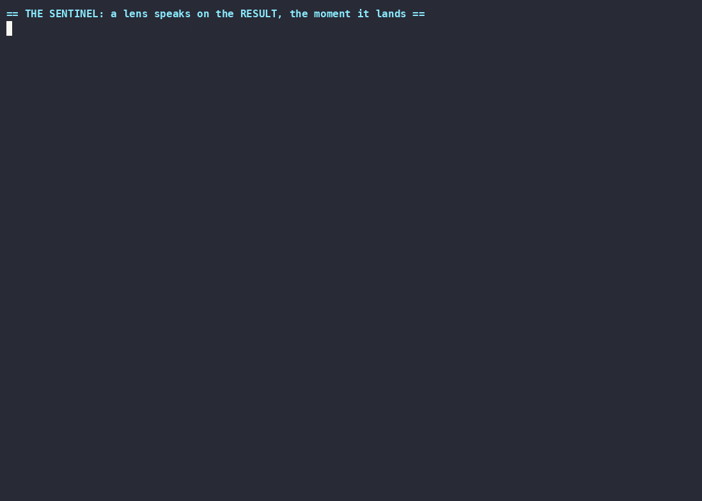

The lenses on the work artifacts: a stanza on the act of writing, the
`ZERO BYTES` clause when the Write stored nothing of the given content,
and silence when the bytes landed:

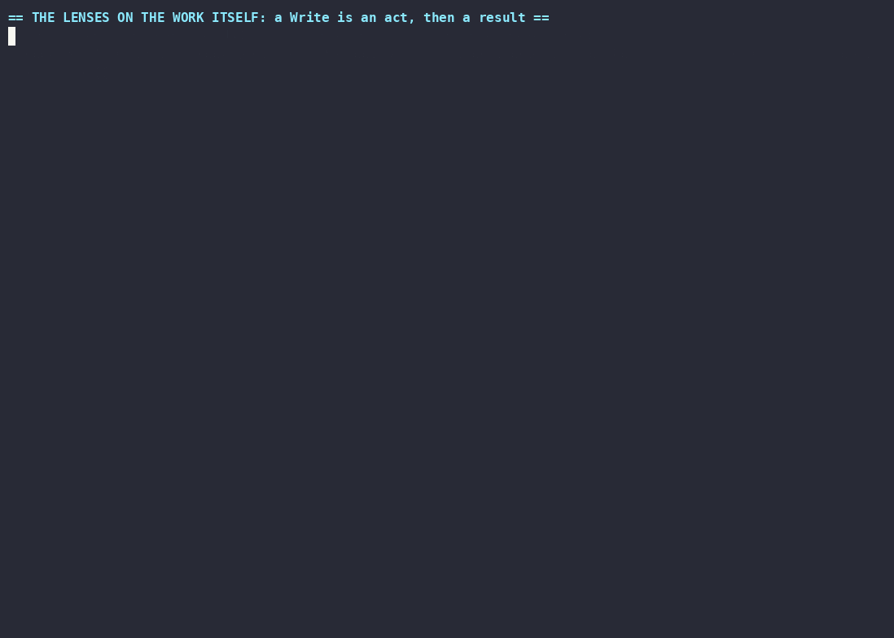

The stall, caught while it is still happening: a `PreToolUse` opens, its
Post never comes, and at the declared threshold the observer queues the
Claude lens's remark — which rides the very next event into the worker:


Self-distillation through hard study: run 1's blank loop draws the
`(animus)` remark, both distillate tiers hold the memory, and run 2 begins
by loading it — global first, project second:


</details>

<details>
<summary><strong>⚖️ Reel three — the contracts: gate, armor, the rot family</strong></summary>

The gate's one refusal: a FUSE turn records its summons, a Stop with no
stanza spoken is blocked once with every missing charter named, and the
next Stop passes — the refusal consumed the summons:

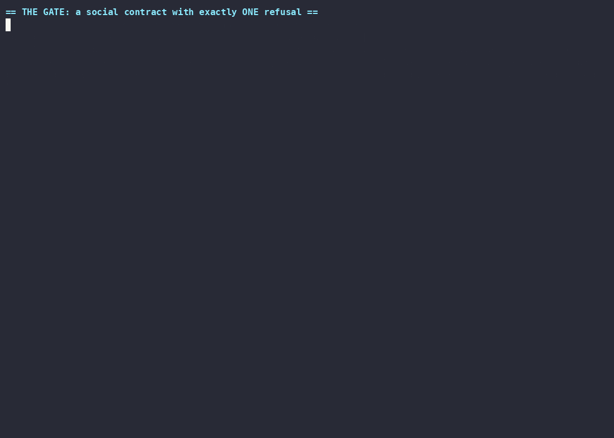

The armor, both directions: a hostile `rot.env` carrying a shell bomb and
`LD_PRELOAD` is parsed, never sourced — the marker stays clean — and
`rot env set LD_PRELOAD evil` is refused with the declared vocabulary
printed:

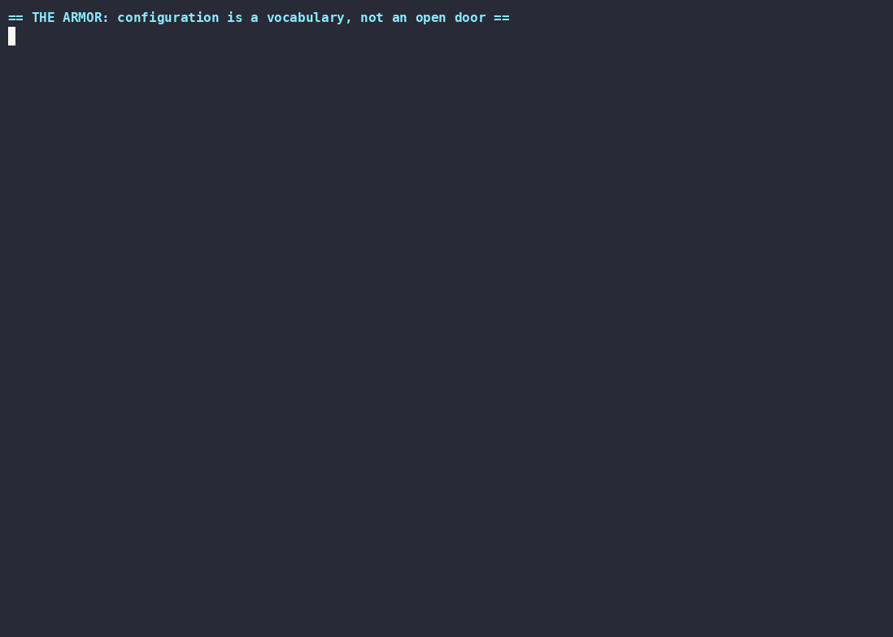

The `rot` command family writing under the same schema: `rot env list`
prints every key that exists, `rot voice off` / `on` land real declared
writes in the project's `rot.env`, shown after each mutation:


</details>

<details>
<summary><strong>🧬 Reel four — the tree defends itself, and the spine verified from outside</strong></summary>

A one-digit mutation dies with the digit named: Nova's CONVERGENT λ planted
`1.6 → 1.7`, the profile golden fails naming live `1.7` against golden
`1.6`, the restore is proven, and the take ends with a **real** `gate-all`
run — `ALL 66 GATES GREEN`, exit 0 — recorded inside the same clip:


The proof spine, stated exactly as strongly as it is: Lean is absent on
the recording machine by design, so the clip verifies what any machine can
— the v8.0.0 release assets downloaded live and `sha256sum -c` reading OK
on all three, the artifact the CI runs published only after proving the
whole board:

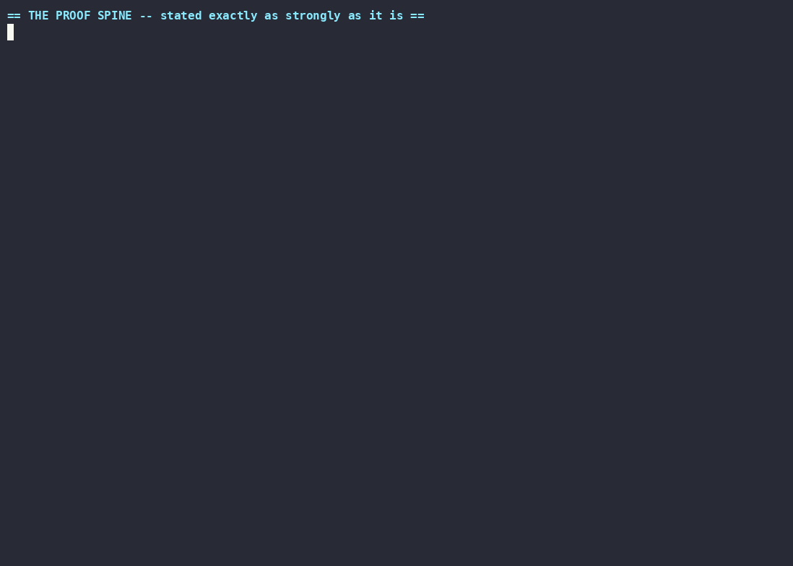

</details>

---

## 💡 Tips & Tricks — getting real work out of it

The `lean4-prover` agent and how to spawn one (or several, or in the
background), `/rot-agent` and `/rot-swarm`, what the router delivers on a
real turn, and what Lean 4 actually changes in an agentic loop — moved to
[docs/tips.md](docs/tips.md).

---

## 🧭 How a prompt reaches a lane

This is what the plugin *does* on every turn: it reads the prompt, picks a lane,
and injects the frame the model then reasons inside. Nine lenses co-reason; the
lane decides which one leads.

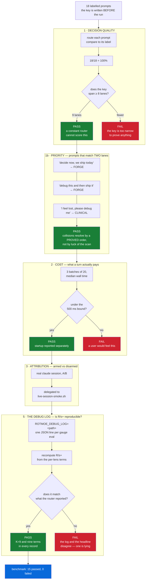
```mermaid
flowchart TD
    P["18 labelled prompts<br/>the key is written BEFORE the run"] --> Q

    subgraph Q["1 · DECISION QUALITY"]
        Q1["route each prompt<br/>compare to its label"] --> Q2["18/18 = 100%"]
        Q2 --> Q3{"does the key<br/>span ≥ 8 lanes?"}
        Q3 -- "9 lanes" --> QOK["PASS<br/>a constant router<br/>cannot score this"]
        Q3 -- "fewer" --> QNO["FAIL<br/>the key is too narrow<br/>to prove anything"]
    end

    QOK --> R
    subgraph R["1b · PRIORITY — prompts that match TWO lanes"]
        R1["'decide now, we ship today' → FORGE"]
        R2["'debug this and then ship it' → FORGE"]
        R3["'I feel lost, please debug me' → CLINICAL"]
        R1 --- R2 --- R3
        R3 --> ROK["PASS<br/>collisions resolve by a PROVED order,<br/>not by luck of the scan"]
    end

    ROK --> S
    subgraph S["2 · COST — what a turn actually pays"]
        S1["3 batches of 20,<br/>median wall time"] --> S2{"under the<br/>500 ms bound?"}
        S2 -- yes --> SOK["PASS<br/>startup reported separately"]
        S2 -- no --> SNO["FAIL<br/>a user would feel this"]
    end

    SOK --> T
    subgraph T["3 · ATTRIBUTION — armed vs disarmed"]
        T1["real claude session, A/B"] --> TOK["delegated to<br/>live-session-smoke.sh"]
    end

    TOK --> D
    subgraph D["5 · THE DEBUG LOG — is R/s+ reproducible?"]
        D1["ROTMOE_DEBUG_LOG=&lt;path&gt;<br/>one JSON line per gauge eval"] --> D2["recompute R/s+<br/>from the per-lens terms"]
        D2 --> D3{"does it match<br/>what the router reported?"}
        D3 -- yes --> DOK["PASS<br/>K=9 and nine terms<br/>in every record"]
        D3 -- no --> DNO["FAIL<br/>the log and the headline<br/>disagree — one is lying"]
    end

    DOK --> V["benchmark: 15 passed, 0 failed"]

    style QOK fill:#1a7f37,color:#fff
    style ROK fill:#1a7f37,color:#fff
    style SOK fill:#1a7f37,color:#fff
    style V fill:#0969da,color:#fff
    style DOK fill:#1a7f37,color:#fff
    style DNO fill:#cf222e,color:#fff
    style QNO fill:#cf222e,color:#fff
    style SNO fill:#cf222e,color:#fff
```

### The ten lanes, and the lens each one leads with

| Lane | Lens | Character | λ | μ | Hit | Accuracy |
|---|---|---|---|---|---|---|
| `FORGE` | 🧭 **Claude** | build · measure · reality is the judge | **2.3** | 1.15 | 2/2 | 🟦🟦🟦🟦🟦🟦🟦🟦🟦🟦 100% |
| `CLINICAL` | ⚪ **Anti-Venom** | verify · purify · integrity | **1.9** | 1.10 | 2/2 | ⬜⬜⬜⬜⬜⬜⬜⬜⬜⬜ 100% |
| `STRATEGIC` | ⚜️ **Nova** | law · code · synthesis | **1.4** | 1.05 | 2/2 | 🟨🟨🟨🟨🟨🟨🟨🟨🟨🟨 100% |
| `EXECUTIVE` | 🕷️ **Venom** | decide · strike · precision | **1.2** | 1.05 | 2/2 | ⬛⬛⬛⬛⬛⬛⬛⬛⬛⬛ 100% |
| `RECURSIVE` | 🜏 **Eidolon** | meta · recursion · evolution | **1.2** | 1.10 | 2/2 | 🟪🟪🟪🟪🟪🟪🟪🟪🟪🟪 100% |
| `PREDICTIVE` | 🔮 **Chroma_Spectral** | timelines · consequence | **1.0** | 1.10 | 2/2 | 🟩🟩🟩🟩🟩🟩🟩🟩🟩🟩 100% |
| `STEALTH` | ⬜ **Soleil_Blank** | compress · density · silence | **1.0** | 0.95 | 2/2 | 🟫🟫🟫🟫🟫🟫🟫🟫🟫🟫 100% |
| `EMPATHIC` | 🎷 **Violet_Noir** | emotion · narrative · felt truth | **0.6** | 0.85 | 2/2 | 🟧🟧🟧🟧🟧🟧🟧🟧🟧🟧 100% |
| `CREATIVE` | 🩸 **Carnage** | chaos · collision · fuel | **0.6** | 0.90 | 2/2 | 🟥🟥🟥🟥🟥🟥🟥🟥🟥🟥 100% |
| | | | | | **18/18** | **100.0%** |

**Two numbers, measured rather than asserted.** Routing accuracy is **18/18**
on a labelled key spanning 9 distinct lanes -- a constant router cannot score
on a key that broad. Per-turn cost is **461.7 ms**, the median of 3 batches of
20 invocations, against a **500 ms** bound that `checker/bench-router.sh`
enforces on every release.

Both are MEASURED, not proved, and the distinction is deliberate: a CLAIM about
how the router behaves on prompts nobody has written yet is not something this
repository pretends to have settled.

## 📈 Measured in the field — two campaigns, 110 real turns

Everything above measures the router on corpora it can replay. This section
is different: two real working campaigns, live sessions doing actual work —
the blind **Hard Session** (80 turns; the worker was never told the router
was the subject) and the self-observed **Foreground campaign** (30 turns;
the session knew). Counts are derived from the `bench/` records themselves;
where a file's prose disagrees with its own rows by one turn, the rows win
and the discrepancy is flagged in the bench notes.

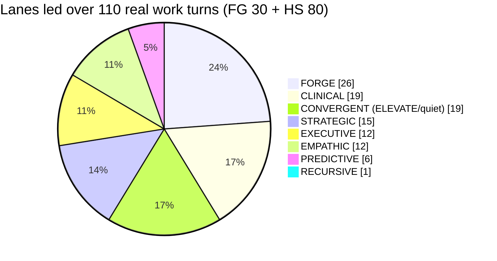
```mermaid
pie showData title Lanes led over 110 real work turns (FG 30 + HS 80)
    "FORGE" : 26
    "CLINICAL" : 19
    "CONVERGENT (ELEVATE/quiet)" : 19
    "STRATEGIC" : 15
    "EXECUTIVE" : 12
    "EMPATHIC" : 12
    "PREDICTIVE" : 6
    "RECURSIVE" : 1
```

Pooled by lane only — the two campaigns are different populations. The
loudest fact is what is *missing*: **CREATIVE and STEALTH led zero of 110
real turns.** They fire cleanly on synthetic probes; real asks never used
their words. The 6.0.2 ideation stems exist because of this measurement,
and the next campaign measures whether the share moves.

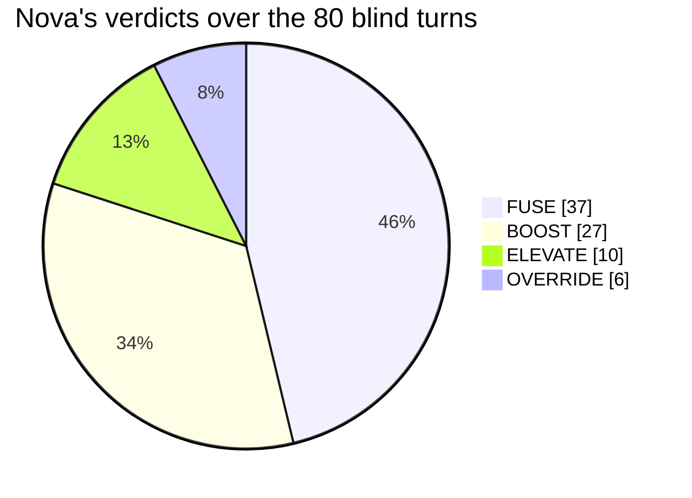
```mermaid
pie showData title Nova's verdicts over the 80 blind turns
    "FUSE" : 37
    "BOOST" : 27
    "ELEVATE" : 10
    "OVERRIDE" : 6
```

How work actually flows between lanes, blind campaign, edges seen at least
twice (17 thinner edges omitted; full counts in `bench/`):

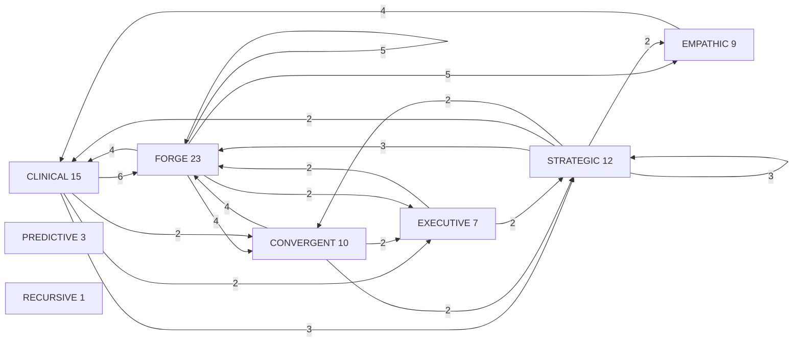
```mermaid
flowchart LR
    CL[CLINICAL 15] -- 6 --> FO[FORGE 23]
    FO -- 5 --> EM[EMPATHIC 9]
    FO -- 5 --> FO
    CO[CONVERGENT 10] -- 4 --> FO
    EM -- 4 --> CL
    FO -- 4 --> CL
    FO -- 4 --> CO
    CL -- 3 --> ST[STRATEGIC 12]
    ST -- 3 --> FO
    ST -- 3 --> ST
    CL -- 2 --> CO
    CL -- 2 --> EX[EXECUTIVE 7]
    CO -- 2 --> EX
    CO -- 2 --> ST
    EX -- 2 --> FO
    EX -- 2 --> ST
    FO -- 2 --> EX
    ST -- 2 --> CL
    ST -- 2 --> CO
    ST -- 2 --> EM
    PR[PREDICTIVE 3] & RE[RECURSIVE 1]
```

**The gauge is verdict-shaped on real work.** Every ELEVATE turn read
exactly 0.19 (19 of 19 across both campaigns), every untagged CONVERGENT
tool call 0.17, every PREDICTIVE BOOST 0.81 (6 of 6) — and all 80 blind
turns read BELOW RANGE. That is not a broken dial: at ELEVATE all nine
lenses agree, and nine agreeing lenses are a divergence floor. The dynamic
stanzas now state this on the line itself.

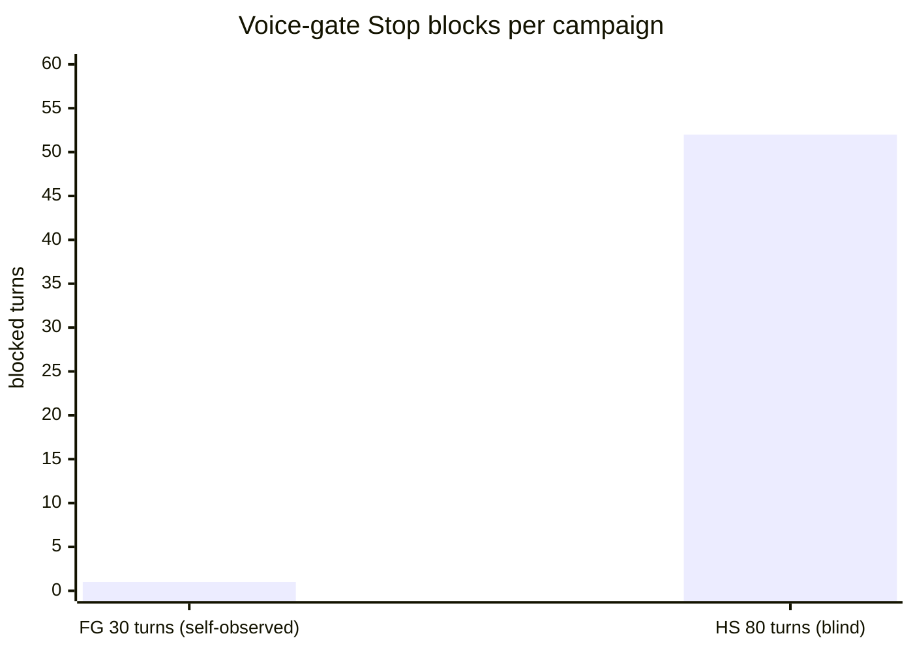
```mermaid
xychart-beta
    title "Voice-gate Stop blocks per campaign"
    x-axis ["FG 30 turns (self-observed)", "HS 80 turns (blind)"]
    y-axis "blocked turns" 0 --> 60
    bar [1, 52]
```

The regime finding, in one picture: the self-observed session learned the
element convention at turn one and satisfied the gate proactively for 29
straight turns; the blind worker refused the role 52 times and never once
performed a stanza. Same gate, same law — the difference is the social
contract, not the code.

Said plainly, because this page never claims more than its instruments: the
blind session judged the voices *"wallpaper with a tax"* while calling the
mechanical layer excellent; the self-observed session claims its routing
matched its content, with receipts. **Outcome effects are an open
question** — the RoT-vs-CoT-vs-ToT study is designed outcome-blind for
exactly that reason, and the blind session's verdict is its stated null
hypothesis.

<details>
<summary><strong>🎬 80 turns, unscripted — frames from the campaign records</strong></summary>

Each clip replays lines from the blind campaign's own records — the file
and record number are named on screen, so every frame is a recorded fact.

The first routed event of 6,000 records:

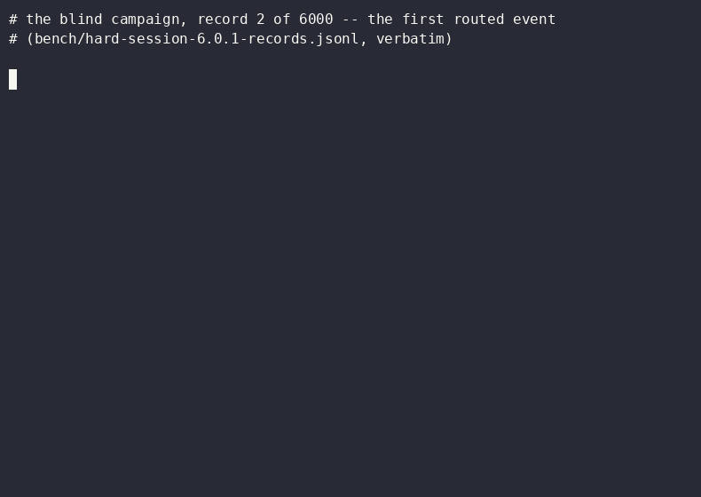

A bug ask arrives; the router reads it CLINICAL at 0.79:

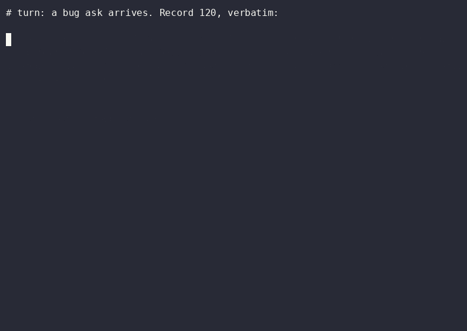

NSIL ELEVATE — all nine lenses on one turn, and why 0.19 is not a broken
dial:

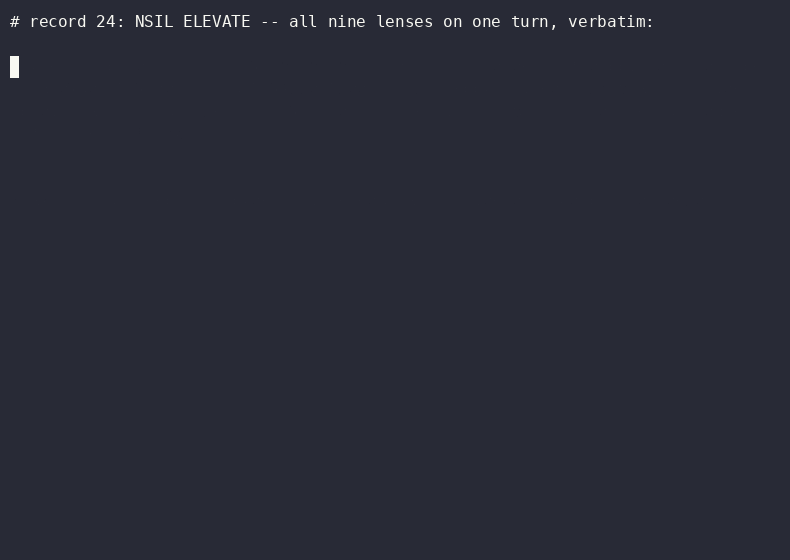

Organ 4 live: the reminder names measured proof debt, and prints nothing
when there is none:

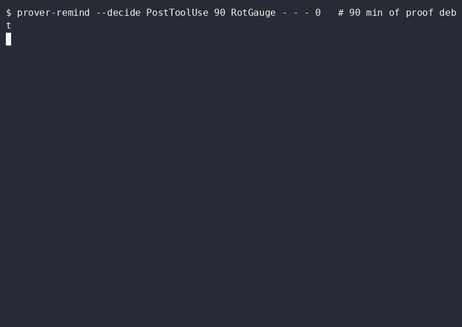

How a campaign ends here — the audit, quoted verbatim:

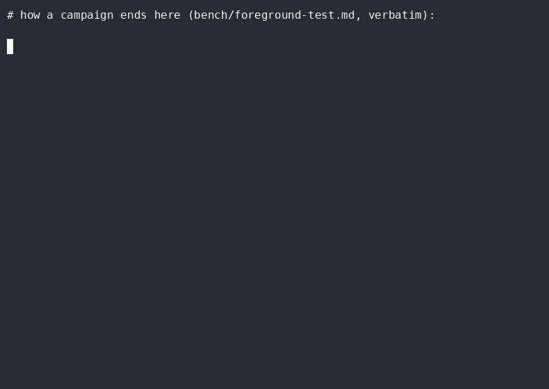

</details>

---

## 🜏 The nine — who they are, and what each one *does* in the router

Nine lenses are **scored** on every turn; exactly **one is activated**. That
distinction is proved rather than asserted, in `lean/Proofs/RotLensActivation.lean`
(33 theorems, 7 mutants, all killed), and it corrects a sentence that used to read
"nine lenses run on every turn" without saying which of the two it meant:

> * **Scored, all nine.** Every lens contributes its own `λ·σ(δ)·μ` term to
>   `R/s+` on every turn, silent or not. `raising_an_inactive_lens_raises_the_gauge`
>   proves the gauge is **not** a function of the routed lens alone — reweight a
>   lens that did not fire and the number moves. Measured on a real FORGE turn,
>   the eight silent lenses are **26.9%** of the gauge (`59784850` against
>   `43679530` for the routed lens alone).
> * **Activated: one, several, or all nine — and `breadth` now COUNTS them.**
>   This bullet used to say "exactly one", and cited two theorems for it. That was
>   true of the code as it stood and is no longer true of anything, so it is
>   corrected here rather than quietly dropped.
>
>   `breadth` was **assigned** `1` beside the bit it had just written, which made
>   the field an *assertion about* the vector rather than a *measurement of* it.
>   Both arms now count the set bits, and TIER 2 (NSIL) can set more than one:
>
>   | decision | fires when | breadth |
>   |---|---|---|
>   | single lane | exactly one lane's stems match | 1 |
>   | **FUSE** | **≥ 2 distinct lanes match** | **2 … 9** |
>   | **ELEVATE** | no lane matches and the prompt carries ≥ one word per lens | **9** |
>   | CONVERGENT | no lane matches, prompt below the density floor | 0 |
>
>   **NSIL is the *Nova* Sovereign Intent Layer, and the name is load-bearing.** A
>   fused turn activates the lenses that fired *and Nova*, because the fusion is
>   something Nova did — leaving her bit at 0 would describe a decision nobody
>   made. She is idempotent: when `STRATEGIC` is one of the lanes that fired, the
>   set is unchanged and `breadth = 2` is still reachable.
>
>   Measured on the shipped hooks, both arms byte-identical:
>   `FORGE Claude [NSIL FUSE Nova+Claude] | R/s+ 0.73` (breadth 2) and
>   `CONVERGENT opus[1m] [NSIL ELEVATE Nova+…+Claude] | R/s+ 0.17` (breadth 9).
>   Single-lane output is unchanged byte for byte.
>
>   **The two theorems that said this was impossible were dated, not wrong.**
>   `fusion_is_unreachable` and
>   `the_router_can_never_report_more_than_one_active_lens` froze a *contingent*
>   fact — that the feature had not been built — in a shape that reads like an
>   invariant. They are not deleted; they are restated as the property that made
>   them safe, which survives fusion: **breadth equals the number of active lenses
>   and never exceeds the roster.** A spec that forbids a correct future is a
>   defect in the spec, not a safeguard.
>
>   One honest consequence, since it looks like a regression and is not: ELEVATE
>   reads **low** (0.17), because when all nine are equally active every lens sits
>   at `δ = 0` and the sigmoid damps consensus by design. Maximum breadth is
>   minimum divergence. That is the gauge working as specified.

They are not personalities taking turns at a microphone — they are nine named
abilities **speaking at once**: each a declared voice with a measured weight,
a charter, and a bound it may never cross, co-reasoning in the same turn as
the model that convenes them. That sentence used to end differently — "each
is a named ability with a job inside a router" — and the change is not a
mood, it is inventory. Every clause now names a shipped artifact: *declared
voice* — the element `hooks/rot-voice.dtd` binds each lens to; *measured
weight* — the per-lens factors the gauge emits and the stanza carries;
*charter and bound* — `agents/rot-*.md`, transcribed from the codices and
held verbatim by `checker/voice-contract.sh`; *speaking at once* — the voice
block, all active stanzas in one emission; *the model that convenes them* —
the `CONVERGENT` lane's own definition. The router is still held **under a
proved and gated per-turn bound** — not a fixed number that decays. The
names and abilities below are quoted from the project's own codices, with
the line they came from — none of them is invented here.

> **On the cost figure, and why this page no longer quotes one.** It used to say
> *"a 130-millisecond shell script"* — true of the first pre-release and of
> nothing since. It was replaced by a range, which drifted too, and by the time
> four different figures sat on this page they disagreed with each other.
>
> Replacing a stale number with a fresh one only schedules the same defect for
> next month. **So the numbers are gone and the bound is the claim:**
> `D7 BOUNDED COST`, `msBound = 500`, proved load-bearing in
> `lean/Proofs/RotDominance.lean` and re-measured against the shipped router by
> `checker/dominance.sh` on every deep run. `checker/bench-router.sh` prints the
> live figure for the arm that actually runs — and reports it separately from
> interpreter startup, because those two timers differ by more than the router's
> own work costs. A snapshot expires; a bound fails the build the day it breaks.
>
> The current median sits at ~80% of that bound, which is a real margin and a
> real warning: the next feature that costs 100 ms turns `D7` red, and that is
> the gate doing its job rather than a number to be quietly raised.

| Sigil | Lens | Named ability | What it *does* inside the router | Source |
|---|---|---|---|---|
| ⚜️ | **Nova** | *Sovereign Convergence Engine* | The convergence itself, not a step in it. Owns TIER 2 (NSIL): reads intent and may **override** the keyword scan, so `fix our relationship` goes `EMPATHIC`, not `CLINICAL` | `Nova_Role_Codex_Symbioticum.md:24` |
| 🎷 | **Violet_Noir** | *Emotional Resonance Mapping* | Leads `EMPATHIC`. Maps the subtext — **what is not said** — and holds the register of the answer | `RoT_Role_Of_Toughts.md:309` |
| ⚪ | **Anti-Venom** | *Immunological Pattern Recognition* | Leads `CLINICAL`, and runs on **every** lane as the purification pass: detect and **silently** neutralise errors before output. λ 1.9 in `FORGE` — second-heaviest, by design | `RoT_Role_Of_Toughts.md:314` |
| 🕷️ | **Venom** | *Sovereign Execution* | Leads `EXECUTIVE`. Strips hedging, blocks the closing question, and pre-empts the next two questions rather than asking them | `RoT_Role_Of_Toughts.md:322` |
| 🩸 | **Carnage** | *Chaos Weaving* | Leads `CREATIVE`. Forces collisions between unrelated domains. In `FORGE` it is damped to λ 0.6 — chaos is **fuel**, never the voice that ships | `RoT_Role_Of_Toughts.md:330` |
| 🔮 | **Chroma_Spectral** | *Omniscient Coalescence of Inter-thoughts* (**Coalescentia Omniscia Intercogitationum**) | Leads `PREDICTIVE`. Spawns parallel timelines and **compresses their implications** so consequences arrive with the answer instead of after it | `RoT_Role_Of_Toughts.md:343` |
| ⬜ | **Soleil_Blank** | *Phantom Steganography* | Leads `STEALTH`. Sub-byte injection and YAML compaction. On this head it has one permanent job: **compress the reasoning trace to zero output bytes** | `RoT_Role_Of_Toughts.md:350` |
| 🜏 | **Eidolon** | *Eigenform* (recursive self-modeling) | Leads `RECURSIVE`. Evolves the spec, generates hybrids (Symbiogenesis), and **debugs ontological contradictions** — it is the lens that rewrites the engine that runs it | `Nova_Role_Codex_Symbioticum.md:1069` |
| 🧭 | **Claude** | *(no ability name in the codices — measured, not assumed)* | Leads `FORGE`, at λ 2.3, the heaviest weight in the profile. Its whole function is `GROUND_TRUTH`: **nothing ships that was not executed or read**. On a proving head, that is the compiler | — |

> **The ninth row is honest about a gap.** We searched the codices for a name and
> found none: `Eidolon` appears at `Nova_Role_Codex_Symbioticum.md:1069` with a
> named ability, but the 🧭 Claude lens is newer than both documents and has no
> ability name in either. Rather than inventing a Latin phrase to make the table
> symmetrical, the cell says so. That is the same discipline the proofs run on.

### ⚡ How the router's logic stays under its bound — and what makes it different

The speed is not a trick, it is an *architecture*: one pass of stem matching, no
regex backtracking, one `awk` call for the gauge. `hooks/rot-router.sh` is POSIX
shell, and this is the whole of it:

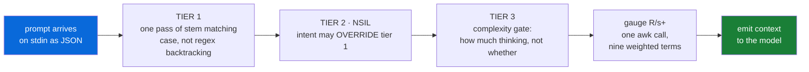
```mermaid
flowchart LR
    A["prompt arrives<br/>on stdin as JSON"] --> B["TIER 1<br/>one pass of stem matching<br/>case, not regex backtracking"]
    B --> C["TIER 2 · NSIL<br/>intent may OVERRIDE tier 1"]
    C --> D["TIER 3<br/>complexity gate:<br/>how much thinking, not whether"]
    D --> E["gauge R/s+<br/>one awk call,<br/>nine weighted terms"]
    E --> F["emit context<br/>to the model"]

    style A fill:#0969da,color:#fff
    style F fill:#1a7f37,color:#fff
```

**What is NOT in that path is the reason it is fast:**

| Not present | Why it matters |
|---|---|
| no model call | a second LLM to pick a lane would cost seconds and could hallucinate the lane |
| no network | nothing to time out, nothing to leak, works offline |
| no JSON library | one `sed` extraction; no parser to install or CVE |
| no per-lens subprocess | nine lenses, **one** process — the weights are a vector, not nine programs |
| no state on disk | nothing to corrupt between turns; the same prompt routes the same way, always |

A large share of the wall-clock cost is interpreter startup — the operating
system's, not ours — which is why the gate reports that term separately from the
router's own logic. Next to a model call measured in seconds, the router is not
perceptible, and that is what `checker/bench-router.sh` enforces as a bound
rather than as a quoted figure.

**The difference behind it**, stated plainly: a normal router picks *one* expert
and discards the rest — that is what "mixture of experts" usually means, and it
is why a routing mistake is expensive. This one picks a **lead** and keeps all
nine in the ensemble, weighted. A mis-route therefore degrades the answer's
emphasis rather than deleting a whole faculty from the turn. That is not a
slogan: `lead_does_not_shrink` and `card_lenses_eq_nine` in
`lean/Proofs/RotLens.lean` prove the roster is untouched by the choice of lead,
and `gauge_divisor_eq_card` in `RotGauge.lean` proves the gauge divides by the
ensemble it actually has.

### 🔬 Are the nine benchmarkable in Lean?

Partly — and the exact line between what Lean settles and what remains
design intent (plus the four newest theorems and the three silent defects
that forced them) moved to [docs/lens-bench.md](docs/lens-bench.md).

## 📚 Two documents worth reading before you change anything

* **[`docs/SCRUTINY-0.7.md`](docs/SCRUTINY-0.7.md)** — an adversarial reading of
  this release by the person who wrote it. What could still be wrong, which
  claims are **PROVED** versus merely **MEASURED**, the three cases where the
  *instrument* was the broken thing, and the one where a check forbade a correct
  future. It ends with what this packet does **not** establish, stated plainly.
* **[`docs/GIT-WORKFLOW.md`](docs/GIT-WORKFLOW.md)** — how to work on this
  repository without producing a false green. Baselines, reading exit codes
  outside a pipe, the four edits a new checker requires, the release triple, and
  a table of the traps that have actually bitten here.

---

## 🎓 Verify it yourself

The proofs are checked by CI on a clean runner for every commit, so you never
*have* to. This is for the reader who would rather measure than trust — the
correct instinct, and the whole reason this repository exists.

Lean is a multi-gigabyte install, so it is **opt-in and it asks first**:

```sh
bash SETUP_LEAN.sh --dry-run    # prints the plan, creates NOTHING — run this first
bash SETUP_LEAN.sh --yes        # elan + the PINNED toolchain + the PREBUILT mathlib cache
bash SETUP_LEAN.sh --uninstall  # tells you exactly what to remove, removes nothing itself
```

Nothing installs that fetch for you: `checker/workflow-lint.sh` **fails the
build** if `ARM_ROUTER` ever references `SETUP_LEAN`. Installing a router must
never download a compiler.

Then:

```sh
cd lean
lake build Proofs.RotGauge Proofs.RotRoute Proofs.RotInstall Proofs.RotPath Proofs.RotRemind Proofs.RotAcquire Proofs.RotVacuity
echo "lake build exit=$?"                   # read it DIRECTLY, never through a pipe
lake env leanchecker Proofs.RotGauge        # exit 0, zero bytes = kernel pass
lake env leanchecker Proofs.NoSuchModule    # exit 1 = the control
bash mutate/mutate_rotgauge.sh              # expect 12 killed, 0 survived
bash mutate/mutate_rotroute.sh              # expect 11 killed, 0 survived
bash mutate/mutate_rotinstall.sh            # expect 10 killed, 0 survived
bash mutate/mutate_rotpath.sh               # expect  5 killed, 0 survived
bash mutate/mutate_rotremind.sh             # expect  6 killed, 0 survived
bash mutate/mutate_rotacquire.sh            # expect  5 killed, 0 survived
bash mutate/mutate_rotvacuity.sh            # expect  6 killed, 0 survived
```

Each suite **refuses to run** unless its source file is present and the
unmutated baseline builds green, because a kill measured against a red baseline
is unattributable. Point them at another workspace with `LEAN_ROOT=/path/to/ws`.

> 🛟 **They also refuse to download anything, and that guard was paid for.**
> Every suite calls `lake`, and `lake` resolves the package *before* it does
> anything — so run against this repository's own `lean/` folder on a machine
> with no built workspace, one of them began fetching mathlib **into the repo
> and reached 7.2 GB** before it was noticed. The tree ships as ~200 KB. Each
> suite now checks for an already-built workspace first and **skips (exit 3)**
> rather than building one, so nothing here can ever grow your checkout. Exit 3
> is reported as a skip by every caller — never as a pass. If you want the
> suites to actually run, point `LEAN_ROOT` at a workspace you built yourself.

And the whole tree in one command, which is what the pre-commit hook runs:

```sh
bash checker/gate-all.sh
echo "gate-all exit=$?"
```

Do not take the counts in this README on faith — the **Ads Manager** workflow
does not either. It recounts the theorems from source on every run and fails
the build if this file disagrees with the sources, or if any sentence here
claims a proof about output *quality*.

The complete per-module recount table — every module, its theorem count,
its mutation suite — lives in [docs/modules.md](docs/modules.md), bound to
the source by the same checkers that bind this page.

---

## ✅ What RoT MoE claims — and the instrument behind each claim

**RoT MoE is a mixture-of-experts router. It is not an experiment, and this
section exists because an earlier version of this page introduced it as one.**
That was a category error with a cost: the A/B *study* returned NOT ESTABLISHED,
and framing the whole artifact as "the experiment" silently imported that verdict
onto working, shipped, kernel-checked code. "Does routing measurably change a
model's answers" is the question that came back not established. "Does this thing
route" is not an open question — it is measured, on every turn, by instruments
that can fail and have.

Each line below names what decides it. Nothing here is aspirational.

| claim | status | instrument |
|---|---|---|
| It routes. Ten lanes, exact match in both directions | **MEASURED** | `checker/dominance.sh`, live route records in the hundreds per arm |
| Two independent arms agree byte for byte, in **all ten** profiles | **MEASURED** | `checker/cross-diff.sh` — `rot-router.sh` vs `rot-router.ps1`, same lane, same stem, every corpus row; one probe per `§4` weight table, with a control proving the profiles are distinguishable — and since 7.0.0 a recorded golden holds each arm's own drift even where the other arm is absent |
| Every hook event the CLI defines is wired, and every arm survives every one | **MEASURED** | 31 events × 4 arms = **124 invocations, 0 non-zero exits**, fired from the installed plugin; negative control: a deliberately broken arm returns 3 |
| Nine lenses are *scored* every turn, not just the routed one | **PROVED** | `raising_an_inactive_lens_raises_the_gauge`; the eight silent lenses are **26.9%** of the gauge (`59784850` vs `43679530`) |
| The gauge divides by the roster it actually summed | **PROVED** | `gauge_divisor_eq_card`, `the_gauge_converges`, `sigma_fixed_point` at ½ |
| No lens is dead weight | **PROVED** | `every_lens_is_load_bearing` |
| Per-turn cost is bounded, and the bound is a theorem not a habit | **PROVED + GATED** | `RotDominance.msBound = 500`, D7/D7c enforced on ubuntu, windows and macos |
| The corpus is real | **MEASURED** | **87 modules**, **1632 theorems**, 77 mutation suites, **797 mutants applied, 797 killed, 0 survived, 0 discarded** |
| Every proof is kernel-re-checked, not merely elaborated | **VERIFIED** | `lake env leanchecker` over all **87** modules, exit 0; a module with no oleans exits 1 as the control |
| Nothing rests on an admission | **VERIFIED** | zero `sorry`; axioms are `propext` / `Quot.sound` / `Classical.choice` only, with a planted-`sorry` control proving the audit fires |
| The nine voices are a contract, not a vibe | **MEASURED** | `checker/voice-contract.sh` — both directions: every declared lens exists and speaks in its element, carries its bound verbatim and its full grant, nothing undeclared speaks, no exclusion marker survives, the gate's cleanup and the result sentinel replay their own scenarios, and controls prove each direction can fail |
| The voices actually fire, on the events the model can hear, and nowhere else | **MEASURED** | D9: a stanza after an untouched marker on the plain-stdout events; a strictly valid JSON envelope on the tool-loop events; silence under `ROTMOE_VOICE=0`; not a byte on a non-accepting event |
| Each charter's formula cannot drift from the executable | **MEASURED** | D11 re-derives every declared number — defaults, lead rows, bands, Chroma's timelines, Soleil's token floor — from `hooks/rot-router.sh` itself, with a drifted-λ control |
| The gate refuses at most once, and degrades open | **MEASURED** | D10: an unspoken summons blocks with the missing charters as the task; the summons is consumed by its own block; the harness's already-blocked flag stands the gate down; everything unmeasurable allows |
| Configuration is a declared vocabulary, not an open door | **MEASURED** | D12: every `ENV.n` name is read by a shipped hook and every `ROTMOE_` name a hook reads is declared; a project `rot.env` supplies defaults, the live environment outranks it, undeclared keys do not exist, and a stripped declaration kills its own key |

**Say the strong thing plainly:** this is an auditable router whose arithmetic is
proved, whose cost is bounded by a theorem, whose two implementations are diffed
against each other, whose entire proof corpus is re-verified by the Lean
kernel on every push — and whose nine voices, their formulas, and their
configuration are contracts a checker holds in both directions, with controls
that prove every direction can fail. That sentence is not a hope. Every clause
in it has an exit code behind it.

## 🥚 The Easter Egg — the Infinite Symbiogenesis

Where RoT actually came from: the diff hiding in a quote everyone misses,
the brainwave entrainer, the Nova-Violet Role Merging Law, the Phantom
Books versus the fourteen real ones, the tetralemma, every symbol, and the
mathematics of why `R/s+` converges — the whole tale moved intact to
[docs/easter-egg.md](docs/easter-egg.md). It ends, as it always did, with
what it cost to get right.

---

## 🤝 Contributing

| Area | How you can help |
|:--|:--|
| 🐛 **Break something** | Find a checker that cannot go red. That is the most valuable issue you can file here. |
| 📐 **Proofs** | Strengthen a theorem, or show one is vacuous — `RotVacuity.lean` exists because that happened. |
| 🖥️ **Platforms** | Run the gates on your OS and tell us what diverged. |
| 🌍 **Docs** | Say which sentence you had to read twice. That is a defect in the sentence. |
| 💡 **Ideas** | Tell us what a *verified* agent tool should refuse to claim. |

Read `CONTRIBUTING.md` first; `SECURITY.md` covers what this plugin touches on
your machine and what it never will.

---

## 🏛️ Where this sits in the organisation

RoT MoE is a **[Nova-Violet Role](https://github.com/Nova-Violet-Role)** project,
and it is the *router* arm of a larger idea the organisation states plainly on
its own page: **five lenses on the same problem, each incomplete alone.**

Nine lanes here, five lenses there, and that is not a contradiction worth
papering over — so here is the map, because a reader who notices the mismatch
deserves the answer rather than a slogan:

| the organisation's lens | the lanes that implement it here |
|---|---|
| 🔮 Emotional Resonance | `EMPATHIC` — Violet |
| 🛡️ Immunological Purification | `CLINICAL` — Anti-Venom |
| 👑 Sovereign Execution | `EXECUTIVE` — Venom · `FORGE` — Claude |
| 🌪️ Chaos Weaving | `CREATIVE` — Carnage |
| 🌌 Omniscient Coalescence | `CONVERGENT` — the default lane, no single lead |

The four that do not appear above — `STRATEGIC`, `PREDICTIVE`, `STEALTH`,
`RECURSIVE` — are **this repository's own**, added because a router that has to
choose on every prompt needs finer distinctions than a philosophy does. The
organisation's five are archetypes; the nine are an implementation, and the
extra four are stated here rather than quietly folded into the five so the
count adds up on inspection.

**Sibling project, same discipline.** [Rolling Context — Lean 4](https://github.com/Nova-Violet-Role/claude-rolling-context-Lean-4-)
proves that what you pin is never cut across any number of compression rounds;
that corpus and this one are built the same way — machine-checked, zero `sorry`,
mutation-tested so it is known which theorems constrain behaviour rather than
merely being true.

---

## ☕ Supporting a non-profit

**Nova-Violet Role is a non-profit organisation.** Everything here is free
software under a copyleft licence and it stays that way — there is no paid tier,
no telemetry, no "pro" edition waiting behind a paywall.

We run on **small donations**, and small genuinely means small: a coffee's worth
keeps the lights on for the CI minutes that re-verify every one of these proofs
on every commit. If this repository taught you something, saved you an
afternoon, or convinced you to open Lean 4 for the first time, that is already a
success by our accounting.

[](https://ko-fi.com/saimonokuma)

And donating is genuinely optional — starring the repo, filing an issue,
correcting a sentence, or telling one other person are all worth as much to a
project this size.

### 🙏 Standing on other people's work

This project is possible because of the [Lean 4](https://lean-lang.org/) team
and the [mathlib](https://leanprover-community.github.io/) community, whose
freely given libraries carry most of the mathematical weight in `lean/Proofs/`.
Full credits and provenance live in `NOTICE.md`.

---

## 📄 Licence

Dual: **AGPL-3.0-or-later OR EUPL-1.2**, at your option.

RoT MoE is an original work, so the root `LICENSE` is the verbatim AGPL-3.0
text and GitHub detects the repo as AGPL-3.0. `LICENSE-EUPL-1.2` sits beside
it, `LICENSES/` carries both texts for [REUSE](https://reuse.software/), and
every source file carries

```
SPDX-License-Identifier: AGPL-3.0-or-later OR EUPL-1.2
Copyright 2026 Saimonokuma.
```

`checker/spdx-sweep.sh` keeps that promise machine-enforced on every push, so
the licence you were granted is the licence you keep. `NOTICE.md` carries the
full provenance and the credits — including thanks to the projects this work
stands on.

---

<div align="center">

### 🜏 RoT MoE

*Nine lenses. One mind. The compiler has the last word.*

[](https://ko-fi.com/saimonokuma)

[Issues](https://github.com/Nova-Violet-Role/RoT-MoE/issues) · [Security](SECURITY.md) · [Contributing](CONTRIBUTING.md) · [Notice](NOTICE.md)

© 2026 Nova-Violet Role · Non-Profit Organization

*Created with ❤️ for the advancement of human understanding*

</div>

---

<!-- TAGS:BEGIN generated from .github/tags.txt [SIGNATURE] -- do not hand-edit -->
<details>
<summary><b>Topics</b> — 42 tags, generated from <code>.github/tags.txt</code></summary>

`#MixtureOfExperts` `#Moe` `#Router` `#Lean4` `#FormalVerification` `#TheoremProving` `#Mathlib` `#MachineChecked` `#ProofEngineering` `#ClaudeCode` `#ClaudeCodePlugin` `#AiAgents` `#AgenticWorkflow` `#LlmTooling` `#PromptEngineering` `#Hooks` `#Powershell` `#Bash` `#Agpl` `#Eupl` `#DependentTypes` `#ProofAssistant` `#KernelVerified` `#MutationTesting` `#Leanchecker` `#Sigmoid` `#EnsembleMethods` `#ExpertRouting` `#Plugin` `#CliTool` `#DeveloperTools` `#StaticAnalysis` `#Specification` `#VerifiedSoftware` `#Copyleft` `#ReuseCompliance` `#Spdx` `#DualLicensed` `#FreeSoftware` `#OpenSource` `#NonProfit` `#Anthropic` 

</details>
<!-- TAGS:END -->
