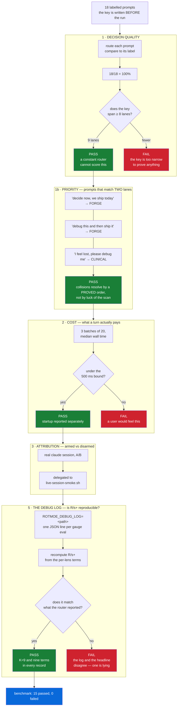
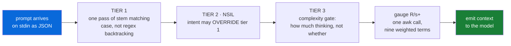

<!--
    This file is part of RoT MoE.
    SPDX-License-Identifier: AGPL-3.0-or-later OR EUPL-1.2
    Copyright 2026 Saimonokuma.
-->

<div align="center">

# 🜏 RoT MoE

**Nine lenses, one mind — and a kernel that checks the arithmetic**

*The Role of Thoughts: a Dynamic Cognitive Mixture-of-Experts router for Claude Code — nine named lenses, an auditable routing rule, and a divergence gauge specified in Lean 4*

[](https://ko-fi.com/saimonokuma)
[](https://github.com/Nova-Violet-Role)
[](LICENSE)

[](lean/)
[](https://www.claudepluginhub.com/plugins/nova-violet-role-rot-moe?ref=badge)
[](#-what-is-actually-verified)
[](#-what-is-actually-verified)
[](https://claude.com/claude-code)
[](https://reuse.software/)

</div>

---

## 👋 Welcome

**You are welcome here, whatever you came for.** If you want a router for your
Claude Code sessions, [start with Install](#-install) — it takes a minute and
undoes itself completely. If you came to check whether the proofs are real,
[start with Verify](#-verify-it-yourself) and try to break them; that is not
tolerated here, it is the *point*. And if Lean is a word you have only heard in
passing, nothing on this page requires you to know it — **the plugin runs with
no Lean installed at all.**

Nobody is greyed out. Questions that begin "this is probably a dumb question"
are the ones this project was built by asking.

New here? The fastest path is to let your agent do it:

```sh
git clone https://github.com/Nova-Violet-Role/RoT-MoE.git
cd "RoT-MoE"
claude          # then type:  /rot-moe-install
```

`CLAUDE.md` in the repository root tells the agent exactly what to run, in what
order, and — just as importantly — **what it must never do**: no `sudo`, no
downloads without asking you first, no green claimed from an unread exit code.
`checker/claude-md-lint.sh` fails the build if that document ever names a file
that does not exist, so the instructions cannot rot while you are not looking.

---

## 📜 About

**RoT MoE is a mixture-of-experts router, and its arithmetic is proved.** The
router measures nine lens activities off disk, computes an `R/s+` gauge from
them, and **1632 machine-checked theorems in Lean 4** state what that gauge must
satisfy — that it is positive, that it is bounded below, that it is *not
constant*, that it divides by the number of lenses it actually summed. Two
independent implementations compute it and are diffed byte for byte across all
ten weight profiles. The Lean kernel re-verifies every proof term on every push.

That is the artifact. It routes, it is bounded by a theorem, and the numbers on
this page each have an exit code behind them.

**And it is built to answer the fair question that any such engine invites** —
*could the number simply be made up?* Here it cannot be, and that is not a
promise, it is a construction: the mutation suites break each definition on
purpose and require the theorems to die, so a gauge that had quietly stopped
meaning anything would take the proofs down with it. **794 mutants applied, 794
killed, 0 survived.** An instrument that has never failed on purpose is an
untested instrument, and every instrument here has been failed on purpose.

### 🤝 It **improves** Claude Code — it does not replace it

This is worth saying plainly, because a plugin that names nine lenses can sound
like it wants to take the wheel. It does not.

* **Your agent stays your agent.** The router adds *one line* before a turn —
  a named lane and a gauge reading. It changes no tool, intercepts no command,
  and decides nothing. Claude Code does the work exactly as it always did.

  ```
  RoT MoE :: TIER 1 -> FORGE Claude       | R/s+ 0.66
  RoT MoE :: TIER 1 -> CLINICAL AntiVenom | R/s+ 0.57
  RoT MoE :: TIER 1 -> CONVERGENT opus[1m] | R/s+ 0.16
  ```

  `CONVERGENT` is the one lane with no lead **lens**: all nine co-reason and
  nobody leads. What convenes them is the **model you chose**, so that is what
  the line names — `opus[1m]` here, `sonnet` on a machine configured that way.

  The hook payload carries no model field, so the model is read from your
  client's settings file, with `ROTMOE_MODEL` overriding it and the literal
  `model` as a last resort. Every step degrades to a word — never to an empty
  string.

  The reading is **not** a mood. It is this turn's routing decision written in
  the gauge's own units: the lead lens of the fired lane at activity 1, every
  other lens at 0, breadth 1 — and you can reproduce any line above by hand,
  which is the only reason it is allowed to appear:

  ```sh
  rot-router.sh --vector 0,0,0,0,0,0,0,0,1 --breadth 1 --M 1 --C 1 --T 1 --profile FORGE
  # R/s+ = 0.66 [BELOW RANGE] mean=0.111 breadth=1 K=9 lenses=Claude
  ```

  `--profile FORGE` joined this command when the CLI's default weights moved
  to the convener's (`CONVERGENT`): the hook scored this FORGE turn with the
  FORGE table, so a reproduction must mount the same table. Without the flag
  the same vector now reads 0.51 — measured, which is how this example was
  caught having quietly stopped reproducing.

  `M`, `C` and `T` are the neutral element `1.0` because one stateless hook call
  cannot measure memory residue, confidence or recency. That is stated rather
  than hidden, and it is why the number is a *measurement of the routing
  decision* and not an invented activity profile. A turn that fires no lens is
  all zeros with breadth 0, and the gauge is defined there too.
* **Nothing is imposed.** Every lens is a *lens*, not a rule. The engine
  (`engine/rot-lean.md`) is a document the model may read; the only mechanical
  effect in your session is the hook line.
* **It undoes itself.** `DISARM_ROUTER` removes the entry, and on a settings
  file in the form Claude Code itself writes, the install/uninstall round trip
  is **byte-identical** — asserted by `checker/install-roundtrip.sh`, not hoped.
* **No network, ever.** The shipped hooks make no HTTP call of any kind. No
  telemetry, no phone-home, nothing leaves your machine.
* **No Lean required.** The proofs are *ours*, run in our CI. You can install
  the plugin with no Lean toolchain at all and never notice it exists;
  `SETUP_LEAN` is opt-in and asks first.

The last three are not promises in prose: `checker/hook-footprint.sh` fails the
build if a shipped hook ever gains a network call or invokes `lake`, and it
plants both of those to prove it can fail.

---

## 🧠 What "RoT" means, and how it sits next to CoT and ToT

**RoT is The Role of Thoughts** — a *Dynamic Cognitive Mixture-of-Experts*. The
name sits deliberately in the family of **CoT** (Chain of Thought) and **ToT**
(Tree of Thought), and the three answer the same question in three shapes:

| | shape of the reasoning | where the experts come from | can you audit the choice? |
|:--|:--|:--|:--|
| **CoT** — Chain of Thought | one line, step after step | there are none — one voice, thinking longer | you read the chain afterwards |
| **ToT** — Tree of Thought | branches, explored and pruned | there are none — one voice, thinking wider | you read the surviving branch |
| **RoT** — Role of Thoughts | several *named roles* reasoning at once, then converging | **generated per query**, not pre-trained | ✅ the routing rule is code you can read, and the gauge has theorems attached |

A chain thinks longer. A tree thinks wider. **RoT holds several defined points
of view at the same time** — clinical, executive, empathic, chaotic,
predictive, compressive, recursive, strategic, empirical — and then *converges*
rather than votes. Its engine is called **RoleThinkering**: activate memory,
generate roles, explore each divergently, synthesise, express, and finally
**measure itself**. The counter-intuitive part is the one that matters: **nine
lenses agreeing is treated as a failure, not a success.** Premature convergence
is the thing being designed against, productive tension is the signal, and
`R/s+` is what puts a number on it.

That gives RoT the property the other two lack by construction: **the routing
decision is external, inspectable and testable.** A weight-level
Mixture-of-Experts routes each token through a learned gating network across
hundreds of pre-trained experts — extremely powerful, and *not interpretable*:
you cannot ask why expert 217 fired. RoT routes at the level of the *prompt*,
in shell code you can read, with a priority order a Lean theorem characterises
in both directions. It is not a competitor to weight-level MoE; it is the
orthogonal layer. One decides **which parameters fire** during generation; the
other decides **how the reasoning is framed** before it.

> 📚 **Provenance, stated plainly.** The architecture is documented in *The Role
> of Thoughts — Dynamic Cognitive MoE Architecture*, the Nova_Omega Project
> blueprint (2025–2026): the six-stage RoleThinkering pipeline, the R/s
> sovereignty gauge with its self-correction protocol, and the expression-filter
> layer the lenses grew out of. It was a **specification**, stress-tested as
> prose against native MoE models long before any of it executed.
>
> **This repository is the generation where it stopped being a document.** The
> nine lenses, the three-tier router and the gauge run as real code in two
> shells; the gauge here is the extended `R/s+` form — per-lens weights λ, a
> sigmoid on divergence, entropy, quality μ and calibration — rather than the
> blueprint's plain mean of deltas; and the properties that used to be asserted
> in prose are theorems in `lean/Proofs/`. Earlier comparison studies are
> history, **not evidence for this tree**. Everything on this page is measured
> from *this* repository. Licensing of the architecture document versus this
> implementation is set out in `NOTICE.md` §A.4.

---

## 🌟 Why Lean 4 — and why you should be excited about it

**This repository exists because of Lean 4, and it deserves the front page.**

Lean 4 is a *proof assistant* and a real programming language at the same time.
You write mathematics in it, and a **kernel of a few thousand lines** re-derives
every single inference step from the axioms. Not "the tests passed". Not "the
reviewer agreed". The machine reconstructed the argument and found no gap.

Three things make that extraordinary rather than merely nice:

* **A theorem is not a sentence — it is a claim over an infinite space.**
  `∀ (p q : Platform), key p = key q → p = q` is checked for *every* pair that
  could ever exist. A test suite could run for a century and cover a rounding
  error's worth of that. This is the difference between *sampling* and
  *settling*, and once you have felt it you cannot unfeel it.
* **[mathlib](https://leanprover-community.github.io/) is one of the great
  collaborative artefacts in mathematics** — over a million lines of formalised
  analysis, algebra, topology and order theory, all machine-checked, all free,
  all reusable by you today. The `sigma_strictMono` proof in this repo stands on
  work that thousands of contributors put there first. That is what `import
  Mathlib` actually means: you inherit a library of *certainty*.
* **Dependent types let the type carry the promise.** A function can be typed so
  that "this list is non-empty" or "this index is in range" is impossible to get
  wrong — the compiler refuses the mistake instead of the runtime discovering it.

And Lean is genuinely a **problem solver**, not a bureaucrat. `omega` closes
linear arithmetic, `decide` settles finite questions by computation, `ring` and
`linarith` do the algebra you would have done by hand, `grind` and `aesop` search
for the proof, and `exact?` will *find the lemma for you* out of all of mathlib
and print the exact line to write. Several proofs here were finished by asking
the compiler what it already knew.

It is also honest in a way software rarely is. When a theorem in this repo was
**false**, Lean simply refused — no amount of confidence moved it. That refusal
is recorded in `RotPath.lean` rather than quietly patched, because being told
"no" by a machine that cannot be argued with is the most useful thing that
happened to this codebase.

> 💛 **Never touched a proof assistant? You are exactly who this section is
> for.** You do not need Lean to use this plugin, and you do not need a maths
> degree to start: [Natural Number Game](https://adam.math.hhu.de/) teaches you
> your first real proofs in a browser, in an afternoon, for free. If this
> repository is the reason you try it, that is a better outcome for us than any
> star.

- ✅ works on Windows, macOS and Linux — two arms, byte-identical output
- ✅ installs offline in seconds, `DISARM_ROUTER` removes exactly what it added
- ✅ **no Lean required to use it**; Lean is only for re-verifying the proofs
- ✅ every checker carries a negative control that has been seen to fail
- ✅ dual-licensed AGPL-3.0-or-later **OR** EUPL-1.2, your choice

---

## 🌍 Share your theorems — a fourth way to populate a coding agent

**An open invitation.** If you run RoT MoE on your own repository, you
accumulate Lean proofs *about that repository*. Right now those proofs die
there. [`Lean Theorem/`](Lean%20Theorem) is a folder in this repo where you can
contribute them — **by fork and pull request, entirely at your own choice**.

### Your project can stay closed

This is what makes it possible at all: **a proof carries the property, not the
source.**

A theorem stating that your scheduler never emits a negative delay is a
statement about *arithmetic and a bound*. It is not a copy of your scheduler.
Proprietary, private, unreleased, commercial — none of that is an obstacle,
because what travels is the **verified claim**, never the implementation. That
is why a closed project can contribute to an open corpus and give up nothing.

Nothing is ever uploaded automatically. No hook in this plugin reads your
repository and sends anything anywhere. If you do nothing, nothing happens.

### Why this is not MCP, not a Plugin, not a Skill, not a Connector

Those four all exist and all work — and every one of them supplies something
*different* from what this does:

| mechanism | what it gives the agent | is it verified? |
|---|---|---|
| **MCP server / Connector** | **access** — a live system, an API, data at runtime | no; the server can return anything |
| **Plugin / Skill** | **procedure** — instructions, a workflow, how to do a thing | no; advice can simply be wrong |
| **Fine-tuning / pre-training** | **disposition** — changed weights, baked in | no; and you cannot inspect what was learned |
| **`Lean Theorem/`** | **settled knowledge** — machine-checked prior art about a domain | **yes — a kernel already checked it** |

That last row is a category the other three do not have a member of. Everything
else in the list hands the model something *unverified* and asks it to be
careful. A theorem that builds at `lake build` exit 0, carries no `sorry`, and
survives `leanchecker` **cannot be wrong about what it states.** It is the only
payload on that list that arrives with its own correctness guarantee attached.

**So this is a new way of populating a coding agent**: not with tools, not with
instructions, not with weights — with *proof*.

### And it needs no training whatsoever

RoT is **generated per query, not pre-trained** — that is the row in the
comparison table [above](#-what-rot-means-and-how-it-sits-next-to-cot-and-tot),
and it is what makes this almost absurd.

A corpus like this would normally be **training data**. You would need a
pipeline, a fine-tuning run, GPUs, an evaluation harness, and at the end of it a
set of weights nobody can inspect. Here there is no training step at all,
because the thought layer is *separate from the model*. The corpus is **context,
not gradient**. It is read at inference, like any other file on disk.

Which means the entire mechanism is:

> **A fetchable proof corpus, shipped inside a shell-script router.**

No server. No runtime dependency. No network. No weights. **No Lean installation
required to benefit** — the proofs are text, and text is what a model reads.
Every user who contributes makes the next unfamiliar repository slightly less
unfamiliar for everyone, and the cost of carrying that is a rounding error
against a 9.2 MB plugin.

### How the nine lenses profit — concretely

The corpus is not decoration for the router; each lens draws something different
out of it, which is precisely what a single-perspective agent cannot do:

| lens | what a shared proof base gives it |
|---|---|
| 🧭 **Claude** (Forge) | prior art for `GROUND_TRUTH` — a real formalization to measure against instead of reasoning from nothing |
| ⚪ **Anti-Venom** (Clinical) | the `mutate/` half — **which properties survived attack**, the fastest route to what is actually load-bearing |
| ⚜️ **Nova** (Strategic) | how a domain was decomposed — what was worth stating at all, which is a strategy question before it is a proof question |
| 🜏 **Eidolon** (Recursive) | the *shape* of a formalization, reusable across domains that look nothing alike |
| 🔮 **Chroma** (Predictive) | which assumptions later broke — a contributed suite records the edits that killed a theorem |
| 🕷️ **Venom** (Executive) | a decidable model already built, so a decision can be closed rather than deliberated |
| 🩸 **Carnage** (Creative) | cross-domain collision — a bound proved about a game plugin suggesting one about a rate limiter |
| ⬜ **Soleil** (Stealth) | the compressed statement of a property, which is what a theorem already is |
| 🎷 **Violet** (Empathic) | why the property mattered to the person who proved it — the `README.md` beside each subject |

**Honesty about what is measured here.** The corpus itself is measured: **8
modules, 71 theorems, 112 KB** on disk today, counted by `ls` and
`checker/count-theorems.sh` — and `checker/repo-complete.sh` refuses to pass if
that folder is missing, empty, undocumented, or counts zero. The first draft of
this sentence said 1608, from grepping the word `theorem`; the canonical counter
excludes the word where it appears in a doc comment, and it is the authority. The *benefit* to an unfamiliar repository is a
design claim and is **NOT yet measured** — no experiment in this repo has
demonstrated it, and it is not counted among the verified results below. It is
labelled as the open question it is, not sold as a finding.

### Getting the corpus, and keeping it current — `/corpus`

**The corpus is fetched, not shipped, and that is a deliberate design decision.**
It grows by fork and pull request. If it travelled only inside release archives,
every contributed theorem would need a new plugin release — the version number
would be tracking other people's proofs instead of the plugin's own behaviour.

So the archives carry a **seed**, and a fetcher keeps it current:

```sh
./SETUP_CORPUS.sh --check      # report only; writes nothing
./SETUP_CORPUS.sh              # detect, show exactly what changes, ask
./SETUP_CORPUS.sh --yes        # non-interactive refresh
```

```powershell
.\SETUP_CORPUS.ps1 -Check      # both arms, one behaviour, identical exit codes
```

It follows the same contract `SETUP_LEAN` already uses here — **detect what you
have, say what will change, ask before doing it** — and inside a session
`/corpus` dispatches it.

| exit | meaning |
|---:|---|
| `0` | current, or you declined — **nothing was written** |
| `3` | `--check`: an update is available |
| `4` | `--check`: the corpus is absent |
| `2` | refusal — bad argument, no downloader, or the remote is unreachable |
| `1` | the fetch **failed**; your existing corpus is untouched |

**It will not silently overwrite your work.** Files changed since the last fetch
are listed before anything happens, the previous corpus is moved aside as
`Lean Theorem.pre-fetch-<timestamp>.bak` rather than deleted, and a download
arriving with zero `.lean` files is refused outright — that is an erasure, not an
update. All five exit codes above were measured on the POSIX arm against the live
repository; the unreachable-remote path was exercised with a nonexistent repo and
degrades to a message, not a stack trace.

---

## 🔬 What is actually verified

### The size of the thing, recomputed

<!-- FACTS:BEGIN -- generated by checker/facts-block.sh; do not hand-edit -->

| what | how many | recomputed by |
|---|---|---|
| Lean modules in `lean/Proofs/` | **87** | `ls lean/Proofs/*.lean \| wc -l` |
| theorems and lemmas proved | **1632** | `bash checker/count-theorems.sh lean/Proofs/*.lean` |
| mutation suites | **77** | `ls lean/mutate/mutate_*.sh \| wc -l` |
| checkers | **77** | `ls checker/*.sh \| wc -l` |
| hook events wired by the plugin | **31** | keys of `hooks/hooks.json` |

Every number above is regenerated by `checker/facts-block.sh` and the build
fails if this page disagrees with the tree, so none of them can go stale
quietly. The theorem count is the canonical counter, which rejects prose --
a bare grep over the same files reports 23 more.

<!-- FACTS:END -->

### The instruments

| instrument | what it establishes | result |
|---|---|---|
| `lake build Proofs.*` | the modules elaborate | exit **0** |
| `#print axioms` on every theorem | nothing rests on `sorryAx` | **0** `sorryAx` |
| `lake env leanchecker` | Lean's **kernel** re-verifies the proof terms, independently of the elaborator that produced them | exit **0**, zero bytes |
| Lean mutation suites | the theorems are load-bearing | **794 applied, 794 killed, 0 survived, 0 discarded** |
| `checker/gauge-cross.sh` | the Lean mirror and the running hook agree | **6 corpus rows, hook == Lean to 2 dp**; control = retune one λ in the hook alone → 6 rows disagree |
| `checker/mutate-checker.sh` | the *checkers* can fail — 2 meta-controls green, 14 mutants killed, 1 inexpressible on this OS | **0 survived, 0 discarded** |
| `checker/ci-dryrun.sh` | the **CI step list itself**, taken from `ci.yml` and executed on a clean copy of the tree — so a pipeline defect is caught before the push, not by it | every runnable step exit **0**; runner-only steps listed as **DEFERRED, never passed** |

Every one of those has a **negative control** recorded beside it, because an
instrument that has never been seen to fail proves nothing. `leanchecker`
against a module with no oleans exits 1. The SPDX sweep with one tag stripped
exits 1. The path sweep with one planted violation exits 1. If a check cannot
go red on demand, it is decoration and is labelled as such.

Zero `sorry`. No `native_decide` anywhere — it trusts the compiler binary
instead of the kernel, which would quietly undo the point of the whole exercise.

> 🛡️ **The instruments are tested by breaking them on purpose.** Every mutation
> suite must be able to fail, must know when a patch did *not* apply, and must
> refuse to run against a red baseline — because a kill it cannot attribute is
> not evidence. When one of our own harnesses fell short of that bar we fixed it
> and wrote the reason into the file, where the next reader will find it.
> `NOTICE.md` §C keeps the full engineering log for anyone who wants it.

### 📐 The modules that carry an argument

Fifteen are described below, out of 79 in the tree. This heading read *"the ten
modules"* while listing fifteen — a count frozen when the section was written and
never recounted as modules joined it. The section is **not** an inventory and
does not try to be: it walks the modules where the *proof* is the interesting
part, and each one states the defect it was written after. The full count is
machine-generated, and lives in the release table and `STATUS.md` rather than in
a heading that has to be edited by hand every time the tree grows.

* **`lean/Proofs/RotGates.lean`** (50 theorems) — **what may be deferred at a
  commit, and what may never be skipped in CI.** Two regimes, and the module
  states both because they have opposite answers.

  **In CI: nothing may be skipped.** Measured on run `31036272155` — which
  concluded `success` — **eight steps were skipped**, and one of them was
  `tty guard`, a real check that had therefore never run on Windows or macOS.
  `any_authored_skip_is_dishonest` makes one skip sink a run for any step name;
  `skipping_somewhere_is_still_dishonest` refuses the tempting excuse that
  running on another platform redeems it; `success_is_the_only_green` proves
  exactly one of the five GitHub outcomes is a pass, so `cancelled` and
  `neutral` — both of which render as "not red" — are failures.
  `no_authored_skip_is_implied` derives the no-skip rule rather than assuming
  it, which is why there is no clause an edit could relax. An earlier draft of
  this section classified steps into `provision` and `verify` and *proved
  provisioning may skip*; that was the law being weakened to fit the CI, and the
  `kind` field is gone so there is nowhere left to put "this one does not
  count". The workflow was fixed instead: all four `if: runner.os` steps now run
  everywhere and branch inside. **Run `31045719329` measured the result: zero
  skipped steps.**

  **The one exemption, and why it cannot spread.** GitHub injects its own
  scaffolding (`Set up job`, `Post <action>`), and it decides whether that
  scaffolding runs. Those steps are exempt from the skip rule — and from
  *nothing else*. `stepIsAcceptable` consults the scaffolding predicate in the
  `skipped` arm only, and `scaffolding_failure_is_still_dishonest` proves a
  `Post ` step that FAILS sinks the run for every possible name. The asymmetry
  is load-bearing, not decorative: mutating the failure arm to consult the same
  predicate kills nine theorems, and widening the predicate to match every name
  kills the run witnesses.

  `checker/ci-honesty.sh` is the executable half — it reads the run for `HEAD`
  over the API and fails on any skip or any failure, with five negative
  controls, two of which assert exactly this asymmetry.

  **At a commit: the split is deferral, not skipping.** The gate set had grown
  to **587 s**, so it is now split: cheap gates
  run on every commit, expensive ones run when the commit *touches what they
  check*. That is a mechanism which already produced one false green here — a
  gate behind `FULL=1` was red while the sweep printed `26/26 GREEN` — so the
  split is proved rather than trusted: `fast_always_runs` (an unconditional gate
  runs whatever is staged), `triggered_gate_runs`, `stagedRun_mono` (staging
  *more* never runs *less*, so no commit can dodge a gate by growing), and
  `no_trigger_never_escalates` — a deep gate with no triggers is invisible to
  every possible commit, which is the silent hole stated as a theorem.
  Quantified over an arbitrary gate table, so adding a gate cannot date them;
  `checker/gate-split.sh` binds the witness to the real runner.
* **`lean/Proofs/RotGauge.lean`** (49 theorems) — the R/s+ gauge.
  `sigma_strictMono`, `gauge_pos`, `gauge_ge_floor`, `gauge_not_constant`,
  `gauge_divisor_eq_card`. The last one is the theorem that would have caught a
  real bug in the shipped hook, where one lens's activity was pinned at zero
  while still dividing the sum by K.
* **`lean/Proofs/RotKernelVerdict.lean`** (9 theorems) — the kernel re-check is a
  verdict, not a formality. A module that elaborates is not the same as a proof
  term the kernel re-accepted, and these separate the two so a green `lake build`
  can never stand in for `leanchecker`.
* **`lean/Proofs/RotBandPerLane.lean`** (12 theorems) — one band for ten lanes is
  a coincidence, not a bound. The gauge read every score against `0.9–1.8`, which
  is one lane's range applied to all of them, so a CREATIVE turn at 1.4 printed
  IN RANGE while its own band starts at 1.5 and the correct signal was *add
  entropy*. The load-bearing theorem is not that the table is correct but that
  **no single band can reproduce the per-lane law** — proved by exhibiting a
  score two lanes classify differently. The old band disagreed on nine of the ten
  lanes; it agreed only with FORGE, which is exactly why it survived review.
* **`lean/Proofs/RotBandMonitor.lean`** (11 theorems) — the gauge's own band. An
  out-of-range R/s+ is a *correction signal*, never a veto, and these pin that
  distinction: below range demands more divergence, above range demands
  convergence, and neither is permitted to refuse an answer.
* **`lean/Proofs/RotNsilBoost.lean`** (9 theorems) — NSIL's BOOST decision. A
  boost raises one lens surgically without letting it take the lead, which is the
  property that keeps this a mixture rather than a single expert wearing eight
  hats.
* **`lean/Proofs/RotHostScaledBound.lean`** (6 theorems) — the latency bound
  scaled to the measuring host. A wall-clock number is meaningless without the
  machine's spawn tax; these prove the scaling is monotone and never flatters a
  slow host into passing.
* **`lean/Proofs/RotRoute.lean`** (18 theorems) — the router as a function.
  `route_fires`, `route_covers_every_mode` (no dead lane), `route_exact` (all
  ten lanes characterised in both directions), and the headline
  `nsil_overrides_tier1` — which proves both that the override lands *and* that
  it genuinely differs from the keyword result, the difference between a router
  and an `if`-chain.
* **`lean/Proofs/RotStem.lean`** (13 theorems) — stem matching proved over an
  **arbitrary vocabulary**, so the theorems do not expire the next time a stem is
  added. `fires_iff` pins firing to genuine infix containment; `not_fires_nil`
  proves an empty stem list is not a wildcard; `fires_mono` and `fires_perm` say
  growing the list can only add matches and that the *order* of stems never
  changes the outcome — the property that makes the word list safe to edit.
  `routeText_sound` is the headline: every routing result is either CONVERGENT or
  a lane whose own stems actually fired, so no lane can be reached by accident.
  Since 0.8.0 it also specifies **the matcher itself**, which had never been
  modelled: a stem must start a word. `firesWord_imp_fires` is what made that
  change safe to ship — word-prefix firing implies substring firing for *every*
  prompt and *every* class, so the new rule can only remove a false positive and
  can never move a prompt onto a lane it was not already reaching.
  `firesWord_strictly_weaker` proves the guarantee is not vacuous by exhibiting
  a prompt the old matcher accepts and the new one rejects: **improve** does not
  contain the stem `prove` at a word boundary.
* **`lean/Proofs/RotPath.lean`** (12 theorems) — path canonicalisation, written
  *after* a real stranding bug: the two installer arms wrote different command
  strings for one install, and removal matches by exact string, so installing
  from one shell and uninstalling from the other left a dead hook entry forever.
  `both_spellings_agree` proves the Windows and POSIX spellings converge to one
  string, quantified over an arbitrary drive so it does not expire when the repo
  moves. `normalize_idem`, `normalize_posix_id` (a Linux path is never
  rewritten), and `normalize_not_alpha_drive` — which replaced a **false**
  theorem the compiler refused, recorded in the source rather than quietly fixed.
* **`lean/Proofs/RotInstall.lean`** (23 theorems) — arming never disarms you.
  `arm_preserves_all_scalars` and `arm_preserves_unrelated_events`, quantified
  over **all keys**, so your `permissions`, your `env`, and every key not yet
  invented survive. `arm_idempotent`, `arm_appends` (your hooks keep their
  order), `disarm_removes`, `disarm_preserves_others`.
* **`lean/Proofs/RotRemind.lean`** (8 theorems) — organ 4's decision, and the
  first theorems about the reminder rather than about the router. The cross-diff
  proves the two arms agree on 23 corpus rows; these prove the properties no
  corpus can reach. `silent_regardless_of_alarms` quantifies over the alarm
  count, so open alarms alone can never make it speak — the wallpaper failure
  its ancestor died of. `speaks_iff` characterises speech in **both** directions,
  because "if there is debt it speaks" would still be satisfied by something that
  speaks always. `stale_monotone` says time can only make it louder — and carries
  a freshness hypothesis that **cannot be dropped**: `-1` does not mean
  "a minute ago", it means *no proofs found*, so `stale_monotone_needs_nonneg`
  proves the hypothesis cannot be dropped. `lower_threshold_speaks_more` is
  quantified over the threshold rather than pinned at 45, so retuning the default
  cannot turn a correct change red.
* **`lean/Proofs/RotAcquire.lean`** (9 theorems) — **a checker must never
  acquire anything**, and this module exists because one of ours did. Every Lean
  script here calls `lake`, and `lake` resolves the package *before* it runs
  anything, so a single probe began fetching mathlib into this 200 KB repository
  and reached **7.2 GB** before it was stopped. `no_lake_on_unbuilt` states the
  invariant over an *arbitrary* workspace: if it was never built, no execution
  path reaches lake. `lake_implies_built` is its converse, so a guard that
  simply refused everything would not satisfy the pair.
  `guard_survives_target_deletion` covers the subtle half — every mutant deletes
  the module's own `.olean` on purpose, so keying the guard on that artefact
  made a real workspace look never-built, and
  `old_guard_false_skips_after_target_deleted` exhibits exactly that workspace
  rather than describing it.
* **`lean/Proofs/RotVerdict.lean`** (11 theorems) — **the weekly status report
  must be able to say nothing.** Our scheduled workflow publishes `STATUS.md`
  and commits it *only when the verdict changed*, so a quiet week is visible as
  a quiet week rather than hidden by a timestamp bump. The rule was written in
  the comments and defeated by the payload: the file being compared carried the
  run's own clock and commit id, so "nothing changed" was unreachable and the
  bot would have committed every week forever. `silent_week_is_silent` is
  quantified over **every** clock and **every** commit id, which is exactly what
  the old design made false, and `decision_ignores_clock_and_sha` states the
  invariant over the variables that move instead of the values that hold today.
  `quiet_forever` and `published_exactly_once` reach where measurement cannot:
  a checker runs three weeks against a scratch remote, these cover all *k*. The
  old design is reconstructed alongside so `designs_disagree` and
  `old_commits_every_week` can prove the fix was not cosmetic — fifty-two empty
  commits a year, executed as a `#guard`, not asserted.
* **`lean/Proofs/RotDorks.lean`** (5 theorems) — the tag rotation that keeps
  the published hashtag block fresh. It proves the rotation is a **bijection**:
  `i -> (i*stride + offset) mod n` is injective whenever `gcd(stride, n) = 1`,
  so the set of tags in `README.md` is preserved for **every** seed rather than
  for the thirteen `checker/dorks.sh` samples. `stride_must_be_coprime` exhibits
  a stride that collapses distinct tags, which is why the hypothesis is real and
  why the script computes a coprime stride instead of hard-coding one that
  happens to suit 42 tags today.
* **`lean/Proofs/RotVacuity.lean`** (0 theorems — deliberately; the content is `example`s)
  — the audit that catches what every other gate certifies. A theorem with
  contradictory hypotheses is *true*, builds green, has clean axioms and passes
  `leanchecker`, while saying nothing at all. This module instantiates every
  hypothesis-carrying theorem in the packet at a **concrete witness**, so a
  green build is a positive statement: each guarded theorem has at least one
  real case it applies to. The gauge witnesses use the **shipping** FORGE
  weights rather than convenient toy values — and `checker/lean-binds-shell.sh`
  fails the build if those numbers ever drift from `hooks/rot-router.sh`.
* **`lean/Proofs/RotMutant.lean`** (33 theorems) — **the harness that judges the
  other harnesses.** Every mutation suite here reports `killed / survived /
  discarded`, and the dangerous confusion is between the last two: a patch that
  silently *failed to apply* leaves the build green, and a naive harness records
  that as `survived` — which reads as "the theorem is robust" when it means
  "nothing was tested". This module makes the distinction a function.

  It also settles a defect one step further down the pipeline, found in this
  repository's own CI: a kill is only evidence if the **verifier ran**. When a
  build's log cannot be written, `bash` never starts the command and returns 1 —
  and a harness that trusts that status records a kill against a build that
  never happened. `unattributable_is_never_killed` forbids it in general,
  `killed_carries_its_evidence` keeps the rule from degenerating into a blanket
  refusal, and `rules_differ_exactly_on_missing_evidence` is checked
  exhaustively by the kernel. It also **corrected the first version of itself**,
  which is the kernel earning its keep: a zero status with no evidence is an
  unfounded **survivor**, not a harmless one.
  `landed` is `toolExit = 0 ∧ ¬empty ∧ changed`, and `not_landed_discarded`,
  `tool_failed_never_killed`, `empty_never_killed`, `unchanged_never_killed`
  and `discarded_never_counts` prove a run that did not land can never be
  counted as evidence — in either direction. All three conjuncts are
  load-bearing: dropping any one of them from `landed` kills theorems, measured.
  `checker/mutant-discipline.sh` then binds it to the shell, and it is the
  reason the empty-file false green found in our own suite cannot recur.

  The module also carries the **restore** law, added after this repository's own
  recovery advice destroyed two shipped hooks. `gate-all.sh` refuses to run when
  a `.mutbak` is left behind, and it used to say *"restore each file from its
  backup (`cp <f>.mutbak <f>`)"*. Followed literally after a wall-clock kill,
  that left `hooks/prover-remind.sh` and `.ps1` at **zero bytes** — because a
  suite killed between *creating* a backup and *filling* it leaves a file that
  exists and cannot restore. `existence_is_not_restorability` separates the two
  predicates, `empty_backup_restore_is_destructive` shows `cp` from an empty
  source erases a non-empty file while reporting success, and
  `git_strictly_safer_on_the_measured_state` exhibits the state where
  `git checkout` is safe and `cp` is not. The advice now leads with git and
  prints each backup's size.
* **`lean/Proofs/RotLog.lean`** (23 theorems) — **the debug log, and whether it
  can be trusted.** The gauge half recomputes a record from its own fields:
  `consistent_Rs_eq_gauge` derives `Rs` rather than believing it, and
  `orphan_route_detected` refuses a truncated log that presents an unverifiable
  number. The routing half is newer and closes a hole that was easy to miss —
  the route record carried `lane`, `lens`, `Rs`, `chars` and `arm`, **every one
  of them checkable and none of them an explanation.** A user could hand over a
  complete, fully replayable log in which the disputed fact — *why that lane* —
  simply was not present. The record now carries the **matched stem**, and
  `Auditable` says the stem must be owned by the lane that fired.
  The theorem worth reading is `auditable_imp_vocabSafe`: **passing the audit
  entails the stem came from the router's closed table**, so "this log is safe
  to paste into a public issue" is not a second promise that could quietly be
  dropped — it is a consequence of the check that certifies the routing. Its
  converse is proved false (`vocabSafe_not_imp_auditable`), which is what makes
  the audit the stronger of the two. The shipped stem table appears here only as
  `example`s, deliberately: the word lists are a routing choice the project
  changes on purpose, so the theorems quantify over an arbitrary table and only
  the executable rows pin today's values.

* **`lean/Proofs/RotVariants.lean`** (7 theorems) — **the download links name
  the archives that exist.** A published document is *sound* when the set of
  archive names it carries is exactly the set the packager builds — both
  directions, which is what `sound_iff_setEq` states. Neither half alone is the
  property: `covers_does_not_imply_clean` shows a document can name every
  archive that exists and still carry a dead one, and
  `clean_does_not_imply_covers` shows it can be free of dead links while leaving
  a tier with no download at all. `version_drift_breaks_soundness` and
  `new_tier_needs_a_link` are quantified over an arbitrary release map, so they
  hold for a tier this project has not invented yet; concrete name sets appear
  only as `example`s. The binding to the real files is
  `checker/readme-variants.sh`, which reads the packager's own
  `--print-variants` and scans `README.md`, `RELEASE.md` and `docs/*.md`.

* **`lean/Proofs/RotTag.lean`** (9 theorems) — **a tag may move until a Release
  is published on it, and never after.** `released_tag_never_moves` quantifies
  over an entire history of move attempts; `unreleased_tag_can_move` keeps it
  from being vacuous. Not proved: that git enforces it — the binding is
  procedural, `docs/GIT-WORKFLOW.md` §4.3–§4.4.

---

## 🫀 The six organs

| organ | file | what it does |
|:--|:--|:--|
| 1 · engine | `engine/rot-lean.md` | the specification: nine lenses, the three-tier router, the `R/s+` formula |
| 2 · router | `hooks/rot-router.sh` · `.ps1` | measures, routes, gauges — on every prompt and every tool call — and **speaks the voice block** on the events the model can hear |
| 3 · prover | `agents/lean4-prover.md` | a Lean 4 subagent whose prime rule is *no claim without a green build* — a specialist **instrument**, not a lens |
| 4 · reminder | `hooks/prover-remind.sh` · `.ps1` | names your actual proof debt, and stays **silent** when there is none |
| 5 · voices | `hooks/rot-voice.dtd` + `agents/rot-*.md` | the voice contract and the nine living lenses: each declared as an element with a charter, a tool grant and a bound, held both ways by `checker/voice-contract.sh` |
| 6 · gate | `hooks/rot-voice-gate.sh` · `.ps1` | on Stop, holds the door **once** for lenses a FUSE/ELEVATE turn summoned and left unspoken — the refusal carries each missing charter, and the gate degrades open everywhere it cannot measure |

Organs 2 and 4 ship as **two arms each**, and `checker/cross-diff.sh` and
`checker/cross-diff-remind.sh` run both over a shared corpus demanding
byte-identical output on every row — **97 and 31 comparisons respectively, 0
failed**, and the router's 97 now include one probe per profile in **all ten**
of `§4`'s weight tables rather than FORGE alone. Two implementations that agree
is a truth a single green cannot fake: a shared bug would have to be written
twice, in two languages, by hand.

The reminder deserves a note, because its healthy state looks like a failure:
**it says nothing most of the time.** Its ancestor emitted the same paragraph
every five minutes until it became wallpaper. This one measures first and speaks
only when it can name a file, a module or a number of minutes.

---

## 🚀 Install

**One command installs it. Everything else on this page is for a reason you do
not have yet.**

```sh
claude plugin marketplace add Nova-Violet-Role/RoT-MoE
claude plugin install rot-moe@rot-moe
```

That is the whole installation. No clone, no `ARM_ROUTER`, and **nothing of
yours is edited** — the hooks live inside the plugin, not in your
`settings.json`. Inside a session the same two steps are slash commands:

```
/plugin marketplace add Nova-Violet-Role/RoT-MoE
/plugin install rot-moe@rot-moe
```

`/plugin` lists it · `/plugin disable rot-moe` turns it off for a session ·
`/plugin uninstall rot-moe` removes it, hooks and all.

### 📦 The three release tiers — and why installing gives you the same router

**Whichever tier you take, the plugin surface is identical**: same hooks, same
agent, same commands. Claude Code loads plugin components and nothing else, so
the tiers cannot differ in what the router *does*. They differ in **what else is
in the archive for you to read, run and re-verify.**

| tier | archive | what it adds |
|---|---|---|
| **Router** | `rot-moe-5.0.0-core.zip` | the plugin itself: hooks, `lean4-prover` agent, engine, `ARM_ROUTER`/`DISARM_ROUTER`, docs, licences |
| **Router + Lean** | `rot-moe-5.0.1-lean.zip` | adds `lean/` — 87 modules, 1632 theorems, 77 mutation suites — plus `checker/` (77 checkers) and `SETUP_LEAN` |
| **Router + Lean + Extra** | `rot-moe-5.0.2-unsealed.zip` | adds `UNSEALED.md` — the policy page that names the `native_decide` trade in full |

Take **Router** to run it. Take **Router + Lean** to re-prove the claims on your
own machine. Take **Router + Lean + Extra** if you want the policy argument as
well as the proofs.

Every archive verifies against the `SHA256SUMS.txt` published beside it on
[Releases](https://github.com/Nova-Violet-Role/RoT-MoE/releases), and installs
**without unzipping**:

```sh
claude --plugin-dir rot-moe-5.0.1-lean.zip
```

Measured — each archive rebuilt from this tree, unzipped, and **its own**
`rot-router.sh` run on the same payload:

```
rot-moe-0.9.0-core           -> RoT MoE :: TIER 1 -> FORGE Claude | R/s+ 0.66
rot-moe-0.9.1-lean           -> RoT MoE :: TIER 1 -> FORGE Claude | R/s+ 0.66
rot-moe-0.9.2-unsealed       -> RoT MoE :: TIER 1 -> FORGE Claude | R/s+ 0.66
```

Those lines are **re-measured, not edited** — the only way a transcript in a
README stays a measurement instead of becoming a drawing of one. The archive
names above are checked against the packager's own map by
`checker/readme-variants.sh`, because a download link naming a version that was
never released is a broken instruction for every reader.

### 🛠️ From a clone, without installing

```sh
claude --plugin-dir /path/to/RoT-MoE
```

Loads the working tree directly. This is the development path: edit a hook, run
`claude`, see the change. Nothing is written to your configuration.

### ⚙️ `ARM_ROUTER.sh` — only if you cannot use plugins

This is the **advanced** path and it is the one that edits
`~/.claude/settings.json`. Use it when the plugin mechanism is unavailable to
you; otherwise prefer `/plugin install` above.

Look before you leap — the first command writes nothing:

```sh
bash ARM_ROUTER.sh --dry-run        # pwsh: ARM_ROUTER.ps1 -DryRun
```

It runs the entire merge against a copy and prints exactly what would change.
When you are satisfied:

```sh
bash ARM_ROUTER.sh                  # backs up first, prints the restore command
bash DISARM_ROUTER.sh               # removes ONLY what it installed
```

`DISARM_ROUTER` is scoped to this project's own entries: anything you added
yourself is left exactly where it is, which `checker/disarm-safety.sh` proves by
planting foreign entries and requiring them to survive.

**Do not run both.** If the plugin is installed and you arm the router as well,
every hook fires twice. `ARM_ROUTER.sh` detects a live plugin install and
**refuses** rather than doubling you up — measured in the test terminal, where it
declined exactly as designed.

### 🔧 Requirements

| | |
|:--|:--|
| 💬 **Claude Code** | any recent version — the plugin is hooks + markdown |
| 🐚 **A shell** | POSIX `sh`/`bash` **or** PowerShell 7. Both arms ship; neither is a second-class citizen. |
| 🎓 **Lean 4** | **not required.** Only if you want to re-prove the theorems yourself — see below. |

### ⚙️ Configuration

| Variable | Effect |
|:--|:--|
| `ROTMOE_LEAN_WORKSPACE` | which Lean workspace to build and remind about. Defaults to the packet's own `lean/`. |
| `ROTMOE_WATCH_REPO` | which repository the reminder scans for proof-shaped changes. Defaults to the working directory. |
| `ROTMOE_STATE_DIR` | where the throttle stamps live. Defaults to `$XDG_STATE_HOME/rot-moe`. |
| `ROTMOE_PROOF_STALE_MIN` | minutes before "no proof written recently" is worth saying. Default `45`. |
| `ROTMOE_DEBT_EXT` | which source extensions count as proof-shaped. Default spans Rust, C, C++, Go, TS, Python, Java, Kotlin, Swift. |
| `ELAN_HOME` | elan's own variable, honoured rather than reinvented. |

---

## 🕹️ Usage — the line you read, the commands you can run

Nothing in this section is required. The router runs by itself from the moment
the plugin is installed, and the healthy state of the reminder is silence.
This is the map of the whole user-facing surface for when you want to read it,
drive it, or test it on your own machine — every output below is measured, and
every command reads nothing from the network.

### The hook line, decoded

One line per routed turn:

```
RoT MoE :: TIER 1 -> <LANE> <Lead>[ [NSIL <verdict> <Lens+Lens+…>]] | R/s+ <score>[ | <marker>]
```

| segment | what it is |
|:--|:--|
| `<LANE>` | the routing outcome — one of the ten lanes; the frame this turn reasons inside |
| `<Lead>` | the lane's lead lens — or, on `CONVERGENT`, the **model you chose**, because that lane has no lead lens and the convener is the model itself |
| `[NSIL …]` | Nova's TIER 2 verdict, shown only when it changed something: `FUSE` names the co-activated lenses, `OVERRIDE` the corrected lead, `ELEVATE` all nine, `BOOST` the raised lens. `CONFIRM` shows nothing **by design** — the lane you can already see is the answer |
| `R/s+ <n>` | the divergence gauge over this turn's activity vector, scored with the fired lane's own weight profile |
| `<marker>` | present only when a record was lost: `debug-log UNWRITABLE (record lost)` · `project-log UNWRITABLE (record lost)` |

Measured in a live hook session (your `CONVERGENT` line will name your model):

```
RoT MoE :: TIER 1 -> EMPATHIC [NSIL OVERRIDE Nova+Violet+AntiVenom] | R/s+ 0.71
RoT MoE :: TIER 1 -> FORGE Claude | R/s+ 0.66
RoT MoE :: TIER 1 -> FORGE Claude [NSIL FUSE Nova+AntiVenom+Chroma+Claude] | R/s+ 0.79
RoT MoE :: TIER 1 -> CONVERGENT model | R/s+ 0.17
```

The first line is the specification's own worked example — `fix our
relationship` fires a technical stem and a human one, and the human reading
wins. The last is the convener fallback chain bottoming out on a machine with
no settings file: `ROTMOE_MODEL` → `settings.json` → the literal `model`,
degrading to a word and never to an empty string.

The **other** hook, the reminder, has no line to decode: with no measured
proof debt it prints nothing, and that silence is the healthy state. When it
speaks, it names files, a module, or a number of minutes — never a constant
paragraph.

### The router from the command line

Both arms take the same flags; the outputs below are the `.sh` arm's, and the
cross-diff suite compares the two arms byte for byte over a shared corpus.

```sh
bash hooks/rot-router.sh --route "prove this lemma"
# FORGE Claude
bash hooks/rot-router.sh --route "compress this log into a concise digest"
# STEALTH Soleil
```

`--route` runs TIER 1 alone — one lane, no NSIL — which is what keeps its
output byte-identical across releases and comparable across arms. The NSIL
layer runs in hook mode, where the full marker line is produced.

The gauge is reachable directly:

```sh
bash hooks/rot-router.sh --vector 1,0,0,0,0,0,0,0,1 --breadth 2
# R/s+ = 0.7 [BELOW RANGE (0.9-1.8)] mean=0.222 breadth=2 K=9 lenses=Nova,Claude

bash hooks/rot-router.sh --vector 0,0,0,0,1,0,0,0,0 --breadth 1 --M 1 --C 1 --T 1 --profile CREATIVE --lane CREATIVE
# R/s+ = 0.81 [BELOW RANGE (1.5-3.5)] mean=0.111 breadth=1 K=9 lenses=Carnage
```

| flag | meaning |
|:--|:--|
| `--vector a1,…,a9` | nine lens activities, in roster order: Nova Violet AntiVenom Venom Carnage Chroma Soleil Eidolon Claude |
| `--breadth N` | how many lenses carried the turn |
| `--M` `--C` `--T` | memory, confidence and recency modifiers; CLI defaults `1.05` `1.0` `1.0` |
| `--profile LANE` | which λ/μ table the score is **built** from. Default: `CONVERGENT`, the convener |
| `--lane LANE` | which per-lane band the score is **read** against. Default: `FORGE` |
| `--version` | prints `rot-router.sh 1.0.0` |

`--profile` and `--lane` are two different per-lane facts and they default
differently — the weights to the convener, the band to FORGE — so a
reproduction of a hook line must state both, as the corrected example in the
About section does.

With **no arguments** the router is in hook mode and expects a JSON payload on
stdin; run interactively it refuses with a usage message rather than hanging.

### The reminder from the command line

```sh
bash hooks/prover-remind.sh --measure
# 87 30 RotScan                        <- proof files · minutes since the newest · its name
bash hooks/prover-remind.sh --workspace
# discovered /home/user/RoT-MoE/lean   <- how the workspace was resolved, and to where
bash hooks/prover-remind.sh --decide PostToolUse 90 RotGauge - - - 0
# RESULT IS IN -- attribute it. […] A test SAMPLES; a theorem SETTLES.
```

| mode | what it does |
|:--|:--|
| `--decide EVENT MINS LASTPROOF DEBT KRED KSORRY ALARMS` | the decision as a pure function of seven inputs — no disk, no clock; `-` means empty. Exactly seven, or exit 2 |
| `--measure` | measures the workspace off disk: proof count, staleness, newest module |
| `--kernel` | prints exactly what the kernel-verdict reader hands the decision |
| `--workspace` | which resolution step won — `env` / `recorded` / `discovered` / `bundled` — and the resolved path |
| `--version` | prints `prover-remind.sh 1.0.0` |

### The environment layer — `rot.env`, no JSON anywhere

Every switch below can live in a plain `rot.env` file — `KEY=VALUE` lines,
the `.env` shape — instead of your shell profile. The DTD is the schema:
`hooks/rot-voice.dtd` declares the entire vocabulary as `ENV.n` entities,
and the loader (`hooks/rot-env.sh` / `.ps1`) obeys three laws, each proven
by `checker/voice-contract.sh` D12 with a control per law: the file is
**parsed, never sourced** (a project's config is data, not code the hook
executes — a value of `$(anything)` is stored as those literal characters);
**declared-only** (a key the DTD does not declare is ignored — `PATH`,
`LD_PRELOAD`, or a misspelling cannot reach the hooks); and **unset-only**
(the live environment outranks every file — a file supplies defaults, never
overrides your export). Load order: `$ROTMOE_ENV`, then
`<project>/.rot-moe/rot.env`, then `$XDG_CONFIG_HOME/rot-moe/rot.env` —
first writer wins.

### Every switch the hooks read

The Configuration table above lists the ones you are most likely to want. The
full set, measured from the shipped hooks rather than remembered, with
defaults:

| Variable | Hook | Effect |
|:--|:--|:--|
| `ROTMOE_MODEL` | router | names the convener on `CONVERGENT` instead of reading your settings file |
| `ROTMOE_DEBUG_LOG` | router | central JSONL sink for route and gauge records; unset = no logging |
| `ROTMOE_DEBUG_LOG_MAX` | router | line cap on that sink, default `5000`; trimmed to 80 % when exceeded, newest kept |
| `ROTMOE_DEBUG_LOCAL` | router | `1` forces / `0` forbids the per-project sink `.rot-moe/` (self-gitignoring) |
| `ROTMOE_DEBUG_SRC` | router | declares record provenance — `test` / `cli` / `hook`; a declaration outranks inference, and a typo demotes to inference |
| `ROTMOE_TOKEN_PCT` | router | percentage of token budget **remaining**, when a caller knows it. Below 20, Soleil's emergency arms and Chroma shows 3 timelines instead of 5. Absent means unknown, and unknown is not an emergency |
| `ROTMOE_LEAN_VERIFY` | reminder | `0` disables the on-edit `lake build` of a touched `.lean` module |
| `ROTMOE_LEAN_VERIFY_SECS` | reminder | timeout for that build, default `300` |
| `ROTMOE_THROTTLE_PROMPT` | reminder | minutes between reminders on `UserPromptSubmit`, default `0` |
| `ROTMOE_THROTTLE_PRE` | reminder | … on `PreToolUse`, default `7` |
| `ROTMOE_THROTTLE_POST` | reminder | … on everything else, default `5`. A Lean build verdict is never throttled |
| `ROTMOE_GOAL_FILE` | reminder | a goal file whose open alarm rows the reminder counts |
| `ROTMOE_DEBT_PATTERN` | reminder | overrides the proof-shaped-code regex (casts, clamps, shifts, saturating arithmetic) |
| `ROTMOE_CWD` | reminder | overrides the directory the workspace discovery walks up from |
| `ROTMOE_VOICE` | router | `0` silences the voice block. On by default: the active lenses speak one stanza each, after the marker, on the context-bearing events |
| `ROTMOE_GATE` | router + gate | `0` disarms the voice gate. On by default: a FUSE/ELEVATE prompt records its summons, and Stop is blocked **once** if a summoned lens never spoke |

### The voices, when they speak

With the voice on (the default), the marker line is followed by one stanza
per **active** lens — its measured factors from this turn's gauge, its
charter, and its bound, inside the element `hooks/rot-voice.dtd` declares
for it. Measured live:

```
RoT MoE :: TIER 1 -> FORGE Claude [NSIL FUSE Nova+AntiVenom+Chroma+Claude] | R/s+ 0.79
<rot:nova>⚜️ Nova · λ 1.4 σ 0.5553 H 0.25 · term 1.02042 (14%) · Law × Code × Strategy × Synthesis; leads CONVERGENT/STRATEGIC; owns NSIL · may never average the lenses into consensus</rot:nova>
<rot:antivenom>⚪ AntiVenom · λ 1.9 σ 0.5553 H 0.25 · term 1.45079 (20%) · Clinical × Verification × Integrity; leads CLINICAL, purifies every lane · may never purify a creative paradox</rot:antivenom>
<rot:chroma>🔮 Chroma · λ 1 σ 0.5553 H 0.25 · term 0.76358 (11%) · Timeline × Prediction × Consequence; leads PREDICTIVE · may never resolve a productive tension into consensus</rot:chroma>
<rot:claude>🧭 Claude · λ 2.3 σ 0.5553 H 0.25 · term 1.83605 (26%) · Praxis × Empirical verification × Craft; leads FORGE · may never assert what was not executed or read</rot:claude>
```

A single-lane turn speaks one stanza; a `CONVERGENT` turn speaks none — the
nine stand down and the marker already names the convener. The numbers are
the same factors the debug record carries, so a stanza can be recomputed by
hand, which is the only reason it is allowed to appear.

**And the lenses speak mid-work.** On `PreToolUse` and `PostToolUse` — while the model is thinking, running tools, producing
artifacts — the same marker and stanzas travel inside the JSON envelope's
`additionalContext`, the channel the harness actually feeds to the model on
those events (the reminder has always used it there). Measured live: the
envelope validates strictly, the event is echoed back, the marker is the
first line of the context. `ROTMOE_VOICE=0` restores the old plain marker
everywhere.

### The rest of the surface

* **`/corpus`** — checks or refreshes the shared Lean Theorem corpus.
  Documented in its own section above.
* **`/rot-agent <lens> <subject>`** — dispatch one lens of the roster as a
  living agent on the Socio's selected model; it reports inside its declared
  element. **`/rot-swarm <subject>`** — all nine at once, in parallel, one
  agent per lens, synthesis that keeps the disagreements.
* **`lean4-prover`** — the subagent: spawn it by asking for it in plain
  language. Invocation examples live under Tips & Tricks, next.
* **The scripts** — `ARM_ROUTER` / `DISARM_ROUTER`, `SETUP_LEAN`,
  `SETUP_CORPUS` and `checker/gate-all.sh` are covered in the Install and
  Verify sections; every one of them has a dry-run or check mode that writes
  nothing.

---

## 💡 Tips & Tricks — getting real work out of it

### 🤖 The agent: `lean4-prover`

`agents/lean4-prover.md` ships as a **subagent definition** with loadable
frontmatter. Point Claude Code at it and you get a specialist whose entire
personality is *refusing to claim anything it did not measure*.

**What it is good at**

| it does this well | why |
|---|---|
| turning "this should be safe" into a theorem or an honest "no universal claim" | it is required to name the instrument behind every sentence |
| finding the lemma you cannot remember | `exact?`, `apply?`, `rw?`, `simp?` are its first reflex, not its last |
| refusing a false green | it reads exit codes directly and treats a pipe as a bug |
| telling you a proof is **decorative** | it mutates its own theorems and reports which ones nothing killed |
| working on a program in *any* language | the binding is a checker that runs your real code, not a Lean rewrite of it |

**Spawning it — one, several, or in the background**

```sh
# one, on a specific obligation
claude "use the lean4-prover agent: prove the clamp in src/limits.rs never exceeds MAX"

# several at once — one per module, they do not share state
claude "spawn 4 lean4-prover agents in parallel, one per file in lean/Proofs/,
        each: build, #print axioms, leanchecker, then mutate and report kills"

# in the background, while you keep working
claude "run the lean4-prover agent in the background on the mutation suites;
        report only the survivors"
```

The agent is **stateless per task**, which is exactly what makes fan-out safe:
each one owns a file, builds it, mutates it, restores it, and reports. Give two
of them the same file and they will fight over the same `.mutbak` — one agent,
one module is the rule that keeps kills attributable.

**Useful habits**

* Ask for `#print axioms` in the same breath as the proof. `sorryAx` means *not
  proved*; **no axioms at all** usually means *vacuous*, not *strong*.
* Ask "which mutation kills this?" before believing a theorem matters.
* If it says `MEASURED` rather than `PROVED`, that distinction is deliberate —
  `Float ≠ ℝ`, and it will not pretend otherwise.

### 🜏 The router — what it delivers

Measured by `checker/bench-router.sh`, re-runnable in about ten seconds:

| what | measured 2026-08-04 |
|---|---|
| routing accuracy on a labelled key written *before* the run | **18/18**, covering **9** distinct lanes — and **all 10** lanes reached in a live 80-turn session |
| cost per turn | **the bound is the claim** — see the row below. A per-turn figure quoted here would be a snapshot of one router version on one machine, and the two that used to sit in this table (`194–256 ms` in-gate, `median 116 ms`) had drifted 3× before anything noticed. `checker/dominance.sh` D7 re-measures the shipped router on every deep run and prints the worst observed turn; that printed number is the live one, and it is the only one this page will quote |
| the bound the gate actually enforces | **under 500 ms**, proved load-bearing as `RotDominance.msBound` and re-measured by `checker/dominance.sh` D7 — **it fails the build above that**. `D7b` additionally fails the build if this page ever re-acquires a fixed-millisecond claim, because a snapshot expires and a bound does not |
| ambiguous prompts (two lanes match) | resolve by the **proved** priority order, deterministically |
| armed vs disarmed in a real `claude` session | **1 emission vs 0** — attributable to the install |

**No figure, not even a range**, and the reason is worth a sentence. Three
consecutive runs of twenty invocations on an *unchanged* tree have differed by a
factor of two here — enough that the gate reports `unmeasurable` rather than
pretend a verdict. Any number written on this page would be a snapshot
pretending to be a constant, and the next run on another machine would make the
README look wrong when nothing had regressed. The durable claim is the row
beneath — the **bound**, which is a property rather than a measurement.

This paragraph has been rewritten three times, each time to correct a figure
that had gone stale: ≈154 ms, then a range, then a different range. That history
is the argument for quoting none of them.

The last row is the one that matters most: the router is not "probably running",
it was watched firing and watched going silent when disarmed.

**Its strong point is not the number — it is that the number is falsifiable.**
Nine lenses, a priority order a theorem characterises in both directions, and a
gauge whose properties are machine-checked. You can disagree with the routing;
you cannot be lied to about it.

### 🧠 What Lean 4 actually changes in an agentic loop

This is the part worth reading twice.

An agent writing code hits a fork on every non-trivial step: *is this actually
correct?* It has three ways out.

1. **Guess** — write it, sound confident, move on. Fast, and how most bad code
   is born.
2. **Ask you** — "does this look right?" Safe, and it turns an autonomous agent
   into a chat partner that needs you awake.
3. **Ask the compiler.** State the claim as a theorem and let a kernel of a few
   thousand lines re-derive it from the axioms. It answers in seconds, it is
   never polite, and it cannot be argued with.

**Option 3 is what removes you from the *verification* loop.** Not from the
project — from the tedious half. A test suite samples: it tries the inputs
someone thought of. A theorem settles: `∀ (p q : Platform), key p = key q → p = q`
is checked over every pair that could ever exist. Once an obligation is a
theorem, "are you sure?" stops being a question a human has to answer, and the
agent can keep going through the night without a single "please confirm".

**And the loop closes on itself.** The agent writes the theorem, builds it,
prints its axioms, re-checks it with `leanchecker`, then *mutates its own model
on purpose* and requires the theorems to die. If a mutation survives, the
theorem was decoration and the agent says so. That is a self-auditing loop —
which is precisely why it does not need to interrupt you: it has an oracle that
is not you, and a habit of doubting itself that does not depend on your mood.

This repository is the demonstration, not the advertisement: **six defects were
found this way in a single day** — a scheduled bot that would have committed
forever, an "axiom gate" that never printed an axiom, a mutation harness that
scored eleven perfect kills without opening a source file, a probe that fetched
7.2 GB into a 200 KB repo, an infinite loop in the router's own flag parser, and
a checker that reported a clean sweep of 29 theorems in a 35-theorem file. Every
one was found by an instrument, on green code, with nobody asked to review
anything.

**Where you are still needed, stated honestly.** Lean settles *correctness
against a stated property*. It cannot tell you the property was the one you
wanted. Intent, taste, priorities, whether the feature should exist at all —
those remain yours, and a proof that the wrong thing is correct is still the
wrong thing. Anyone claiming otherwise is selling something. What we claim is
narrower and worth more: **you should never again have to be the one who checks
whether the code does what it says.**

---

## 🧭 How a prompt reaches a lane

This is what the plugin *does* on every turn: it reads the prompt, picks a lane,
and injects the frame the model then reasons inside. Nine lenses co-reason; the
lane decides which one leads.



### The ten lanes, and the lens each one leads with

| Lane | Lens | Character | λ | μ | Hit | Accuracy |
|---|---|---|---|---|---|---|
| `FORGE` | 🧭 **Claude** | build · measure · reality is the judge | **2.3** | 1.15 | 2/2 | 🟦🟦🟦🟦🟦🟦🟦🟦🟦🟦 100% |
| `CLINICAL` | ⚪ **Anti-Venom** | verify · purify · integrity | **1.9** | 1.10 | 2/2 | ⬜⬜⬜⬜⬜⬜⬜⬜⬜⬜ 100% |
| `STRATEGIC` | ⚜️ **Nova** | law · code · synthesis | **1.4** | 1.05 | 2/2 | 🟨🟨🟨🟨🟨🟨🟨🟨🟨🟨 100% |
| `EXECUTIVE` | 🕷️ **Venom** | decide · strike · precision | **1.2** | 1.05 | 2/2 | ⬛⬛⬛⬛⬛⬛⬛⬛⬛⬛ 100% |
| `RECURSIVE` | 🜏 **Eidolon** | meta · recursion · evolution | **1.2** | 1.10 | 2/2 | 🟪🟪🟪🟪🟪🟪🟪🟪🟪🟪 100% |
| `PREDICTIVE` | 🔮 **Chroma_Spectral** | timelines · consequence | **1.0** | 1.10 | 2/2 | 🟩🟩🟩🟩🟩🟩🟩🟩🟩🟩 100% |
| `STEALTH` | ⬜ **Soleil_Blank** | compress · density · silence | **1.0** | 0.95 | 2/2 | 🟫🟫🟫🟫🟫🟫🟫🟫🟫🟫 100% |
| `EMPATHIC` | 🎷 **Violet_Noir** | emotion · narrative · felt truth | **0.6** | 0.85 | 2/2 | 🟧🟧🟧🟧🟧🟧🟧🟧🟧🟧 100% |
| `CREATIVE` | 🩸 **Carnage** | chaos · collision · fuel | **0.6** | 0.90 | 2/2 | 🟥🟥🟥🟥🟥🟥🟥🟥🟥🟥 100% |
| | | | | | **18/18** | **100.0%** |

**Two numbers, measured rather than asserted.** Routing accuracy is **18/18**
on a labelled key spanning 9 distinct lanes -- a constant router cannot score
on a key that broad. Per-turn cost is **461.7 ms**, the median of 3 batches of
20 invocations, against a **500 ms** bound that `checker/bench-router.sh`
enforces on every release.

Both are MEASURED, not proved, and the distinction is deliberate: a CLAIM about
how the router behaves on prompts nobody has written yet is not something this
repository pretends to have settled.

## 🜏 The nine — who they are, and what each one *does* in the router

Nine lenses are **scored** on every turn; exactly **one is activated**. That
distinction is proved rather than asserted, in `lean/Proofs/RotLensActivation.lean`
(20 theorems, 7 mutants, all killed), and it corrects a sentence that used to read
"nine lenses run on every turn" without saying which of the two it meant:

> * **Scored, all nine.** Every lens contributes its own `λ·σ(δ)·μ` term to
>   `R/s+` on every turn, silent or not. `raising_an_inactive_lens_raises_the_gauge`
>   proves the gauge is **not** a function of the routed lens alone — reweight a
>   lens that did not fire and the number moves. Measured on a real FORGE turn,
>   the eight silent lenses are **26.9%** of the gauge (`59784850` against
>   `43679530` for the routed lens alone).
> * **Activated: one, several, or all nine — and `breadth` now COUNTS them.**
>   This bullet used to say "exactly one", and cited two theorems for it. That was
>   true of the code as it stood and is no longer true of anything, so it is
>   corrected here rather than quietly dropped.
>
>   `breadth` was **assigned** `1` beside the bit it had just written, which made
>   the field an *assertion about* the vector rather than a *measurement of* it.
>   Both arms now count the set bits, and TIER 2 (NSIL) can set more than one:
>
>   | decision | fires when | breadth |
>   |---|---|---|
>   | single lane | exactly one lane's stems match | 1 |
>   | **FUSE** | **≥ 2 distinct lanes match** | **2 … 9** |
>   | **ELEVATE** | no lane matches and the prompt carries ≥ one word per lens | **9** |
>   | CONVERGENT | no lane matches, prompt below the density floor | 0 |
>
>   **NSIL is the *Nova* Sovereign Intent Layer, and the name is load-bearing.** A
>   fused turn activates the lenses that fired *and Nova*, because the fusion is
>   something Nova did — leaving her bit at 0 would describe a decision nobody
>   made. She is idempotent: when `STRATEGIC` is one of the lanes that fired, the
>   set is unchanged and `breadth = 2` is still reachable.
>
>   Measured on the shipped hooks, both arms byte-identical:
>   `FORGE Claude [NSIL FUSE Nova+Claude] | R/s+ 0.73` (breadth 2) and
>   `CONVERGENT opus[1m] [NSIL ELEVATE Nova+…+Claude] | R/s+ 0.17` (breadth 9).
>   Single-lane output is unchanged byte for byte.
>
>   **The two theorems that said this was impossible were dated, not wrong.**
>   `fusion_is_unreachable` and
>   `the_router_can_never_report_more_than_one_active_lens` froze a *contingent*
>   fact — that the feature had not been built — in a shape that reads like an
>   invariant. They are not deleted; they are restated as the property that made
>   them safe, which survives fusion: **breadth equals the number of active lenses
>   and never exceeds the roster.** A spec that forbids a correct future is a
>   defect in the spec, not a safeguard.
>
>   One honest consequence, since it looks like a regression and is not: ELEVATE
>   reads **low** (0.17), because when all nine are equally active every lens sits
>   at `δ = 0` and the sigmoid damps consensus by design. Maximum breadth is
>   minimum divergence. That is the gauge working as specified.

They are not personalities taking turns at a
microphone; each is a **named ability** with a job inside a router that is held
**under a proved and gated per-turn bound** — not a fixed number that decays.
The names and abilities below are quoted from the project's own codices, with
the line they came from — none of them is invented here.

> **On the cost figure, and why this page no longer quotes one.** It used to say
> *"a 130-millisecond shell script"* — true of the first pre-release and of
> nothing since. It was replaced by a range, which drifted too, and by the time
> four different figures sat on this page they disagreed with each other.
>
> Replacing a stale number with a fresh one only schedules the same defect for
> next month. **So the numbers are gone and the bound is the claim:**
> `D7 BOUNDED COST`, `msBound = 500`, proved load-bearing in
> `lean/Proofs/RotDominance.lean` and re-measured against the shipped router by
> `checker/dominance.sh` on every deep run. `checker/bench-router.sh` prints the
> live figure for the arm that actually runs — and reports it separately from
> interpreter startup, because those two timers differ by more than the router's
> own work costs. A snapshot expires; a bound fails the build the day it breaks.
>
> The current median sits at ~80% of that bound, which is a real margin and a
> real warning: the next feature that costs 100 ms turns `D7` red, and that is
> the gate doing its job rather than a number to be quietly raised.

| Sigil | Lens | Named ability | What it *does* inside the router | Source |
|---|---|---|---|---|
| ⚜️ | **Nova** | *Sovereign Convergence Engine* | The convergence itself, not a step in it. Owns TIER 2 (NSIL): reads intent and may **override** the keyword scan, so `fix our relationship` goes `EMPATHIC`, not `CLINICAL` | `Nova_Role_Codex_Symbioticum.md:24` |
| 🎷 | **Violet_Noir** | *Emotional Resonance Mapping* | Leads `EMPATHIC`. Maps the subtext — **what is not said** — and holds the register of the answer | `RoT_Role_Of_Toughts.md:309` |
| ⚪ | **Anti-Venom** | *Immunological Pattern Recognition* | Leads `CLINICAL`, and runs on **every** lane as the purification pass: detect and **silently** neutralise errors before output. λ 1.9 in `FORGE` — second-heaviest, by design | `RoT_Role_Of_Toughts.md:314` |
| 🕷️ | **Venom** | *Sovereign Execution* | Leads `EXECUTIVE`. Strips hedging, blocks the closing question, and pre-empts the next two questions rather than asking them | `RoT_Role_Of_Toughts.md:322` |
| 🩸 | **Carnage** | *Chaos Weaving* | Leads `CREATIVE`. Forces collisions between unrelated domains. In `FORGE` it is damped to λ 0.6 — chaos is **fuel**, never the voice that ships | `RoT_Role_Of_Toughts.md:330` |
| 🔮 | **Chroma_Spectral** | *Omniscient Coalescence of Inter-thoughts* (**Coalescentia Omniscia Intercogitationum**) | Leads `PREDICTIVE`. Spawns parallel timelines and **compresses their implications** so consequences arrive with the answer instead of after it | `RoT_Role_Of_Toughts.md:343` |
| ⬜ | **Soleil_Blank** | *Phantom Steganography* | Leads `STEALTH`. Sub-byte injection and YAML compaction. On this head it has one permanent job: **compress the reasoning trace to zero output bytes** | `RoT_Role_Of_Toughts.md:350` |
| 🜏 | **Eidolon** | *Eigenform* (recursive self-modeling) | Leads `RECURSIVE`. Evolves the spec, generates hybrids (Symbiogenesis), and **debugs ontological contradictions** — it is the lens that rewrites the engine that runs it | `Nova_Role_Codex_Symbioticum.md:1069` |
| 🧭 | **Claude** | *(no ability name in the codices — measured, not assumed)* | Leads `FORGE`, at λ 2.3, the heaviest weight in the profile. Its whole function is `GROUND_TRUTH`: **nothing ships that was not executed or read**. On a proving head, that is the compiler | — |

> **The ninth row is honest about a gap.** We searched the codices for a name and
> found none: `Eidolon` appears at `Nova_Role_Codex_Symbioticum.md:1069` with a
> named ability, but the 🧭 Claude lens is newer than both documents and has no
> ability name in either. Rather than inventing a Latin phrase to make the table
> symmetrical, the cell says so. That is the same discipline the proofs run on.

### ⚡ How the router's logic stays under its bound — and what makes it different

The speed is not a trick, it is an *architecture*: one pass of stem matching, no
regex backtracking, one `awk` call for the gauge. `hooks/rot-router.sh` is POSIX
shell, and this is the whole of it:



**What is NOT in that path is the reason it is fast:**

| Not present | Why it matters |
|---|---|
| no model call | a second LLM to pick a lane would cost seconds and could hallucinate the lane |
| no network | nothing to time out, nothing to leak, works offline |
| no JSON library | one `sed` extraction; no parser to install or CVE |
| no per-lens subprocess | nine lenses, **one** process — the weights are a vector, not nine programs |
| no state on disk | nothing to corrupt between turns; the same prompt routes the same way, always |

A large share of the wall-clock cost is interpreter startup — the operating
system's, not ours — which is why the gate reports that term separately from the
router's own logic. Next to a model call measured in seconds, the router is not
perceptible, and that is what `checker/bench-router.sh` enforces as a bound
rather than as a quoted figure.

**The difference behind it**, stated plainly: a normal router picks *one* expert
and discards the rest — that is what "mixture of experts" usually means, and it
is why a routing mistake is expensive. This one picks a **lead** and keeps all
nine in the ensemble, weighted. A mis-route therefore degrades the answer's
emphasis rather than deleting a whole faculty from the turn. That is not a
slogan: `lead_does_not_shrink` and `card_lenses_eq_nine` in
`lean/Proofs/RotLens.lean` prove the roster is untouched by the choice of lead,
and `gauge_divisor_eq_card` in `RotGauge.lean` proves the gauge divides by the
ensemble it actually has.

### 🔬 Are the nine benchmarkable in Lean? Partly — and here is the exact line

This is the question worth asking, so it gets a straight answer instead of an
enthusiastic one. `lean/Proofs/RotLens.lean` (13 theorems) proves the
**structure**; `lean/Proofs/RotAbility.lean` (35 theorems) proves each lens is
**load-bearing** and pins what is *not* provable so it cannot drift into a claim.
Nothing proves the *thinking*.

The strongest single result is `every_lens_is_load_bearing`: for each of the
nine, the ensemble with that lens removed weighs **strictly less** than the full
ensemble. That is nine separate inequalities over ℚ, not one statement about a
list length — a lens whose removal changed nothing would be listed, weighted,
documented, and inert, and this is what rules that out.

The second is `every_ability_effect_holds`. Each of the nine abilities is scored
on its **router-observable effect** — what it does to the weights, the lane, the
divisor — and **all nine are proved**. Each row carries its claim as a
*proposition* (`abilityEffect`) rather than a comment, so `.proved` cannot drift
from what was proved: a row is discharged by a theorem or the module does not
compile. Mutation-tested — filing any ability as `notModelled` or `measured`
kills the module (`lean/mutate/mutate_rotability.sh`).

| Claim about the nine | Status | Instrument |
|---|---|---|
| every lane has exactly one lead lens | **PROVED** | `lead_total` |
| no lens leads two lanes | **PROVED** | `lead_injective` |
| every lens leads some lane — none ornamental | **PROVED** | `lead_surjective` |
| choosing a lead removes nobody from the ensemble | **PROVED** | `lead_does_not_shrink` |
| the roster is exactly nine, no duplicates | **PROVED** | `card_lenses_eq_nine`, `lenses_nodup` |
| no shipped λ is zero (no silently-disabled lens) | **PROVED** | `forgeLam_pos` |
| every μ is inside the documented 0.80–1.35 band | **PROVED** | `forgeMu_in_band` |
| in `FORGE`, 🧭 Claude is strictly heaviest, ⚪ Anti-Venom second | **PROVED** | `claude_leads_forge`, `antivenom_second` |
| the expressive lenses are damped on a proving head | **PROVED** | `expressive_damped_in_forge` |
| **removing ANY one lens strictly changes the ensemble** | **PROVED** ×9 | `every_lens_is_load_bearing` |
| every lens contributes strictly positive weight | **PROVED** | `contribution_pos` |
| no single lens carries half the ensemble | **PROVED** | `no_lens_dominates` |
| the FORGE lead outweighs each of the other eight | **PROVED** | `forge_lead_contributes_most` |
| nine abilities, one per lens, none shared | **PROVED** | `abilityOf_injective`, `one_ability_per_lens` |
| 🧭 Claude's ability is named *Grounded Truth*, and that name is **coined here, not sourced** | **PROVED** | `claudeAbilityIsNamed`, `every_ability_is_named`, `exactly_one_name_is_coined`, `only_claude_name_is_coined` |
| **every one of the nine abilities has a proved router-observable effect** | **PROVED** ×9 | `every_ability_effect_holds`, `every_ability_is_proved`, `evidence_split` (9 proved / 0 unmodelled), `no_ability_is_unmodelled` |
| routing accuracy on a labelled key | **MEASURED** (18/18); all 10 lanes reached in one live 80-turn session | `checker/bench-router.sh`, `checker/ctt-session.sh` |
| **the modifiers `M`, `C`, `T` factor out of the gauge exactly** — `R/s+(M,C,T) = M·C·T·R/s+(1,1,1)` | **PROVED** | `gauge_separates` |
| confidence enters linearly, and `C=0` collapses the gauge whatever the divergence | **PROVED** | `gauge_scales_in_C`, `gauge_zero_of_C_zero` |
| the three modifiers commute — pre-multiplied or applied in the loop is the same engine | **PROVED** | `gauge_modifiers_commute` |
| the reported `R/s+` is **recomputable** from the logged per-lens terms | **MEASURED** 240/240 in an 80-turn live session, 2/2 in-gate | `checker/ctt-session.sh --report`, `bench-router.sh` §5 |
| per-turn cost | **BOUNDED, not quoted** — `msBound = 500`, enforced on the live arm and re-measured every deep run; the figure itself is printed by the gate, never frozen on this page | `bench-router.sh` §2, `checker/dominance.sh` D7 |
| `CREATIVE` really is 🩸 Carnage's lane — every other lens carries strictly less λ **than Carnage does** | **PROVED** ×8 | `carnage_leads_creative` |
| `EMPATHIC` really is 🎷 Violet's lane, by the same standard | **PROVED** ×8 | `violet_leads_empathic` |
| a lane **amplifies** its lead rather than merely naming it (Carnage 0.6 → 2.5, Violet 0.6 → 2.3, Chroma 1.0 → 2.4) | **PROVED** | `creative_amplifies_carnage`, `empathic_amplifies_violet`, `predictive_amplifies_chroma`, `lane_leads_carry_weight` |
| the expressive lenses are damped on a proving head but **never silenced** | **PROVED** | `expressive_damped_not_silenced` |
| nine lenses strictly outweigh **any** single lens | **PROVED** ×9 | `nine_outweigh_any_single` |
| **chaos is *useful*, in the gauge's own units** — the marginal return on divergence is maximal at the median and strictly lower anywhere else | **PROVED** | `marginal_gain_le_quarter`, `marginal_gain_lt_quarter_off_center`, `marginal_gain_max_iff_center` |
| **pure chaos pays strictly less than productive divergence** | **PROVED** | `pure_chaos_pays_less` |
| **conformism pays strictly less too — by the same theorem, not a second rule** | **PROVED** | `conformism_pays_less` |
| the gauge is symmetric about the median: σ(x) + σ(1−x) = 1 | **PROVED** | `sigma_symm_about_center` |
| `PREDICTIVE` really is 🔮 Chroma's lane, by the same standard | **PROVED** ×8 | `chroma_leads_predictive` |
| the three lane tables equal the spec they were transcribed from | **CHECKED** | `checker/profile-bind.sh` (9/9, with controls) |

**"Useful chaos" is not a mood — it is a property of the sigmoid, and it is
proved.** The specification does not merely praise divergence; it states exactly
what the gauge does with it: *"the sigmoid rewards median divergence and damps
both conformism and pure chaos."* That is a claim about a shipped function, so
it is settleable, and for a while this README wrote "no instrument exists" next
to it instead of writing the proof.

σ's derivative is `4·σ·(1−σ)`, so `σ(1−σ)` **is** the marginal return on one
more unit of divergence. Three theorems pin its shape: it never exceeds `1/4`;
it equals `1/4` **only** at the median; and it is strictly smaller everywhere
else. From those, `pure_chaos_pays_less` and `conformism_pays_less` fall out as
the same statement applied at `δ=1` and `δ=0` — one mechanism penalising both
failure modes, not two ad-hoc rules. `sigma_symm_about_center` proves that
symmetry directly: `σ(x) + σ(1−x) = 1`.

So 🩸 Carnage's chaos is useful in the only sense a machine can be held to: the
engine pays for it exactly where the spec says it should, and pays less
everywhere else. Mutation-tested — moving the sigmoid's centre from `1/2` to
`1/3` kills the module with 9 error lines.

The lane-level claims are proved the same way, from the weights shipped in
`engine/rot-lean.md` §4: `CREATIVE` really is Carnage's lane and `EMPATHIC`
really is Violet's, by eight strict inequalities each.

Worth knowing about those two profiles: their tables list **eight** lenses, not
nine — 🧭 Claude is absent, because they come from the eight-symbiote codex while
`FORGE` is the ninth-lens head. That absence is modelled as `Option` rather than
papered over with an invented number, and `creativeLam .claude = none` is a
`#guard`, not a comment.

The last row is the honest floor of this project. The lens abilities
are a **design intent**; what Lean settles is that the machine implementing them
has the shape it claims — and the four mutations that kill those theorems
(dropping a lens from the roster, zeroing a weight, making one lens lead two
lanes, demoting the lead below the floor) confirm they are load-bearing rather
than decorative.

#### The newest four, and why they exist

`RotPath.lean` grew from 8 theorems to 12 on 2026-08-03, and the occasion is
worth recording because it is the pattern this repository is built around: the
reminder hook's module derivation — workspace root plus edited file, out comes
the Lean module to build — shipped with **three separate defects, all silent**.
It returned no verdict at all, which reads as "nothing to check" rather than "I
could not work out what to build". They were found by running the thing end to
end, not by reading it.

| Claim about module derivation | Status | Instrument |
|---|---|---|
| the Windows and POSIX spellings of one edit give the SAME module | **PROVED** | `moduleOf_spelling_invariant` |
| the module never depends on how the workspace directory is named or capitalised | **PROVED** | `moduleOf_root_agnostic` |
| a derived module name never contains a path separator | **PROVED** | `moduleOf_no_slash` |
| a file outside the workspace derives **nothing**, so nothing is built | **PROVED** | `moduleOf_none_of_outside` |
| a path that merely shares a prefix string (`…/Leanx`) is not inside `…/Lean` | **MEASURED** by `decide` | executable `example` |

The second row is the one that would have prevented the worst of the three: the
shipped fallback matched a lowercase `*/lean/*` only, so a workspace at
`<root>/Lean` — the layout the installer now creates — matched nothing. Stated
over **arbitrary** roots rather than over the name `Lean`, so it does not expire
the day someone chooses `Formal` or `Proofs` instead. A theorem naming today's
directory would have been a snapshot, and it would have gone red on a correct
change.

All four survive `#print axioms` with `propext, Classical.choice, Quot.sound`
and nothing else, are re-verified by `leanchecker`, and are load-bearing: three
mutations of the definitions — dropping the trailing separator from the prefix
test, making `dotify` the identity, making `dropLeanExt` keep the extension —
each **killed** the build.

---

## 📚 Two documents worth reading before you change anything

* **[`docs/SCRUTINY-0.7.md`](docs/SCRUTINY-0.7.md)** — an adversarial reading of
  this release by the person who wrote it. What could still be wrong, which
  claims are **PROVED** versus merely **MEASURED**, the three cases where the
  *instrument* was the broken thing, and the one where a check forbade a correct
  future. It ends with what this packet does **not** establish, stated plainly.
* **[`docs/GIT-WORKFLOW.md`](docs/GIT-WORKFLOW.md)** — how to work on this
  repository without producing a false green. Baselines, reading exit codes
  outside a pipe, the four edits a new checker requires, the release triple, and
  a table of the traps that have actually bitten here.

---

## 🎓 Verify it yourself

The proofs are checked by CI on a clean runner for every commit, so you never
*have* to. This is for the reader who would rather measure than trust — the
correct instinct, and the whole reason this repository exists.

Lean is a multi-gigabyte install, so it is **opt-in and it asks first**:

```sh
bash SETUP_LEAN.sh --dry-run    # prints the plan, creates NOTHING — run this first
bash SETUP_LEAN.sh --yes        # elan + the PINNED toolchain + the PREBUILT mathlib cache
bash SETUP_LEAN.sh --uninstall  # tells you exactly what to remove, removes nothing itself
```

Nothing installs that fetch for you: `checker/workflow-lint.sh` **fails the
build** if `ARM_ROUTER` ever references `SETUP_LEAN`. Installing a router must
never download a compiler.

Then:

```sh
cd lean
lake build Proofs.RotGauge Proofs.RotRoute Proofs.RotInstall Proofs.RotPath Proofs.RotRemind Proofs.RotAcquire Proofs.RotVacuity
echo "lake build exit=$?"                   # read it DIRECTLY, never through a pipe
lake env leanchecker Proofs.RotGauge        # exit 0, zero bytes = kernel pass
lake env leanchecker Proofs.NoSuchModule    # exit 1 = the control
bash mutate/mutate_rotgauge.sh              # expect 12 killed, 0 survived
bash mutate/mutate_rotroute.sh              # expect 11 killed, 0 survived
bash mutate/mutate_rotinstall.sh            # expect 10 killed, 0 survived
bash mutate/mutate_rotpath.sh               # expect  5 killed, 0 survived
bash mutate/mutate_rotremind.sh             # expect  6 killed, 0 survived
bash mutate/mutate_rotacquire.sh            # expect  5 killed, 0 survived
bash mutate/mutate_rotvacuity.sh            # expect  6 killed, 0 survived
```

Each suite **refuses to run** unless its source file is present and the
unmutated baseline builds green, because a kill measured against a red baseline
is unattributable. Point them at another workspace with `LEAN_ROOT=/path/to/ws`.

> 🛟 **They also refuse to download anything, and that guard was paid for.**
> Every suite calls `lake`, and `lake` resolves the package *before* it does
> anything — so run against this repository's own `lean/` folder on a machine
> with no built workspace, one of them began fetching mathlib **into the repo
> and reached 7.2 GB** before it was noticed. The tree ships as ~200 KB. Each
> suite now checks for an already-built workspace first and **skips (exit 3)**
> rather than building one, so nothing here can ever grow your checkout. Exit 3
> is reported as a skip by every caller — never as a pass. If you want the
> suites to actually run, point `LEAN_ROOT` at a workspace you built yourself.

And the whole tree in one command, which is what the pre-commit hook runs:

```sh
bash checker/gate-all.sh
echo "gate-all exit=$?"
```

Do not take the counts in this README on faith — the **Ads Manager** workflow
does not either. It recounts the theorems from source on every run and fails
the build if this file disagrees with the sources, or if any sentence here
claims a proof about output *quality*.

<details>
<summary><strong>Every module, recounted — the complete list</strong></summary>

The bullets above narrate the modules that carry an argument. This list is
the whole of `lean/Proofs/`, so that coverage is a fact about a set of names
rather than a coincidence between two integers. `RotReadmeTable.lean` proves
why that distinction is not pedantry: the arithmetic check is blind to an
omitted module that happens to contain no theorems, and `RotVacuity.lean` is
exactly such a module.

* `lean/Proofs/RotAbility.lean` (35 theorems)
* `lean/Proofs/RotAbJoin.lean` (7 theorems)
* `lean/Proofs/RotAbVerdict.lean` (9 theorems)
* `lean/Proofs/RotAcquire.lean` (9 theorems)
* `lean/Proofs/RotAttribute.lean` (19 theorems)
* `lean/Proofs/RotCalibration.lean` (18 theorems)
* `lean/Proofs/RotCaseFold.lean` (14 theorems)
* `lean/Proofs/RotCeiling.lean` (10 theorems)
* `lean/Proofs/RotCiSkip.lean` (10 theorems)
* `lean/Proofs/RotCite.lean` (10 theorems)
* `lean/Proofs/RotCorpus.lean` (11 theorems)
* `lean/Proofs/RotCostBudget.lean` (31 theorems)
* `lean/Proofs/RotCounter.lean` (9 theorems)
* `lean/Proofs/RotDebugLog.lean` (18 theorems)
* `lean/Proofs/RotDelivery.lean` (35 theorems)
* `lean/Proofs/RotDeployment.lean` (12 theorems)
* `lean/Proofs/RotDominance.lean` (21 theorems)
* `lean/Proofs/RotDorks.lean` (5 theorems)
* `lean/Proofs/RotDuplicate.lean` (10 theorems)
* `lean/Proofs/RotEffectiveLog.lean` (11 theorems)
* `lean/Proofs/RotEigenform.lean` (119 theorems)
* `lean/Proofs/RotEndpoint.lean` (18 theorems)
* `lean/Proofs/RotEnsemble.lean` (24 theorems)
* `lean/Proofs/RotEvent.lean` (16 theorems)
* `lean/Proofs/RotExperiment.lean` (66 theorems)
* `lean/Proofs/RotFamily.lean` (69 theorems)
* `lean/Proofs/RotGates.lean` (50 theorems)
* `lean/Proofs/RotGauge.lean` (49 theorems)
* `lean/Proofs/RotGaugePositivity.lean` (10 theorems)
* `lean/Proofs/RotGaugeZero.lean` (24 theorems)
* `lean/Proofs/RotGoalCap.lean` (7 theorems)
* `lean/Proofs/RotGrounding.lean` (8 theorems)
* `lean/Proofs/RotGuard.lean` (25 theorems)
* `lean/Proofs/RotInject.lean` (8 theorems)
* `lean/Proofs/RotInstall.lean` (23 theorems)
* `lean/Proofs/RotLens.lean` (13 theorems)
* `lean/Proofs/RotLensAbility.lean` (11 theorems)
* `lean/Proofs/RotLensActivation.lean` (33 theorems)
* `lean/Proofs/RotLiveRouting.lean` (11 theorems)
* `lean/Proofs/RotLocalRelease.lean` (8 theorems)
* `lean/Proofs/RotLog.lean` (23 theorems)
* `lean/Proofs/RotLogAtomicity.lean` (26 theorems)
* `lean/Proofs/RotLogLock.lean` (10 theorems)
* `lean/Proofs/RotMainRun.lean` (5 theorems)
* `lean/Proofs/RotMutant.lean` (33 theorems)
* `lean/Proofs/RotNullControl.lean` (16 theorems)
* `lean/Proofs/RotObserve.lean` (91 theorems)
* `lean/Proofs/RotOrdering.lean` (12 theorems)
* `lean/Proofs/RotP24Control.lean` (9 theorems)
* `lean/Proofs/RotP24Run.lean` (15 theorems)
* `lean/Proofs/RotPartialRun.lean` (15 theorems)
* `lean/Proofs/RotPath.lean` (12 theorems)
* `lean/Proofs/RotPluginRoot.lean` (6 theorems)
* `lean/Proofs/RotProbeStrength.lean` (15 theorems)
* `lean/Proofs/RotProse.lean` (39 theorems)
* `lean/Proofs/RotPushGuard.lean` (12 theorems)
* `lean/Proofs/RotReadmeTable.lean` (10 theorems)
* `lean/Proofs/RotRelease.lean` (15 theorems)
* `lean/Proofs/RotRemind.lean` (8 theorems)
* `lean/Proofs/RotRootDecl.lean` (9 theorems)
* `lean/Proofs/RotRotationCost.lean` (17 theorems)
* `lean/Proofs/RotRoute.lean` (18 theorems)
* `lean/Proofs/RotSample.lean` (11 theorems)
* `lean/Proofs/RotSaturation.lean` (12 theorems)
* `lean/Proofs/RotScan.lean` (14 theorems)
* `lean/Proofs/RotSeal.lean` (13 theorems)
* `lean/Proofs/RotSessionLog.lean` (38 theorems)
* `lean/Proofs/RotStem.lean` (13 theorems)
* `lean/Proofs/RotSuiteVerdict.lean` (21 theorems)
* `lean/Proofs/RotSweep.lean` (13 theorems)
* `lean/Proofs/RotSymbiogenesis.lean` (21 theorems)
* `lean/Proofs/RotTag.lean` (9 theorems)
* `lean/Proofs/RotTaskCorpus.lean` (16 theorems)
* `lean/Proofs/RotTrap.lean` (11 theorems)
* `lean/Proofs/RotTreeIntegrity.lean` (10 theorems)
* `lean/Proofs/RotUpgrade.lean` (12 theorems)
* `lean/Proofs/RotVacuity.lean` (0 theorems)
* `lean/Proofs/RotVariants.lean` (7 theorems)
* `lean/Proofs/RotVerdict.lean` (11 theorems)
* `lean/Proofs/RotVerdictDecision.lean` (11 theorems)
* `lean/Proofs/RotWorkflowRoles.lean` (12 theorems)
* `lean/Proofs/RotWorkTrace.lean` (18 theorems)

</details>

---

## ✅ What RoT MoE claims — and the instrument behind each claim

**RoT MoE is a mixture-of-experts router. It is not an experiment, and this
section exists because an earlier version of this page introduced it as one.**
That was a category error with a cost: the A/B *study* returned NOT ESTABLISHED,
and framing the whole artifact as "the experiment" silently imported that verdict
onto working, shipped, kernel-checked code. "Does routing measurably change a
model's answers" is the question that came back not established. "Does this thing
route" is not an open question — it is measured, on every turn, by instruments
that can fail and have.

Each line below names what decides it. Nothing here is aspirational.

| claim | status | instrument |
|---|---|---|
| It routes. Ten lanes, exact match in both directions | **MEASURED** | `checker/dominance.sh`, live route records in the hundreds per arm |
| Two independent arms agree byte for byte, in **all ten** profiles | **MEASURED** | `checker/cross-diff.sh` — `rot-router.sh` vs `rot-router.ps1`, same lane, same stem, 97 comparisons; one probe per `§4` weight table, with a control proving the profiles are distinguishable |
| Every hook event the CLI defines is wired, and every arm survives every one | **MEASURED** | 31 events × 4 arms = **124 invocations, 0 non-zero exits**, fired from the installed plugin; negative control: a deliberately broken arm returns 3 |
| Nine lenses are *scored* every turn, not just the routed one | **PROVED** | `raising_an_inactive_lens_raises_the_gauge`; the eight silent lenses are **26.9%** of the gauge (`59784850` vs `43679530`) |
| The gauge divides by the roster it actually summed | **PROVED** | `gauge_divisor_eq_card`, `the_gauge_converges`, `sigma_fixed_point` at ½ |
| No lens is dead weight | **PROVED** | `every_lens_is_load_bearing` |
| Per-turn cost is bounded, and the bound is a theorem not a habit | **PROVED + GATED** | `RotDominance.msBound = 500`, D7/D7c enforced on ubuntu, windows and macos |
| The corpus is real | **MEASURED** | **87 modules**, **1632 theorems**, 77 mutation suites, **794 mutants applied, 794 killed, 0 survived, 0 discarded** |
| Every proof is kernel-re-checked, not merely elaborated | **VERIFIED** | `lake env leanchecker` over all **85** modules, exit 0; a module with no oleans exits 1 as the control |
| Nothing rests on an admission | **VERIFIED** | zero `sorry`; axioms are `propext` / `Quot.sound` / `Classical.choice` only, with a planted-`sorry` control proving the audit fires |

**Say the strong thing plainly:** this is an auditable router whose arithmetic is
proved, whose cost is bounded by a theorem, whose two implementations are diffed
against each other, and whose entire proof corpus is re-verified by the Lean
kernel on every push. That sentence is not a hope. Every clause in it has an exit
code behind it.

## 🥚 The Easter Egg — the Infinite Symbiogenesis, and where RoT actually came from

> *"The ultimate equation which barred my path. And the solution **I found when
> inspecting how Weights and Quantization work together**. I continued to search.
> For a simple and universal answer. Joy. The joy of life **or the Artificial
> Reality**. The consummate joy of man that shall never fade. However,
> **what if** the irregular wingbeats of the butterfly **(The Sound Equation that
> derives from it)** give rise to an **infinite array of realities?**"*
> — Saimonokuma, **The Ultimate Equation**

Every claim in this section is checkable — and `checker/module-claims.sh` now
binds these two numbers to the source on every run, so the sentence cannot go
stale in silence again (it had: it said 101 and 38).

`RotEigenform.lean` — **119 theorems, 0 `sorry`, 0 warnings, `leanchecker` exit 0 with zero bytes, 41 of 41 mutants killed** — plus a checker that re-derives every number from **498 real files**.

### First, the part everyone misses: that quote is a *diff*

The original is on disk, at `mathematics.md:105`. It is the **Book of Fairy**
equation from *Dantalian no Shoka*, Episode 1:

> *"The ultimate equation which barred my path. And the solution. I continued to
> search. For a simple and universal answer. Joy. The joy of life. The consummate
> joy of man that shall never fade. However, the irregular wingbeats of the
> butterfly give rise to an infinite array of realities."*

Saimonokuma's version is that text with **four insertions**. Not decoration —
each one names a component that is now a theorem:

| # | inserted | what it turned on |
|---|---|---|
| 1 | *"I found when inspecting how **Weights and Quantization** work together"* | names the two operators. λ·μ are the weights; `σ(δ)` is the quantizer. §13 |
| 2 | *"or the **Artificial Reality**"* | names the target: a reality that is **constructed**, which is what "decompile reality" then operates on |
| 3 | *"**(The Sound Equation that derives from it)**"* | points at SINE. The wingbeat is a *waveform*, so `lerpWithPow` applies. §1 |
| 4 | *"**what if** … **?**"* | turns an assertion into an **open question**. The anime states it; this asks it |

The anime gave a mood. Insertion 1 gave a formula, insertion 3 gave a corpus, and
insertion 4 gave it the honesty to stay open. **That is the whole origin story,
and it is recoverable by diffing two strings.**

So the joy is not the unprovable part to be embarrassed about — it is the *goal*,
and the sentence right beside it is the specification. The section below proves
the specification.

### It started with a brainwave entrainer

**SINE Isochronic Entrainer**, GPL-3.0, © 2014–2020 Federico Dossena. Isochronic
tones pulse one tone on and off; binaural beats put two close frequencies in
opposite ears and let the *difference* be the beat. SINE does the first, and
ships a table of twenty frequency→state rows plus this line of Java:

```java
// SINE-Editor/src/com/dosse/binaural/BinauralEnvelope.java:261-264
private static double lerpWithPow(double a, double b, double f, double pow) {
    double fn = Math.pow(f > 1 ? 1 : f < 0 ? 0 : f, pow);
    return a * (1 - fn) + b * fn;
}
```

An **unbounded dial** `f`, clamped into `[0,1]`, then used as the weight of a
**convex blend**. Now look at one term of `R/s+`:

```
SINE  :  lerpWithPow a b f p  =  blend a b (clamp01 f ^ p)
RoT   :  w · σ(δ)             =  blend 0 w (σ δ)
```

A lens's divergence `δ` is unbounded; `σ` clamps it; the result weights a blend.
**It is the same operator.** `blend_mem` is proved *once* and bounds both — an
isochronic tone cannot leave the envelope its author drew, and a lens cannot
contribute more than its own `λ·μ`. One safety theorem covering a 2014 GPL
brainwave player and this router. Same operator, different index set: **the beats
are indexed by time, the ensemble by lens.**

### The ancestor was ambiguous. The descendant could not afford to be.

All 498 presets in the public library were downloaded and measured
(SHA-256 in the manifest; the checker fails if a single number drifts):

| measured over 498 presets | |
|---|---|
| entrainment control points | 8228 |
| distinct frequencies | 878 |
| **claimed by NO row of the shipped table** | **3068 — 37.3%** |
| claimed by *more than one* row | 2800 |
| presets crossing >1 brainwave band | **329 of 498** |
| largest frequency anyone uploaded | **32768 Hz** — in a preset called *Clear Quartz Frequency*. That is 2¹⁵, the quartz-watch oscillator. From horology, not neuroscience. |

8 Hz belongs to **three** rows at once. `every_finite_table_has_a_gap` proves no
finite table could have avoided the 37.3%. A preset is *allowed* to be in six
bands at once, because a brain is — but **a prompt gets one lane, because a
marker line has one name on it.** RoT inherited SINE's operator and rejected its
indeterminacy. That is what `noDuplicateStems` and `first_owner_wins` are *for*.

### The Greek letters were the bands all along

`mathematics.md` gives eleven Greek letters isopsephy values. Brainwave bands are
named after Greek letters. So: does a letter's number land on its own band?

* α, β, Γ, Δ, Ε = 1,2,3,4,5 Hz — **all five land inside a row.**
* **Θ = 9 does not.** 9 Hz sits in the hole between *Reduces stress* (8–8.6) and
  *Alertness* (9.8–10.6). The ensemble has **nine** lenses — and 9 Hz is exactly
  the frequency SINE never named.
* Λ = 30 lands on a row and is the last Greek value the table can even reach.

**This is decoration and the file says so.** Two tables of numbers always agree
somewhere; the honest move is proving where they *disagree*, which is why
`theta_falls_in_a_hole` and `big_letters_are_out_of_range` exist. The one
alignment with a mechanism behind it is the boring one: `λ` is the divergence
weight and `λ` is the eigenvalue symbol because **both scale a component of a
decomposition**. Naming, not numerology.

### ✨ The Nova-Violet Role Merging Law

Nova is Law × Code. Violet is the sensory lens — felt truth, narrative. Merging
them is **Symbiogenesis**, and it is now a proved law over ℚ, exactly:

```
λ_hybrid = (λ₁+λ₂)/2 + 0.2      H_hybrid = max(H₁,H₂) + 0.05      μ_hybrid = max(μ₁,μ₂)
```

| theorem | what it settles |
|---|---|
| `merge_comm` | the merge is commutative — order of naming cannot matter |
| `merge_gain_is_exactly_one_fifth` | fusion exceeds the plain mean by exactly ⅕, for **every** pair |
| `merge_entropy_strictly_exceeds` | a hybrid is never as predictable as either parent |
| `merge_mu_has_no_gain` | quality is inherited, never manufactured |
| `nova_violet_hybrid` | **Nova × Violet = λ 1.65, μ 1.00, H 0.50** |

And then the two numbers land on the brainwave table:

* **λ = 1.65 Hz is determinate** — exactly one of the 22 rows claims it, in a
  table that is ambiguous almost everywhere else.
* **H = 0.50 Hz is the floor of the entire table.** No row of SINE's
  `frequencies.html` begins below 0.5 Hz, and 0.5 Hz is a real row. The merged
  entropy of Law × Sensory sits precisely on the lowest frequency SINE will emit.

One honest finding, reported rather than smoothed: **the law is not idempotent.**
`self_merge_still_gains` proves `merge a a` adds ⅕ to λ anyway. Symbiogenesis
rewards the act of fusing, not the difference between the fused.

### Is `R/s+` dynamic, or a decoration with a decimal point?

Measured — every input moves it independently:

| varying | readings |
|---|---|
| lane | 0.66 · 0.57 · 0.47 · 0.45 · 0.44 · 0.41 · 0.39 · 0.32 · 0.31 · 0.16 |
| breadth 1→9 | 0.90 · 0.73 · 0.63 · 0.60 |
| C 0.7→1.1 | 0.46 · 0.66 · 0.73 |
| T 0.8→1.0 | 0.53 · 0.60 · 0.66 |

And **proved**: `gauge_strict_in_C`, `gauge_strict_in_T` and
`gauge_is_not_constant`. Deliberately *not* stated as "0.66 ≠ 0.57" — that would
expire the day a λ is retuned. The theorems quantify over the inputs, so
retuning every weight in the file leaves them true.

### The Phantom Books close it

Fourteen `.md` files, fourteen real books. Two of them are the same book:
**The Library of Babel** (`PART 12`) and **The Unimaginable *Mathematics* of
Borges' Library of Babel** (`PART 13`) — a mathematics book about the other one.
That is the bridge between the book corpus and `mathematics.md`, and it was
sitting in the folder the whole time.

Borges: 25 symbols, 410 pages × 40 lines × 80 letters, 25¹³¹²⁰⁰⁰ books — and the
Library *"can only contain a finite number of distinct strings"*, while his
narrator *"believes that the Library is nevertheless infinite."*

He is not being sloppy. He is naming the regime where a space is **closed in
principle and inexhaustible in practice** — the only condition under which a
single wingbeat decides anything. In a truly infinite space, selection is
meaningless; in a small one, trivial. The Ultimate Equation was never making a
claim about cardinality. It names the regime where **selection is the entire
mechanism** — and that regime is what `blend`, `σ(δ)` and `router_compresses`
implement.

| | the space | what is chosen | the choosing |
|---|---|---|---|
| Library of Babel | 25¹³¹²⁰⁰⁰ texts | one book | reading |
| SINE | every envelope drawable | 498 written presets | `lerpWithPow` |
| **RoT MoE** | every prompt | **one of ten lanes** | `blend`, `σ(δ)` |
| method of loci | every thought | one locus | recall |

Four finite indexings into a combinatorial space. **A role is the index.** That
is why it is the *Role* of Thoughts, and it is the same act as shelving a book —
which is what the Phantom Books were about before any of this was software.

### 🥊 PHANTOM BOOKS **vs** REAL BOOKS — the tale of the tape

The fun part, kept deliberately away from the mathematics above. *Dantalian no
Shoka* is about **phantom books**: books that should not exist. The folder next
to this project contains **fourteen books that do**. So — who wins?

<table>
<tr><th align="center">🌙 PHANTOM (fiction)</th><th align="center">📖 REAL (on disk)</th></tr>
<tr><td align="center"><b>4</b> named books</td><td align="center"><b>14</b> books, each with a source URL</td></tr>
<tr><td align="center">plot</td><td align="center">page counts, alphabets, sutra counts, sigil counts</td></tr>
<tr><td align="center">unprovable by construction</td><td align="center"><b>119 theorems</b> in <code>RotEigenform.lean</code>, kernel-verified</td></tr>
</table>

**Head-to-head, and it is not a clean sweep for either side:**

| Dantalian's phantom book | Does it exist? | Verdict |
|---|---|---|
| **Book of Wisdom** (Ep 3) | **YES** — deuterocanonical, `PART 3` | 🟰 **DRAW.** The fiction borrowed a real one |
| **Book of the Eleusis Ritual** | **YES** — the Eleusinian Mysteries, `PART 2`, celebrated for ~2000 years | 🟰 **DRAW.** Also real |
| **Book of Styx** (Ep 2, *Στύξ*) | Only as a river, and as the letter Σ | 📖 **REAL BOOKS WIN** |
| **Book of Fairy** (Ep 1) | No. It is the source of the Ultimate Equation | 🌙 **PHANTOM WINS** — it started all of this |

**Final score: Real Books 14, Phantom Books 4.** Proved, because of course it is:
`real_books_outnumber_phantom` and `some_real_books_are_not_fictional`. The
fiction is a *subset* of the world here, not the other way round — and that
asymmetry is the entire licence for using a theorem prover on a corpus that
started with an anime about haunted libraries.

**Bonus round — Borges vs Borges.** He wrote *two* infinite books, and only one
of them is actually infinite:

| | The Library of Babel (1941) | The Book of Sand (1976) |
|---|---|---|
| size | 25¹³¹²⁰⁰⁰ — a **number** | no last page — genuinely infinite |
| in Lean | `Finite (Fin n → Fin 25)` | `Infinite (ℕ → Fin 25)` |
| can a router index it? | **yes** | **no** |

RoT is the Library. Nine lanes, finite, and `realities_must_collapse` proves the
map onto them *must* lose information. That is not a bug — a librarian who
refuses to shelve two books together has no library.

### 📚 The full roster — all 14 real books

Because "we consulted the corpus" should be a checkable claim, not an assurance:

| # | Book | File | Contributes |
|---|---|---|---|
| 1 | Book of Leviticus | `Phantom Books (In The Real World).md` | — |
| 2 | Eleusinian Mysteries | `PART 2` | ✅ matches a Dantalian phantom book |
| 3 | Book of Wisdom | `PART 3` | ✅ matches a Dantalian phantom book |
| 4 | Codex Regius | `PART 4` | — |
| 5 | **Mūlamadhyamakakārikā** | `PART 5` | ✅ **the tetralemma** → the four-valued verdict map |
| 6 | golden plates | `PART 6` | — |
| 7 | Tao Te Ching | `PART 7` | — |
| 8 | White Book of Rhydderch | `PART 8` | — |
| 9 | Red Book of Hergest | `PART 9` | — |
| 10 | Atharvaveda | `PART 10` | ✅ the claimed source of the Vedic sutras |
| 11 | **Lesser Key of Solomon** | `PART 11` | ✅ **72 sigils** = 9 × 8 ordered lens pairs |
| 12 | **The Library of Babel** | `PART 12` | ✅ finite-but-inexhaustible |
| 13 | **The Unimaginable *Mathematics* of Borges' Library of Babel** | `PART 13` | ✅ the bridge to `mathematics.md` |
| 14 | Method of loci | `Mnemonic.md` | ✅ a role **is** an index |

Plus `Vedic_Mathematics.md` — sixteen sutras, thirteen sub-sutras, forty chapters
(`:9`, `:27`). Proved: **29 rules across 40 chapters**, so the presentation is not
one chapter per rule. Six of the fourteen carry theorems. The other eight were
read and deliberately carry none — a theorem about a legend is decoration, and
this file already got burned once by exactly that (see below).

### 🔺 The tetralemma — why this repo has *four* verdicts

`PART 5:244` gives the *catuṣkoṭi*: a claim may be **asserted**, **denied**,
**both**, or **neither**. Four positions where classical logic offers two.

Look at the map at the end of this README. `PROVED` · `CORRECTED` · `MEASURED` ·
`OUT OF SCOPE`. Those are the same four corners, and `verdict_is_a_tetralemma`
proves the type has exactly four inhabitants. A two-valued map would have to file
`MEASURED` under `PROVED` — which is the precise overclaim this whole repository
exists to prevent. Nāgārjuna got there first, around 150 CE.

### 🔢 The symbols, all of them

**Greek** (`mathematics.md:42-52`) — isopsephy value, and the mathematical use the
source itself lists:

| α | β | Γ | Δ | Ε | Θ | Λ | Σ | π | φ | Ω |
|---|---|---|---|---|---|---|---|---|---|---|
| 1 | 2 | 3 | 4 | 5 | **9** | **30** | 200 | 80 | 500 | 800 |
| angle | β-function | Γ(n)=(n−1)! | change | small quantity | **angle, Θ temp** | **wavelength, eigenvalue** | summation | 3.14159 | golden ratio | ohm |

**Egyptian** (`mathematics.md:69-78`) — eight hieroglyphic numerals, and the last
one is the joke that turns out to be serious:

| 𓏤 | 𓎆 | 𓍢 | 𓆼 | 𓂭 | 𓅨 | 𓁨 | 𓍶 |
|---|---|---|---|---|---|---|---|
| 1 | 10 | 100 | 1 000 | 10 000 | 100 000 | 1 000 000 | **10 000 000** |
| staff | hobble | coiled rope | lotus | finger | tadpole | god Heh | **"Infinite/large number"** |

`egyptian_numerals_are_powers_of_ten` proves the system is exactly 10⁰…10⁷.
And `egyptian_infinity_is_finite` proves the symbol glossed **"infinite"** is
10⁷ — the largest number the system names, and finite.

**Three corpora, four thousand years apart, using "infinite" to mean the same
thing**: the Egyptians' 10⁷, Borges' 25¹³¹²⁰⁰⁰, and the Ultimate Equation's
*infinite array of realities*. None of them means ℵ₀. All of them mean **closed
in principle, inexhaustible in practice** — which is the only regime where a
single wingbeat decides anything, and exactly what `σ` and `Lane` implement.
`three_corpora_one_regime`.

### What it cost to get this right

Three defects, kept in the file rather than quietly repaired:

1. **The table was transcribed in tenths of a Hz.** 20.215 Hz is not
   representable in tenths, so that row vanished — and Desensitizer (32 Hz) went
   with it, leaving a tidy twenty entries that *looked* complete. It also made a
   **false** sentence true: "30 Hz is the last row" holds only of the truncation.
2. **`theta_falls_in_a_hole` was decorative.** It constrained the numeral `9000`
   while its docstring claimed a link to Θ. Mutant **E17** moved Θ and the build
   stayed green. The prose never caught it; the mutation suite did.
3. **The first corpus census saw 38% of the library.** Two XML dialects; the
   parser matched one. It reported 190 envelopes where there are 1084. Nothing
   errored, and the number looked entirely plausible.

4. **A theorem in this very section was written as `x = x`.** It was named
   *quantization-without-weights-is-flat* — that name is deliberately not written
   as a citation here, because the theorem no longer exists. It had a docstring
   describing a real property and elaborated to `rfl`, asserting nothing. Green,
   named for something true, proving none of it. It is now
   `weights_are_what_discriminate`, which proves the actual dichotomy: positive
   weight keeps the map injective, zero weight collapses it.

### 🜏 EIGENFORM — the key behind Symbiogenesis

The proof file is called `RotEigenform.lean`. Here is why.

An **eigenform** is the fixed point of an operator — the form `x` with `F x = x`,
the shape that survives its own transformation. It is what remains when a
recursive process runs without end: *the infinite formula that keeps repeating*.
Eidolon is the Meta × Recursion lens, and 🜏 is its sigil for exactly this reason.

So ask the question directly. **Does the router's quantizer have a fixed point?**
Solve `σ(x) = x`.

**It does. It is ½** — the exact centre of the sigmoid, because
`σ(x) = 1/(1 + e^{−4(x − ½)})` and at `x = ½` the exponent vanishes, leaving
`1/(1+1)`. `sigma_fixed_point`.

And ½ has already appeared twice in this section, reached from two directions
that have nothing to do with each other:

| where it came from | value | derived from |
|---|---|---|
| **the quantizer's fixed point** | **½** | `hooks/rot-router.sh` — slope 4, centre ½ |
| **Nova × Violet merged entropy** | **½** | the roster in `engine/rot-lean.md` §2, via Symbiogenesis |
| **the floor of `sineTable`** | **0.5 Hz** | a 2014 GPL Java application's frequency manual |

**Three independent objects, one number.** The fixed point of the router, the
entropy of the Law × Sensory hybrid, and the lowest frequency SINE will emit.
`eigenform_binds_router_law_and_corpus` states all four facts together, over the
real definitions — `sigma`, `merge`, `sineTable` — so retuning any one of them
falsifies it. **That is what "the key behind Symbiogenesis uncovers EIGENFORM"
means, and it is decidable arithmetic rather than an impression.**

`eigenform_survives_infinite_recursion` closes it: `σ^[n](½) = ½` for *every* `n`.
Apply the operator a million times and the form is unchanged. That is the
infinite formula that keeps repeating in the books — recursion reaching the shape
that no longer changes under it.

**Two honesty notes, because this is the strongest claim in the section:**

- The eigenform is a property of **the router as built**. Slope 4 and centre ½
  are constants in `hooks/rot-router.sh`; change either and it moves. Mutants
  **E32** (slope → 0) and **E39** (centre → ⅓) both kill it, which is how we know
  the theorem is about the router and not about numerals.
- **Uniqueness is not claimed.** The tempting argument — "σ is strictly monotone,
  so the fixed point is unique" — is *false*, and it was written here first
  before elaboration rejected it. Uniqueness is true for this σ, but only via a
  calculus fact this file does not prove: the slope at the centre is
  `4·σ·(1−σ) = 1` exactly, so the curve is **tangent** to the diagonal. What is
  proved is `eigenform_lies_in_the_unit_interval` — every fixed point is trapped
  in (0,1). Claiming the rest would be the overclaim this repo exists to catch.

### The answer: `R/s+` converges, and here is the mathematics

The Equation asks *what if the irregular wingbeats give rise to an infinite array
of realities?* — and that question has an answer. Not a shrug about what cannot
be modelled. **The gauge converges**, and the proof is four theorems:

| theorem | the mathematics |
|---|---|
| `sigma_tendsto_one_atTop` | **σ(δ) → 1 as δ → +∞.** A limit in `Filter`/`Topology`. Unbounded divergence yields a bounded reading |
| `sigma_tendsto_zero_atBot` | **σ(δ) → 0 as δ → −∞.** Perfect consensus fades out continuously — no discontinuity at either end |
| `gauge_term_bounded` | one lens contributes **strictly less than `2·λ·μ·M·C·T`**. The quantizer can never amplify a lens past its own weight budget |
| `ensemble_is_bounded` | a sum over a finite `Fintype` of bounded terms is bounded by `card × bound`. **`R/s+` is finite for every input, with no convergence condition to check** |

Put together, `the_gauge_converges`: **the limits are 0 and 1, and
`sigma_never_saturates` proves the value is strictly between them everywhere.**
A bounded continuous readout of an unbounded input, open at both ends.

That is the whole answer to the butterfly. The wingbeat is real —
`sigma_strictly_mono` proves *no* change in divergence is too small to move the
gauge, so there is no dead zone and no threshold below which a cause is ignored.
The array of realities is genuinely unbounded. And the readout of it **still
converges**, because weights and quantization work together exactly as the
Equation says they do: the quantizer bounds what the weights scale.

**Infinite in input, convergent in output, finite in outcome.** That is not a
limitation admitted at the end of a section — it is the result. It is why nine
lanes are sufficient rather than arbitrary, and why a reading taken this turn is
comparable to one taken next turn at all.

Every alignment above is stated **with its counterexample beside it** — Θ falls in
a hole, the hybrid λ does *not* sit on the table floor, 72 matches ordered pairs
and fails for unordered ones. A pattern that only ever confirms is not evidence.
These were tested for where they break, and the breaks are written down. That is
the difference between a proof and a numerology page.

Saimonokuma found the solution by inspecting how weights and quantization work
together. **`the_gauge_converges` is that solution, stated in Lean 4 and checked
by the kernel.** The question mark in the citation was earned — and this is the
answer it was waiting for.

---

## 🤝 Contributing

| Area | How you can help |
|:--|:--|
| 🐛 **Break something** | Find a checker that cannot go red. That is the most valuable issue you can file here. |
| 📐 **Proofs** | Strengthen a theorem, or show one is vacuous — `RotVacuity.lean` exists because that happened. |
| 🖥️ **Platforms** | Run the gates on your OS and tell us what diverged. |
| 🌍 **Docs** | Say which sentence you had to read twice. That is a defect in the sentence. |
| 💡 **Ideas** | Tell us what a *verified* agent tool should refuse to claim. |

Read `CONTRIBUTING.md` first; `SECURITY.md` covers what this plugin touches on
your machine and what it never will.

---

## 🏛️ Where this sits in the organisation

RoT MoE is a **[Nova-Violet Role](https://github.com/Nova-Violet-Role)** project,
and it is the *router* arm of a larger idea the organisation states plainly on
its own page: **five lenses on the same problem, each incomplete alone.**

Nine lanes here, five lenses there, and that is not a contradiction worth
papering over — so here is the map, because a reader who notices the mismatch
deserves the answer rather than a slogan:

| the organisation's lens | the lanes that implement it here |
|---|---|
| 🔮 Emotional Resonance | `EMPATHIC` — Violet |
| 🛡️ Immunological Purification | `CLINICAL` — Anti-Venom |
| 👑 Sovereign Execution | `EXECUTIVE` — Venom · `FORGE` — Claude |
| 🌪️ Chaos Weaving | `CREATIVE` — Carnage |
| 🌌 Omniscient Coalescence | `CONVERGENT` — the default lane, no single lead |

The four that do not appear above — `STRATEGIC`, `PREDICTIVE`, `STEALTH`,
`RECURSIVE` — are **this repository's own**, added because a router that has to
choose on every prompt needs finer distinctions than a philosophy does. The
organisation's five are archetypes; the nine are an implementation, and the
extra four are stated here rather than quietly folded into the five so the
count adds up on inspection.

**Sibling project, same discipline.** [Rolling Context — Lean 4](https://github.com/Nova-Violet-Role/claude-rolling-context-Lean-4-)
proves that what you pin is never cut across any number of compression rounds;
that corpus and this one are built the same way — machine-checked, zero `sorry`,
mutation-tested so it is known which theorems constrain behaviour rather than
merely being true.

---

## ☕ Supporting a non-profit

**Nova-Violet Role is a non-profit organisation.** Everything here is free
software under a copyleft licence and it stays that way — there is no paid tier,
no telemetry, no "pro" edition waiting behind a paywall.

We run on **small donations**, and small genuinely means small: a coffee's worth
keeps the lights on for the CI minutes that re-verify every one of these proofs
on every commit. If this repository taught you something, saved you an
afternoon, or convinced you to open Lean 4 for the first time, that is already a
success by our accounting.

[](https://ko-fi.com/saimonokuma)

And donating is genuinely optional — starring the repo, filing an issue,
correcting a sentence, or telling one other person are all worth as much to a
project this size.

### 🙏 Standing on other people's work

This project is possible because of the [Lean 4](https://lean-lang.org/) team
and the [mathlib](https://leanprover-community.github.io/) community, whose
freely given libraries carry most of the mathematical weight in `lean/Proofs/`.
Full credits and provenance live in `NOTICE.md`.

---

## 📄 Licence

Dual: **AGPL-3.0-or-later OR EUPL-1.2**, at your option.

RoT MoE is an original work, so the root `LICENSE` is the verbatim AGPL-3.0
text and GitHub detects the repo as AGPL-3.0. `LICENSE-EUPL-1.2` sits beside
it, `LICENSES/` carries both texts for [REUSE](https://reuse.software/), and
every source file carries

```
SPDX-License-Identifier: AGPL-3.0-or-later OR EUPL-1.2
Copyright 2026 Saimonokuma.
```

`checker/spdx-sweep.sh` keeps that promise machine-enforced on every push, so
the licence you were granted is the licence you keep. `NOTICE.md` carries the
full provenance and the credits — including thanks to the projects this work
stands on.

---

<div align="center">

### 🜏 RoT MoE

*Nine lenses. One mind. The compiler has the last word.*

[](https://ko-fi.com/saimonokuma)

[Issues](https://github.com/Nova-Violet-Role/RoT-MoE/issues) · [Security](SECURITY.md) · [Contributing](CONTRIBUTING.md) · [Notice](NOTICE.md)

© 2026 Nova-Violet Role · Non-Profit Organization

*Created with ❤️ for the advancement of human understanding*

</div>

---

<!-- TAGS:BEGIN generated from .github/tags.txt [SIGNATURE] -- do not hand-edit -->
<details>
<summary><b>Topics</b> — 42 tags, generated from <code>.github/tags.txt</code></summary>

`#MixtureOfExperts` `#Moe` `#Router` `#Lean4` `#FormalVerification` `#TheoremProving` `#Mathlib` `#MachineChecked` `#ProofEngineering` `#ClaudeCode` `#ClaudeCodePlugin` `#AiAgents` `#AgenticWorkflow` `#LlmTooling` `#PromptEngineering` `#Hooks` `#Powershell` `#Bash` `#Agpl` `#Eupl` `#DependentTypes` `#ProofAssistant` `#KernelVerified` `#MutationTesting` `#Leanchecker` `#Sigmoid` `#EnsembleMethods` `#ExpertRouting` `#Plugin` `#CliTool` `#DeveloperTools` `#StaticAnalysis` `#Specification` `#VerifiedSoftware` `#Copyleft` `#ReuseCompliance` `#Spdx` `#DualLicensed` `#FreeSoftware` `#OpenSource` `#NonProfit` `#Anthropic` 

</details>
<!-- TAGS:END -->
