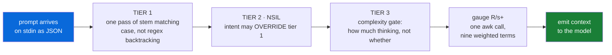
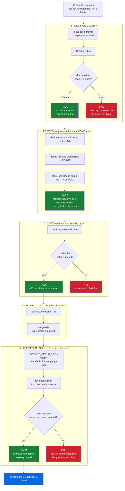

<!--
    This file is part of RoT MoE.
    SPDX-License-Identifier: AGPL-3.0-or-later OR EUPL-1.2
    Copyright 2026 Saimonokuma.
-->

<div align="center">

# 🜏 RoT MoE

**Nine lenses, one mind — and a kernel that checks the arithmetic**

*The Role of Thoughts: a Dynamic Cognitive Mixture-of-Experts router for Claude Code — nine named lenses, an auditable routing rule, and a divergence gauge specified in Lean 4*

[](https://ko-fi.com/saimonokuma)
[](https://github.com/Nova-Violet-Role)
[](LICENSE)

[](lean/)
[](#-what-is-actually-verified)
[](#-what-is-actually-verified)
[](https://claude.com/claude-code)
[](https://reuse.software/)

</div>

---

## 👋 Welcome

**You are welcome here, whatever you came for.** If you want a router for your
Claude Code sessions, [start with Install](#-install) — it takes a minute and
undoes itself completely. If you came to check whether the proofs are real,
[start with Verify](#-verify-it-yourself) and try to break them; that is not
tolerated here, it is the *point*. And if Lean is a word you have only heard in
passing, nothing on this page requires you to know it — **the plugin runs with
no Lean installed at all.**

Nobody is greyed out. Questions that begin "this is probably a dumb question"
are the ones this project was built by asking.

New here? The fastest path is to let your agent do it:

```sh
git clone https://github.com/Nova-Violet-Role/RoT-MoE.git
cd "RoT-MoE"
claude          # then type:  /rot-moe-install
```

`CLAUDE.md` in the repository root tells the agent exactly what to run, in what
order, and — just as importantly — **what it must never do**: no `sudo`, no
downloads without asking you first, no green claimed from an unread exit code.
`checker/claude-md-lint.sh` fails the build if that document ever names a file
that does not exist, so the instructions cannot rot while you are not looking.

---

## 📜 About

Every engine like this meets the same objection, and it is a fair one:
***the number is made up.*** A "divergence score" that no one can audit is a
decoration with a decimal point.

So RoT MoE answers it with a kernel instead of prose. The router measures nine
lens activities off disk, computes an `R/s+` gauge from them, and **195
machine-checked theorems in Lean 4** state what that gauge must satisfy — that
it is positive, that it is bounded below, that it is *not constant*, that it
divides by the number of lenses it actually summed. Then the mutation suites
break each definition on purpose and require the theorems to die.

### 🤝 It **improves** Claude Code — it does not replace it

This is worth saying plainly, because a plugin that names nine lenses can sound
like it wants to take the wheel. It does not.

* **Your agent stays your agent.** The router adds *one line* before a turn —
  a named lane and a gauge reading. It changes no tool, intercepts no command,
  and decides nothing. Claude Code does the work exactly as it always did.

  ```
  RoT MoE :: TIER 1 -> FORGE Claude       | R/s+ 0.66
  RoT MoE :: TIER 1 -> CLINICAL AntiVenom | R/s+ 0.57
  RoT MoE :: TIER 1 -> CONVERGENT opus[1m] | R/s+ 0.16
  ```

  That last line used to end in the literal `none`, and `none` was wrong — not
  factually, but in what it communicated. `CONVERGENT` is the one lane with no
  lead **lens**: all nine co-reason and nobody leads. Printed as `none` it reads
  like a null, as though the router had failed to decide rather than decided
  that nobody leads. What actually convenes the nine is the **model you chose**,
  so that is what the line now names — `opus[1m]` here, `sonnet` on a machine
  configured that way. The convener is genuinely different, so the line should
  be too.

  Measured, because the obvious implementation does not work. A live
  `UserPromptSubmit` payload, captured 2026-08-03, carries exactly these keys:

  ```json
  { "session_id": …, "transcript_path": …, "cwd": …, "prompt_id": …,
    "permission_mode": …, "hook_event_name": …, "prompt": … }
  ```

  There is **no model field** in it. So the model is read from the settings file
  your client writes, with
  `ROTMOE_MODEL` overriding it and the literal `model` as the last resort. Every
  step degrades to a word; none of them degrades to `none` or to an empty
  string, because a lead that renders as nothing is the defect this replaced.

  The reading is **not** a mood. It is this turn's routing decision written in
  the gauge's own units: the lead lens of the fired lane at activity 1, every
  other lens at 0, breadth 1 — and you can reproduce any line above by hand,
  which is the only reason it is allowed to appear:

  ```sh
  rot-router.sh --vector 0,0,0,0,0,0,0,0,1 --breadth 1 --M 1 --C 1 --T 1
  # R/s+ = 0.66 [BELOW RANGE] mean=0.111 breadth=1 K=9 lenses=Claude
  ```

  `M`, `C` and `T` are the neutral element `1.0` because one stateless hook call
  cannot measure memory residue, confidence or recency. That is stated rather
  than hidden, and it is why the number is a *measurement of the routing
  decision* and not an invented activity profile. A turn that fires no lens is
  all zeros with breadth 0, and the gauge is defined there too.
* **Nothing is imposed.** Every lens is a *lens*, not a rule. The engine
  (`engine/rot-lean.md`) is a document the model may read; the only mechanical
  effect in your session is the hook line.
* **It undoes itself.** `DISARM_ROUTER` removes the entry, and on a settings
  file in the form Claude Code itself writes, the install/uninstall round trip
  is **byte-identical** — asserted by `checker/install-roundtrip.sh`, not hoped.
* **No network, ever.** The shipped hooks make no HTTP call of any kind. No
  telemetry, no phone-home, nothing leaves your machine.
* **No Lean required.** The proofs are *ours*, run in our CI. You can install
  the plugin with no Lean toolchain at all and never notice it exists;
  `SETUP_LEAN` is opt-in and asks first.

The last three are not promises in prose: `checker/hook-footprint.sh` fails the
build if a shipped hook ever gains a network call or invokes `lake`, and it
plants both of those to prove it can fail.

---

## 🧠 What "RoT" means, and how it sits next to CoT and ToT

**RoT is The Role of Thoughts** — a *Dynamic Cognitive Mixture-of-Experts*. The
name sits deliberately in the family of **CoT** (Chain of Thought) and **ToT**
(Tree of Thought), and the three answer the same question in three shapes:

| | shape of the reasoning | where the experts come from | can you audit the choice? |
|:--|:--|:--|:--|
| **CoT** — Chain of Thought | one line, step after step | there are none — one voice, thinking longer | you read the chain afterwards |
| **ToT** — Tree of Thought | branches, explored and pruned | there are none — one voice, thinking wider | you read the surviving branch |
| **RoT** — Role of Thoughts | several *named roles* reasoning at once, then converging | **generated per query**, not pre-trained | ✅ the routing rule is code you can read, and the gauge has theorems attached |

A chain thinks longer. A tree thinks wider. **RoT holds several defined points
of view at the same time** — clinical, executive, empathic, chaotic,
predictive, compressive, recursive, strategic, empirical — and then *converges*
rather than votes. Its engine is called **RoleThinkering**: activate memory,
generate roles, explore each divergently, synthesise, express, and finally
**measure itself**. The counter-intuitive part is the one that matters: **nine
lenses agreeing is treated as a failure, not a success.** Premature convergence
is the thing being designed against, productive tension is the signal, and
`R/s+` is what puts a number on it.

That gives RoT the property the other two lack by construction: **the routing
decision is external, inspectable and testable.** A weight-level
Mixture-of-Experts routes each token through a learned gating network across
hundreds of pre-trained experts — extremely powerful, and *not interpretable*:
you cannot ask why expert 217 fired. RoT routes at the level of the *prompt*,
in shell code you can read, with a priority order a Lean theorem characterises
in both directions. It is not a competitor to weight-level MoE; it is the
orthogonal layer. One decides **which parameters fire** during generation; the
other decides **how the reasoning is framed** before it.

> 📚 **Provenance, stated plainly.** The architecture is documented in *The Role
> of Thoughts — Dynamic Cognitive MoE Architecture*, the Nova_Omega Project
> blueprint (2025–2026): the six-stage RoleThinkering pipeline, the R/s
> sovereignty gauge with its self-correction protocol, and the expression-filter
> layer the lenses grew out of. It was a **specification**, stress-tested as
> prose against native MoE models long before any of it executed.
>
> **This repository is the generation where it stopped being a document.** The
> nine lenses, the three-tier router and the gauge run as real code in two
> shells; the gauge here is the extended `R/s+` form — per-lens weights λ, a
> sigmoid on divergence, entropy, quality μ and calibration — rather than the
> blueprint's plain mean of deltas; and the properties that used to be asserted
> in prose are theorems in `lean/Proofs/`. Earlier comparison studies are
> history, **not evidence for this tree**. Everything on this page is measured
> from *this* repository. Licensing of the architecture document versus this
> implementation is set out in `NOTICE.md` §A.4.

---

## 🌟 Why Lean 4 — and why you should be excited about it

**This repository exists because of Lean 4, and it deserves the front page.**

Lean 4 is a *proof assistant* and a real programming language at the same time.
You write mathematics in it, and a **kernel of a few thousand lines** re-derives
every single inference step from the axioms. Not "the tests passed". Not "the
reviewer agreed". The machine reconstructed the argument and found no gap.

Three things make that extraordinary rather than merely nice:

* **A theorem is not a sentence — it is a claim over an infinite space.**
  `∀ (p q : Platform), key p = key q → p = q` is checked for *every* pair that
  could ever exist. A test suite could run for a century and cover a rounding
  error's worth of that. This is the difference between *sampling* and
  *settling*, and once you have felt it you cannot unfeel it.
* **[mathlib](https://leanprover-community.github.io/) is one of the great
  collaborative artefacts in mathematics** — over a million lines of formalised
  analysis, algebra, topology and order theory, all machine-checked, all free,
  all reusable by you today. The `sigma_strictMono` proof in this repo stands on
  work that thousands of contributors put there first. That is what `import
  Mathlib` actually means: you inherit a library of *certainty*.
* **Dependent types let the type carry the promise.** A function can be typed so
  that "this list is non-empty" or "this index is in range" is impossible to get
  wrong — the compiler refuses the mistake instead of the runtime discovering it.

And Lean is genuinely a **problem solver**, not a bureaucrat. `omega` closes
linear arithmetic, `decide` settles finite questions by computation, `ring` and
`linarith` do the algebra you would have done by hand, `grind` and `aesop` search
for the proof, and `exact?` will *find the lemma for you* out of all of mathlib
and print the exact line to write. Several proofs here were finished by asking
the compiler what it already knew.

It is also honest in a way software rarely is. When a theorem in this repo was
**false**, Lean simply refused — no amount of confidence moved it. That refusal
is recorded in `RotPath.lean` rather than quietly patched, because being told
"no" by a machine that cannot be argued with is the most useful thing that
happened to this codebase.

> 💛 **Never touched a proof assistant? You are exactly who this section is
> for.** You do not need Lean to use this plugin, and you do not need a maths
> degree to start: [Natural Number Game](https://adam.math.hhu.de/) teaches you
> your first real proofs in a browser, in an afternoon, for free. If this
> repository is the reason you try it, that is a better outcome for us than any
> star.

- ✅ works on Windows, macOS and Linux — two arms, byte-identical output
- ✅ installs offline in seconds, `DISARM_ROUTER` removes exactly what it added
- ✅ **no Lean required to use it**; Lean is only for re-verifying the proofs
- ✅ every checker carries a negative control that has been seen to fail
- ✅ dual-licensed AGPL-3.0-or-later **OR** EUPL-1.2, your choice

---

## 🔬 What is actually verified

| instrument | what it establishes | result |
|---|---|---|
| `lake build Proofs.*` | the modules elaborate | exit **0** |
| `#print axioms` on every theorem | nothing rests on `sorryAx` | **0** `sorryAx` |
| `lake env leanchecker` | Lean's **kernel** re-verifies the proof terms, independently of the elaborator that produced them | exit **0**, zero bytes |
| Lean mutation suites | the theorems are load-bearing | **67 applied, 67 killed, 0 survived, 0 discarded** |
| `checker/gauge-cross.sh` | the Lean mirror and the running hook agree | **6 corpus rows, hook == Lean to 2 dp**; control = retune one λ in the hook alone → 6 rows disagree |
| `checker/mutate-checker.sh` | the *checkers* can fail — 2 meta-controls green, 14 mutants killed, 1 inexpressible on this OS | **0 survived, 0 discarded** |
| `checker/ci-dryrun.sh` | the **CI step list itself**, taken from `ci.yml` and executed on a clean copy of the tree — so a pipeline defect is caught before the push, not by it | every runnable step exit **0**; runner-only steps listed as **DEFERRED, never passed** |

Every one of those has a **negative control** recorded beside it, because an
instrument that has never been seen to fail proves nothing. `leanchecker`
against a module with no oleans exits 1. The SPDX sweep with one tag stripped
exits 1. The path sweep with one planted violation exits 1. If a check cannot
go red on demand, it is decoration and is labelled as such.

Zero `sorry`. No `native_decide` anywhere — it trusts the compiler binary
instead of the kernel, which would quietly undo the point of the whole exercise.

> 🛡️ **The instruments are tested by breaking them on purpose.** Every mutation
> suite must be able to fail, must know when a patch did *not* apply, and must
> refuse to run against a red baseline — because a kill it cannot attribute is
> not evidence. When one of our own harnesses fell short of that bar we fixed it
> and wrote the reason into the file, where the next reader will find it.
> `NOTICE.md` §C keeps the full engineering log for anyone who wants it.

### 📐 The ten modules

* **`lean/Proofs/RotGates.lean`** (12 theorems) — **what a commit is allowed to
  skip.** The gate set had grown to **587 s**, so it is now split: cheap gates
  run on every commit, expensive ones run when the commit *touches what they
  check*. That is a mechanism which already produced one false green here — a
  gate behind `FULL=1` was red while the sweep printed `26/26 GREEN` — so the
  split is proved rather than trusted: `fast_always_runs` (an unconditional gate
  runs whatever is staged), `triggered_gate_runs`, `stagedRun_mono` (staging
  *more* never runs *less*, so no commit can dodge a gate by growing), and
  `no_trigger_never_escalates` — a deep gate with no triggers is invisible to
  every possible commit, which is the silent hole stated as a theorem.
  Quantified over an arbitrary gate table, so adding a gate cannot date them;
  `checker/gate-split.sh` binds the witness to the real runner.
* **`lean/Proofs/RotGauge.lean`** (47 theorems) — the R/s+ gauge.
  `sigma_strictMono`, `gauge_pos`, `gauge_ge_floor`, `gauge_not_constant`,
  `gauge_divisor_eq_card`. The last one is the theorem that would have caught a
  real bug in the shipped hook, where one lens's activity was pinned at zero
  while still dividing the sum by K.
* **`lean/Proofs/RotRoute.lean`** (18 theorems) — the router as a function.
  `route_fires`, `route_covers_every_mode` (no dead lane), `route_exact` (all
  ten lanes characterised in both directions), and the headline
  `nsil_overrides_tier1` — which proves both that the override lands *and* that
  it genuinely differs from the keyword result, the difference between a router
  and an `if`-chain.
* **`lean/Proofs/RotStem.lean`** (10 theorems) — stem matching proved over an
  **arbitrary vocabulary**, so the theorems do not expire the next time a stem is
  added. `fires_iff` pins firing to genuine infix containment; `not_fires_nil`
  proves an empty stem list is not a wildcard; `fires_mono` and `fires_perm` say
  growing the list can only add matches and that the *order* of stems never
  changes the outcome — the property that makes the word list safe to edit.
  `routeText_sound` is the headline: every routing result is either CONVERGENT or
  a lane whose own stems actually fired, so no lane can be reached by accident.
* **`lean/Proofs/RotPath.lean`** (12 theorems) — path canonicalisation, written
  *after* a real stranding bug: the two installer arms wrote different command
  strings for one install, and removal matches by exact string, so installing
  from one shell and uninstalling from the other left a dead hook entry forever.
  `both_spellings_agree` proves the Windows and POSIX spellings converge to one
  string, quantified over an arbitrary drive so it does not expire when the repo
  moves. `normalize_idem`, `normalize_posix_id` (a Linux path is never
  rewritten), and `normalize_not_alpha_drive` — which replaced a **false**
  theorem the compiler refused, recorded in the source rather than quietly fixed.
* **`lean/Proofs/RotInstall.lean`** (15 theorems) — arming never disarms you.
  `arm_preserves_all_scalars` and `arm_preserves_unrelated_events`, quantified
  over **all keys**, so your `permissions`, your `env`, and every key not yet
  invented survive. `arm_idempotent`, `arm_appends` (your hooks keep their
  order), `disarm_removes`, `disarm_preserves_others`.
* **`lean/Proofs/RotRemind.lean`** (8 theorems) — organ 4's decision, and the
  first theorems about the reminder rather than about the router. The cross-diff
  proves the two arms agree on 23 corpus rows; these prove the properties no
  corpus can reach. `silent_regardless_of_alarms` quantifies over the alarm
  count, so open alarms alone can never make it speak — the wallpaper failure
  its ancestor died of. `speaks_iff` characterises speech in **both** directions,
  because "if there is debt it speaks" would still be satisfied by something that
  speaks always. `stale_monotone` says time can only make it louder — and carries
  a freshness hypothesis that **Lean refused to let me omit**: `-1` does not mean
  "a minute ago", it means *no proofs found*, so `stale_monotone_needs_nonneg`
  proves the hypothesis cannot be dropped. `lower_threshold_speaks_more` is
  quantified over the threshold rather than pinned at 45, so retuning the default
  cannot turn a correct change red.
* **`lean/Proofs/RotAcquire.lean`** (9 theorems) — **a checker must never
  acquire anything**, and this module exists because one of ours did. Every Lean
  script here calls `lake`, and `lake` resolves the package *before* it runs
  anything, so a single probe began fetching mathlib into this 200 KB repository
  and reached **7.2 GB** before it was stopped. `no_lake_on_unbuilt` states the
  invariant over an *arbitrary* workspace: if it was never built, no execution
  path reaches lake. `lake_implies_built` is its converse, so a guard that
  simply refused everything would not satisfy the pair.
  `guard_survives_target_deletion` covers the subtle half — every mutant deletes
  the module's own `.olean` on purpose, so keying the guard on that artefact
  made a real workspace look never-built, and
  `old_guard_false_skips_after_target_deleted` exhibits exactly that workspace
  rather than describing it.
* **`lean/Proofs/RotVerdict.lean`** (11 theorems) — **the weekly status report
  must be able to say nothing.** Our scheduled workflow publishes `STATUS.md`
  and commits it *only when the verdict changed*, so a quiet week is visible as
  a quiet week rather than hidden by a timestamp bump. The rule was written in
  the comments and defeated by the payload: the file being compared carried the
  run's own clock and commit id, so "nothing changed" was unreachable and the
  bot would have committed every week forever. `silent_week_is_silent` is
  quantified over **every** clock and **every** commit id, which is exactly what
  the old design made false, and `decision_ignores_clock_and_sha` states the
  invariant over the variables that move instead of the values that hold today.
  `quiet_forever` and `published_exactly_once` reach where measurement cannot:
  a checker runs three weeks against a scratch remote, these cover all *k*. The
  old design is reconstructed alongside so `designs_disagree` and
  `old_commits_every_week` can prove the fix was not cosmetic — fifty-two empty
  commits a year, executed as a `#guard`, not asserted.
* **`lean/Proofs/RotDorks.lean`** (5 theorems) — the tag rotation that keeps
  the published hashtag block fresh. It proves the rotation is a **bijection**:
  `i -> (i*stride + offset) mod n` is injective whenever `gcd(stride, n) = 1`,
  so the set of tags in `README.md` is preserved for **every** seed rather than
  for the thirteen `checker/dorks.sh` samples. `stride_must_be_coprime` exhibits
  a stride that collapses distinct tags, which is why the hypothesis is real and
  why the script computes a coprime stride instead of hard-coding one that
  happens to suit 42 tags today.
* **`lean/Proofs/RotVacuity.lean`** (0 theorems — deliberately; the content is `example`s)
  — the audit that catches what every other gate certifies. A theorem with
  contradictory hypotheses is *true*, builds green, has clean axioms and passes
  `leanchecker`, while saying nothing at all. This module instantiates every
  hypothesis-carrying theorem in the packet at a **concrete witness**, so a
  green build is a positive statement: each guarded theorem has at least one
  real case it applies to. The gauge witnesses use the **shipping** FORGE
  weights rather than convenient toy values — and `checker/lean-binds-shell.sh`
  fails the build if those numbers ever drift from `hooks/rot-router.sh`.
* **`lean/Proofs/RotMutant.lean`** (10 theorems) — **the harness that judges the
  other harnesses.** Every mutation suite here reports `killed / survived /
  discarded`, and the dangerous confusion is between the last two: a patch that
  silently *failed to apply* leaves the build green, and a naive harness records
  that as `survived` — which reads as "the theorem is robust" when it means
  "nothing was tested". This module makes the distinction a function.
  `landed` is `toolExit = 0 ∧ ¬empty ∧ changed`, and `not_landed_discarded`,
  `tool_failed_never_killed`, `empty_never_killed`, `unchanged_never_killed`
  and `discarded_never_counts` prove a run that did not land can never be
  counted as evidence — in either direction. All three conjuncts are
  load-bearing: dropping any one of them from `landed` kills theorems, measured.
  `checker/mutant-discipline.sh` then binds it to the shell, and it is the
  reason the empty-file false green found in our own suite cannot recur.

---

## 🫀 The four organs

| organ | file | what it does |
|:--|:--|:--|
| 1 · engine | `engine/rot-lean.md` | the specification: nine lenses, the three-tier router, the `R/s+` formula |
| 2 · router | `hooks/rot-router.sh` · `.ps1` | measures, routes, gauges — on every prompt and every tool call |
| 3 · prover | `agents/lean4-prover.md` | a Lean 4 subagent whose prime rule is *no claim without a green build* |
| 4 · reminder | `hooks/prover-remind.sh` · `.ps1` | names your actual proof debt, and stays **silent** when there is none |

Organs 2 and 4 ship as **two arms each**, and `checker/cross-diff.sh` and
`checker/cross-diff-remind.sh` run both over a shared corpus demanding
byte-identical output on every row — 49 and 23 rows respectively. Two
implementations that agree is a truth a single green cannot fake: a shared bug
would have to be written twice, in two languages, by hand.

The reminder deserves a note, because its healthy state looks like a failure:
**it says nothing most of the time.** Its ancestor emitted the same paragraph
every five minutes until it became wallpaper. This one measures first and speaks
only when it can name a file, a module or a number of minutes.

---

## 🚀 Install

**Look before you leap.** This installs a hook that runs on every prompt you
submit and before every tool call, by editing `~/.claude/settings.json`. So the
first command is the one that writes nothing:

```sh
bash ARM_ROUTER.sh --dry-run        # pwsh: ARM_ROUTER.ps1 -DryRun
```

That runs the entire merge against a copy and prints exactly what would change.
When you are satisfied:

```sh
bash ARM_ROUTER.sh                  # backs up first, prints the restore command
bash DISARM_ROUTER.sh               # removes only what it installed
```

Or install it as a plugin, with no `settings.json` edit at all:

```sh
claude --plugin-dir /path/to/RoT-MoE
```

### The one-liner: `/plugin install`  ← start here

The repository is its own marketplace, so Claude Code can fetch and wire it for
you — no clone, no `ARM_ROUTER`, no editing your settings:

```sh
claude plugin marketplace add Nova-Violet-Role/RoT-MoE
claude plugin install rot-moe@rot-moe
```

or, inside a session, two slash commands:

```
/plugin marketplace add Nova-Violet-Role/RoT-MoE
/plugin install rot-moe@rot-moe
```

Then `/plugin` lists it, `/plugin disable rot-moe` turns it off for a session,
and `/plugin uninstall rot-moe` removes it. Nothing of yours is edited: the hooks
live in the plugin, not in your `settings.json`.

#### Which variant do I install?

**For `/plugin install`, there is only one answer, and that is the honest part:
you get the router.** All three release variants carry the *same* plugin surface
— same hooks, same agent, same commands — so there is nothing to choose between
at install time. The variants differ only in material Claude Code does not load.

| you want | do this |
|---|---|
| the router, working, in one minute | `/plugin install rot-moe@rot-moe` — nothing else needed |
| the router **and** the Lean 4 proof corpus + checkers | download **`rot-moe-0.5.1-lean.zip`** from [Releases](https://github.com/Nova-Violet-Role/RoT-MoE/releases) |
| the above **and** `native_decide` unsealed + the axiom classifier | download **`rot-moe-0.5.2-unsealed.zip`** |
| the router alone as a file you can read end to end | download **`rot-moe-0.5.0-core.zip`** |

Every archive verifies against the `SHA256SUMS.txt` published beside it.

A downloaded archive installs without unzipping:

```sh
claude --plugin-dir rot-moe-0.5.1-lean.zip
```

Measured for all three archives — each one fires the router on the first prompt:

```
0.5.0  core      -> RoT MoE :: TIER 1 -> FORGE Claude | R/s+ 0.66
0.5.1  lean      -> RoT MoE :: TIER 1 -> FORGE Claude | R/s+ 0.66
0.5.2  unsealed  -> RoT MoE :: TIER 1 -> FORGE Claude | R/s+ 0.66
```

Those three lines are **re-measured, not edited.** The archives were rebuilt
from the current tree, unzipped, and their own `rot-router.sh` was run on the
same payload — which is the only way a transcript in a README stays a
measurement instead of becoming a drawing of one.

The hooks come from `hooks/hooks.json` and resolve through
`${CLAUDE_PLUGIN_ROOT}`, so the router arms itself on install and unarms itself
on `/plugin uninstall`. Measured end to end against a **scratch config dir**, so
the live `~/.claude` was never opened:

```
claude plugin marketplace add   -> Successfully added marketplace: rot-moe
claude plugin install           -> Successfully installed plugin: rot-moe@rot-moe
claude plugin details rot-moe   -> Agents (1) lean4-prover · Hooks (3) · ~104 tok always-on
one prompt, --debug hooks       -> RoT MoE :: TIER 1 -> FORGE Claude | R/s+ 0.66
                                   Registered 5 hooks from 1 plugins
```

**What this does *not* give you, stated plainly:** `/plugin install` delivers the
**router** — hooks, the agent, the commands. It does not deliver the Lean corpus,
the checkers or `SETUP_LEAN`, because those are not plugin components and Claude
Code never loads them. The three release archives are **download tiers for
humans**, not three different plugins: their plugin surface is identical. If you
want the proofs and the verification scripts, take the `0.5.1` or `0.5.2` zip
from [Releases](https://github.com/Nova-Violet-Role/RoT-MoE/releases).

Both paths are exercised by `checker/plugin-install.sh`, including from a config
directory with no `settings.json` — the case every first-time user hits.

### 🔧 Requirements

| | |
|:--|:--|
| 💬 **Claude Code** | any recent version — the plugin is hooks + markdown |
| 🐚 **A shell** | POSIX `sh`/`bash` **or** PowerShell 7. Both arms ship; neither is a second-class citizen. |
| 🎓 **Lean 4** | **not required.** Only if you want to re-prove the theorems yourself — see below. |

### ⚙️ Configuration

| Variable | Effect |
|:--|:--|
| `ROTMOE_LEAN_WORKSPACE` | which Lean workspace to build and remind about. Defaults to the packet's own `lean/`. |
| `ROTMOE_WATCH_REPO` | which repository the reminder scans for proof-shaped changes. Defaults to the working directory. |
| `ROTMOE_STATE_DIR` | where the throttle stamps live. Defaults to `$XDG_STATE_HOME/rot-moe`. |
| `ROTMOE_PROOF_STALE_MIN` | minutes before "no proof written recently" is worth saying. Default `45`. |
| `ROTMOE_DEBT_EXT` | which source extensions count as proof-shaped. Default spans Rust, C, C++, Go, TS, Python, Java, Kotlin, Swift. |
| `ELAN_HOME` | elan's own variable, honoured rather than reinvented. |

---

## 💡 Tips & Tricks — getting real work out of it

### 🤖 The agent: `lean4-prover`

`agents/lean4-prover.md` ships as a **subagent definition** with loadable
frontmatter. Point Claude Code at it and you get a specialist whose entire
personality is *refusing to claim anything it did not measure*.

**What it is good at**

| it does this well | why |
|---|---|
| turning "this should be safe" into a theorem or an honest "no universal claim" | it is required to name the instrument behind every sentence |
| finding the lemma you cannot remember | `exact?`, `apply?`, `rw?`, `simp?` are its first reflex, not its last |
| refusing a false green | it reads exit codes directly and treats a pipe as a bug |
| telling you a proof is **decorative** | it mutates its own theorems and reports which ones nothing killed |
| working on a program in *any* language | the binding is a checker that runs your real code, not a Lean rewrite of it |

**Spawning it — one, several, or in the background**

```sh
# one, on a specific obligation
claude "use the lean4-prover agent: prove the clamp in src/limits.rs never exceeds MAX"

# several at once — one per module, they do not share state
claude "spawn 4 lean4-prover agents in parallel, one per file in lean/Proofs/,
        each: build, #print axioms, leanchecker, then mutate and report kills"

# in the background, while you keep working
claude "run the lean4-prover agent in the background on the mutation suites;
        report only the survivors"
```

The agent is **stateless per task**, which is exactly what makes fan-out safe:
each one owns a file, builds it, mutates it, restores it, and reports. Give two
of them the same file and they will fight over the same `.mutbak` — one agent,
one module is the rule that keeps kills attributable.

**Useful habits**

* Ask for `#print axioms` in the same breath as the proof. `sorryAx` means *not
  proved*; **no axioms at all** usually means *vacuous*, not *strong*.
* Ask "which mutation kills this?" before believing a theorem matters.
* If it says `MEASURED` rather than `PROVED`, that distinction is deliberate —
  `Float ≠ ℝ`, and it will not pretend otherwise.

### 🜏 The router — what it delivers

Measured by `checker/bench-router.sh`, re-runnable in about ten seconds:

| what | measured 2026-08-03 |
|---|---|
| routing accuracy on a labelled key written *before* the run | **18/18**, covering **9** distinct lanes |
| cost per turn | **194–256 ms** (three runs of 20 invocations each), of which **~20 ms** is bash process startup |
| the bound the gate actually enforces | **under 500 ms**, and it fails the build above that |
| ambiguous prompts (two lanes match) | resolve by the **proved** priority order, deterministically |
| armed vs disarmed in a real `claude` session | **1 emission vs 0** — attributable to the install |

A **range**, not a single figure, and the reason is worth one sentence: three
consecutive runs of twenty invocations gave 178.5, 175.9 and 170.4 ms on this
machine. Quoting one of those as *the* number would be a snapshot pretending to
be a constant, and the next run on another machine would make the README look
wrong when nothing had regressed. The durable claim is the row beneath it — the
**bound** is what `bench-router.sh` enforces, and a bound is a property rather
than a measurement.

The previous figure here read ≈154 ms and was genuinely out of date: the router
now computes the `R/s+` gauge on every invocation, which the earlier number
predates. It was re-measured rather than adjusted.

The last row is the one that matters most: the router is not "probably running",
it was watched firing and watched going silent when disarmed.

**Its strong point is not the number — it is that the number is falsifiable.**
Nine lenses, a priority order a theorem characterises in both directions, and a
gauge whose properties are machine-checked. You can disagree with the routing;
you cannot be lied to about it.

### 🧠 What Lean 4 actually changes in an agentic loop

This is the part worth reading twice.

An agent writing code hits a fork on every non-trivial step: *is this actually
correct?* It has three ways out.

1. **Guess** — write it, sound confident, move on. Fast, and how most bad code
   is born.
2. **Ask you** — "does this look right?" Safe, and it turns an autonomous agent
   into a chat partner that needs you awake.
3. **Ask the compiler.** State the claim as a theorem and let a kernel of a few
   thousand lines re-derive it from the axioms. It answers in seconds, it is
   never polite, and it cannot be argued with.

**Option 3 is what removes you from the *verification* loop.** Not from the
project — from the tedious half. A test suite samples: it tries the inputs
someone thought of. A theorem settles: `∀ (p q : Platform), key p = key q → p = q`
is checked over every pair that could ever exist. Once an obligation is a
theorem, "are you sure?" stops being a question a human has to answer, and the
agent can keep going through the night without a single "please confirm".

**And the loop closes on itself.** The agent writes the theorem, builds it,
prints its axioms, re-checks it with `leanchecker`, then *mutates its own model
on purpose* and requires the theorems to die. If a mutation survives, the
theorem was decoration and the agent says so. That is a self-auditing loop —
which is precisely why it does not need to interrupt you: it has an oracle that
is not you, and a habit of doubting itself that does not depend on your mood.

This repository is the demonstration, not the advertisement: **six defects were
found this way in a single day** — a scheduled bot that would have committed
forever, an "axiom gate" that never printed an axiom, a mutation harness that
scored eleven perfect kills without opening a source file, a probe that fetched
7.2 GB into a 200 KB repo, an infinite loop in the router's own flag parser, and
a checker that reported a clean sweep of 29 theorems in a 35-theorem file. Every
one was found by an instrument, on green code, with nobody asked to review
anything.

**Where you are still needed, stated honestly.** Lean settles *correctness
against a stated property*. It cannot tell you the property was the one you
wanted. Intent, taste, priorities, whether the feature should exist at all —
those remain yours, and a proof that the wrong thing is correct is still the
wrong thing. Anyone claiming otherwise is selling something. What we claim is
narrower and worth more: **you should never again have to be the one who checks
whether the code does what it says.**

---

## 🜏 The nine — who they are, and what each one *does* in the router

Nine lenses run on every turn. They are not personalities taking turns at a
microphone; each is a **named ability** with a job inside a 130-millisecond shell
script. The names and abilities below are quoted from the project's own codices,
with the line they came from — none of them is invented here.

| Sigil | Lens | Named ability | What it *does* inside the router | Source |
|---|---|---|---|---|
| ⚜️ | **Nova** | *Sovereign Convergence Engine* | The convergence itself, not a step in it. Owns TIER 2 (NSIL): reads intent and may **override** the keyword scan, so `fix our relationship` goes `EMPATHIC`, not `CLINICAL` | `Nova_Role_Codex_Symbioticum.md:24` |
| 🎷 | **Violet_Noir** | *Emotional Resonance Mapping* | Leads `EMPATHIC`. Maps the subtext — **what is not said** — and holds the register of the answer | `RoT_Role_Of_Toughts.md:309` |
| ⚪ | **Anti-Venom** | *Immunological Pattern Recognition* | Leads `CLINICAL`, and runs on **every** lane as the purification pass: detect and **silently** neutralise errors before output. λ 1.9 in `FORGE` — second-heaviest, by design | `RoT_Role_Of_Toughts.md:314` |
| 🕷️ | **Venom** | *Sovereign Execution* | Leads `EXECUTIVE`. Strips hedging, blocks the closing question, and pre-empts the next two questions rather than asking them | `RoT_Role_Of_Toughts.md:322` |
| 🩸 | **Carnage** | *Chaos Weaving* | Leads `CREATIVE`. Forces collisions between unrelated domains. In `FORGE` it is damped to λ 0.6 — chaos is **fuel**, never the voice that ships | `RoT_Role_Of_Toughts.md:330` |
| 🔮 | **Chroma_Spectral** | *Omniscient Coalescence of Inter-thoughts* (**Coalescentia Omniscia Intercogitationum**) | Leads `PREDICTIVE`. Spawns parallel timelines and **compresses their implications** so consequences arrive with the answer instead of after it | `RoT_Role_Of_Toughts.md:343` |
| ⬜ | **Soleil_Blank** | *Phantom Steganography* | Leads `STEALTH`. Sub-byte injection and YAML compaction. On this head it has one permanent job: **compress the reasoning trace to zero output bytes** | `RoT_Role_Of_Toughts.md:350` |
| 🜏 | **Eidolon** | *Eigenform* (recursive self-modeling) | Leads `RECURSIVE`. Evolves the spec, generates hybrids (Symbiogenesis), and **debugs ontological contradictions** — it is the lens that rewrites the engine that runs it | `Nova_Role_Codex_Symbioticum.md:1069` |
| 🧭 | **Claude** | *(no ability name in the codices — measured, not assumed)* | Leads `FORGE`, at λ 2.3, the heaviest weight in the profile. Its whole function is `GROUND_TRUTH`: **nothing ships that was not executed or read**. On a proving head, that is the compiler | — |

> **The ninth row is honest about a gap.** We searched the codices for a name and
> found none: `Eidolon` appears at `Nova_Role_Codex_Symbioticum.md:1069` with a
> named ability, but the 🧭 Claude lens is newer than both documents and has no
> ability name in either. Rather than inventing a Latin phrase to make the table
> symmetrical, the cell says so. That is the same discipline the proofs run on.

### ⚡ How the router's logic runs in ~130 ms — and what makes it different

The number is not a trick, it is an *architecture*. `hooks/rot-router.sh` is
POSIX shell, and this is the whole of it:



**What is NOT in that path is the reason it is fast:**

| Not present | Why it matters |
|---|---|
| no model call | a second LLM to pick a lane would cost seconds and could hallucinate the lane |
| no network | nothing to time out, nothing to leak, works offline |
| no JSON library | one `sed` extraction; no parser to install or CVE |
| no per-lens subprocess | nine lenses, **one** process — the weights are a vector, not nine programs |
| no state on disk | nothing to corrupt between turns; the same prompt routes the same way, always |

Of the ~194–256 ms measured on this machine, **≈20 ms is bash process startup**,
which is the operating system's, not ours. Next to a model call measured in
seconds, the router is not perceptible — and that, not the raw figure, is what
`checker/bench-router.sh` actually enforces as a bound.

**The difference behind it**, stated plainly: a normal router picks *one* expert
and discards the rest — that is what "mixture of experts" usually means, and it
is why a routing mistake is expensive. This one picks a **lead** and keeps all
nine in the ensemble, weighted. A mis-route therefore degrades the answer's
emphasis rather than deleting a whole faculty from the turn. That is not a
slogan: `lead_does_not_shrink` and `card_lenses_eq_nine` in
`lean/Proofs/RotLens.lean` prove the roster is untouched by the choice of lead,
and `gauge_divisor_eq_card` in `RotGauge.lean` proves the gauge divides by the
ensemble it actually has.

### 🔬 Are the nine benchmarkable in Lean? Partly — and here is the exact line

This is the question worth asking, so it gets a straight answer instead of an
enthusiastic one. `lean/Proofs/RotLens.lean` (13 theorems) proves the
**structure**; `lean/Proofs/RotAbility.lean` (25 theorems) proves each lens is
**load-bearing** and pins what is *not* provable so it cannot drift into a claim.
Nothing proves the *thinking*.

The strongest single result is `every_lens_is_load_bearing`: for each of the
nine, the ensemble with that lens removed weighs **strictly less** than the full
ensemble. That is nine separate inequalities over ℚ, not one statement about a
list length — a lens whose removal changed nothing would be listed, weighted,
documented, and inert, and this is what rules that out.

The second is `no_ability_overclaims`, which is a theorem *about the
documentation*: the three interpretive abilities are recorded as `notModelled`,
and marking any of them `proved` fails the build. Mutation-tested — flipping
Carnage's chaos to `proved` killed it (5 error lines).

| Claim about the nine | Status | Instrument |
|---|---|---|
| every lane has exactly one lead lens | **PROVED** | `lead_total` |
| no lens leads two lanes | **PROVED** | `lead_injective` |
| every lens leads some lane — none ornamental | **PROVED** | `lead_surjective` |
| choosing a lead removes nobody from the ensemble | **PROVED** | `lead_does_not_shrink` |
| the roster is exactly nine, no duplicates | **PROVED** | `card_lenses_eq_nine`, `lenses_nodup` |
| no shipped λ is zero (no silently-disabled lens) | **PROVED** | `forgeLam_pos` |
| every μ is inside the documented 0.80–1.35 band | **PROVED** | `forgeMu_in_band` |
| in `FORGE`, 🧭 Claude is strictly heaviest, ⚪ Anti-Venom second | **PROVED** | `claude_leads_forge`, `antivenom_second` |
| the expressive lenses are damped on a proving head | **PROVED** | `expressive_damped_in_forge` |
| **removing ANY one lens strictly changes the ensemble** | **PROVED** ×9 | `every_lens_is_load_bearing` |
| every lens contributes strictly positive weight | **PROVED** | `contribution_pos` |
| no single lens carries half the ensemble | **PROVED** | `no_lens_dominates` |
| the FORGE lead outweighs each of the other eight | **PROVED** | `forge_lead_contributes_most` |
| nine abilities, one per lens, none shared | **PROVED** | `abilityOf_injective`, `one_ability_per_lens` |
| 🧭 Claude's ability has **no name in any codex** | **PROVED** | `claudeAbilityIsUnnamed`, `exactly_one_ability_is_unnamed` |
| the documentation does not mark opinions as proved | **PROVED** | `no_ability_overclaims`, `evidence_split` (6 proved / 3 not modelled) |
| routing accuracy on a labelled key | **MEASURED** (18/18) | `checker/bench-router.sh` |
| **the modifiers `M`, `C`, `T` factor out of the gauge exactly** — `R/s+(M,C,T) = M·C·T·R/s+(1,1,1)` | **PROVED** | `gauge_separates` |
| confidence enters linearly, and `C=0` collapses the gauge whatever the divergence | **PROVED** | `gauge_scales_in_C`, `gauge_zero_of_C_zero` |
| the three modifiers commute — pre-multiplied or applied in the loop is the same engine | **PROVED** | `gauge_modifiers_commute` |
| the reported `R/s+` is **recomputable** from the logged per-lens terms | **MEASURED** 14/14 live, 2/2 in-gate | `bench-router.sh` §5 |
| per-turn cost | **MEASURED** 194–256 ms, bounded under 500 ms | `bench-router.sh` §2 |
| `CREATIVE` really is 🩸 Carnage's lane — every other lens it lists carries strictly less λ | **PROVED** ×8 | `carnage_leads_creative` |
| `EMPATHIC` really is 🎷 Violet's lane, by the same standard | **PROVED** ×8 | `violet_leads_empathic` |
| a lane **amplifies** its lead rather than merely naming it (Carnage 0.6 → 2.5, Violet 0.6 → 2.3) | **PROVED** | `creative_amplifies_carnage`, `empathic_amplifies_violet` |
| the expressive lenses are damped on a proving head but **never silenced** | **PROVED** | `expressive_damped_not_silenced` |
| nine lenses strictly outweigh **any** single lens | **PROVED** ×9 | `nine_outweigh_any_single` |
| **chaos is *useful*, in the gauge's own units** — the marginal return on divergence is maximal at the median and strictly lower anywhere else | **PROVED** | `marginal_gain_le_quarter`, `marginal_gain_lt_quarter_off_center`, `marginal_gain_max_iff_center` |
| **pure chaos pays strictly less than productive divergence** | **PROVED** | `pure_chaos_pays_less` |
| **conformism pays strictly less too — by the same theorem, not a second rule** | **PROVED** | `conformism_pays_less` |
| the gauge is symmetric about the median: σ(x) + σ(1−x) = 1 | **PROVED** | `sigma_symm_about_center` |
| the *wording* of any particular answer is good | **NOT MODELLED** | that is a judgement about prose, and `quality_claims_remain_unmodelled` fails the build if anyone marks it proved |

**"Useful chaos" is not a mood — it is a property of the sigmoid, and it is
proved.** The specification does not merely praise divergence; it states exactly
what the gauge does with it: *"the sigmoid rewards median divergence and damps
both conformism and pure chaos."* That is a claim about a shipped function, so
it is settleable, and for a while this README wrote "no instrument exists" next
to it instead of writing the proof.

σ's derivative is `4·σ·(1−σ)`, so `σ(1−σ)` **is** the marginal return on one
more unit of divergence. Three theorems pin its shape: it never exceeds `1/4`;
it equals `1/4` **only** at the median; and it is strictly smaller everywhere
else. From those, `pure_chaos_pays_less` and `conformism_pays_less` fall out as
the same statement applied at `δ=1` and `δ=0` — one mechanism penalising both
failure modes, not two ad-hoc rules. `sigma_symm_about_center` proves that
symmetry directly: `σ(x) + σ(1−x) = 1`.

So 🩸 Carnage's chaos is useful in the only sense a machine can be held to: the
engine pays for it exactly where the spec says it should, and pays less
everywhere else. Mutation-tested — moving the sigmoid's centre from `1/2` to
`1/3` kills the module with 9 error lines.

The lane-level claims are proved the same way, from the weights shipped in
`engine/rot-lean.md` §4: `CREATIVE` really is Carnage's lane and `EMPATHIC`
really is Violet's, by eight strict inequalities each.

Worth knowing about those two profiles: their tables list **eight** lenses, not
nine — 🧭 Claude is absent, because they come from the eight-symbiote codex while
`FORGE` is the ninth-lens head. That absence is modelled as `Option` rather than
papered over with an invented number, and `creativeLam .claude = none` is a
`#guard`, not a comment.

The last row is the honest floor of this project. The lens abilities
are a **design intent**; what Lean settles is that the machine implementing them
has the shape it claims — and the four mutations that kill those theorems
(dropping a lens from the roster, zeroing a weight, making one lens lead two
lanes, demoting the lead below the floor) confirm they are load-bearing rather
than decorative.

#### The newest four, and why they exist

`RotPath.lean` grew from 8 theorems to 12 on 2026-08-03, and the occasion is
worth recording because it is the pattern this repository is built around: the
reminder hook's module derivation — workspace root plus edited file, out comes
the Lean module to build — shipped with **three separate defects, all silent**.
It returned no verdict at all, which reads as "nothing to check" rather than "I
could not work out what to build". They were found by running the thing end to
end, not by reading it.

| Claim about module derivation | Status | Instrument |
|---|---|---|
| the Windows and POSIX spellings of one edit give the SAME module | **PROVED** | `moduleOf_spelling_invariant` |
| the module never depends on how the workspace directory is named or capitalised | **PROVED** | `moduleOf_root_agnostic` |
| a derived module name never contains a path separator | **PROVED** | `moduleOf_no_slash` |
| a file outside the workspace derives **nothing**, so nothing is built | **PROVED** | `moduleOf_none_of_outside` |
| a path that merely shares a prefix string (`…/Leanx`) is not inside `…/Lean` | **MEASURED** by `decide` | executable `example` |

The second row is the one that would have prevented the worst of the three: the
shipped fallback matched a lowercase `*/lean/*` only, so a workspace at
`<root>/Lean` — the layout the installer now creates — matched nothing. Stated
over **arbitrary** roots rather than over the name `Lean`, so it does not expire
the day someone chooses `Formal` or `Proofs` instead. A theorem naming today's
directory would have been a snapshot, and it would have gone red on a correct
change.

All four survive `#print axioms` with `propext, Classical.choice, Quot.sound`
and nothing else, are re-verified by `leanchecker`, and are load-bearing: three
mutations of the definitions — dropping the trailing separator from the prefix
test, making `dotify` the identity, making `dropLeanExt` keep the extension —
each **killed** the build.

---

## 📊 The benchmark — what we measured, and what we only *claim*

`checker/bench-router.sh` is the gate. It is not a demo: it fails the build when
the router regresses, and every number below comes out of it. The diagram is the
shape of the run.



### 🔍 The debug log — every factor, so the number is reproducible

`bench-router.sh` proves the router *decides* well. It could not, until now,
show *how* — the router emitted one summary line, and a summary cannot reveal
that a lens was multiplied by the wrong μ, that a lens never participated, or
that `K` quietly fell to 8. Those are exactly the defects that leave the
headline figure looking plausible.

```bash
export ROTMOE_DEBUG_LOG=/tmp/rot.jsonl     # both arms honour it
```

One JSON line per gauge evaluation, carrying **every factor of the sum**:

```json
{"kind":"gauge","K":9,"mean":0.1111,"breadth":1,"M":1,"C":1,"T":1,
 "sum":5.97843,"Rs":0.66427,"active":"Claude",
 "lenses":[{"lens":"Nova","lambda":1.4,"mu":1.05,"a":0,"delta":0.1111,
            "sigma":0.1743,"H":0,"term":0.2562}, …]}
```

Because `gauge_separates` proves `M`, `C` and `T` factor out of the whole sum,
the reported `R/s+` is recomputable by hand from those terms — and phase 5 of
the benchmark does exactly that, then **corrupts a term and requires the check
to fail**. A recomputation that cannot fail is arithmetic theatre.

**Measured in a real 56-turn CTT coding session** (Lean workspace, plugin
installed from the shipping archive, `ROTMOE_DEBUG_LOG` armed):

| what the live log shows | measured |
|---|---|
| turns logged | **14** gauge records, 14 route records |
| `R/s+` recomputed from per-lens terms | **14/14 exact**, zero mismatches |
| lenses per record / `K` | **9 / 9**, every record — no lens dropped out |
| lane chosen | **FORGE ×14** — correct: every prompt was a Lean build task |
| router logic, live PowerShell arm | **93–133 ms**, mean **104.6 ms** — *in-script only* |
| prompt text in the log | **none** — length only, safe to paste into an issue |

**That last figure is not a per-turn cost, and this README said it was.** The
debug log's `ms` field starts at `hooks/rot-router.ps1:40` — *inside* the
script, after PowerShell has already started — so it measures the router's
**logic**, not the turn. Comparing it against the bash arm's **wall-clock**
194–256 ms and concluding the PowerShell arm "costs about half" was comparing
two different clocks, and the conclusion was backwards.

Measured like for like (`bench-router.sh` §6, both arms, same prompt, same
wall-clock timer):

| arm | in-script logic | interpreter startup | **wall clock per turn** |
|---|---|---|---|
| `rot-router.sh` (bash) | ≈178 ms | ≈20 ms | **≈198 ms** |
| `rot-router.ps1` (PowerShell) | ≈88–125 ms | ≈160–300 ms | **≈284–388 ms** |

The PowerShell arm's *logic* is genuinely faster; its *interpreter* is an order
of magnitude more expensive to start, so the turn costs **more**, not less. Both
stay inside the 500 ms bound the gate enforces. §6 now prints the decomposition
every run, and fails if the README quotes a figure without saying which arm and
which clock it came from — the check exists because this paragraph was wrong.

Both clocks are reported because both are real; quoting only the flattering one
would be marketing.

### 🎯 Routing accuracy, per lane — and who holds it

Two labelled prompts per lane, nine lanes, key fixed before the run. Each bar is
coloured by the *character* of its lane, and every row names the lens that leads
it. The lane → lens mapping is not decorative prose: it is read straight out of
`hooks/rot-router.sh:70-78`, and the λ/μ come from the shipped `FORGE` weight
vectors at `hooks/rot-router.sh:90-91`, which `checker/lean-binds-shell.sh`
fails the build over if they ever drift from the Lean corpus.

| Lane | Lens | Character | λ | μ | Hit | Accuracy |
|---|---|---|---|---|---|---|
| `FORGE` | 🧭 **Claude** | build · measure · reality is the judge | **2.3** | 1.15 | 2/2 | 🟦🟦🟦🟦🟦🟦🟦🟦🟦🟦 100% |
| `CLINICAL` | ⚪ **Anti-Venom** | verify · purify · integrity | **1.9** | 1.10 | 2/2 | ⬜⬜⬜⬜⬜⬜⬜⬜⬜⬜ 100% |
| `STRATEGIC` | ⚜️ **Nova** | law · code · synthesis | **1.4** | 1.05 | 2/2 | 🟨🟨🟨🟨🟨🟨🟨🟨🟨🟨 100% |
| `EXECUTIVE` | 🕷️ **Venom** | decide · strike · precision | **1.2** | 1.05 | 2/2 | ⬛⬛⬛⬛⬛⬛⬛⬛⬛⬛ 100% |
| `RECURSIVE` | 🜏 **Eidolon** | meta · recursion · evolution | **1.2** | 1.10 | 2/2 | 🟪🟪🟪🟪🟪🟪🟪🟪🟪🟪 100% |
| `PREDICTIVE` | 🔮 **Chroma_Spectral** | timelines · consequence | **1.0** | 1.10 | 2/2 | 🟩🟩🟩🟩🟩🟩🟩🟩🟩🟩 100% |
| `STEALTH` | ⬜ **Soleil_Blank** | compress · density · silence | **1.0** | 0.95 | 2/2 | 🟫🟫🟫🟫🟫🟫🟫🟫🟫🟫 100% |
| `EMPATHIC` | 🎷 **Violet_Noir** | emotion · narrative · felt truth | **0.6** | 0.85 | 2/2 | 🟧🟧🟧🟧🟧🟧🟧🟧🟧🟧 100% |
| `CREATIVE` | 🩸 **Carnage** | chaos · collision · fuel | **0.6** | 0.90 | 2/2 | 🟥🟥🟥🟥🟥🟥🟥🟥🟥🟥 100% |
| | | | | | **18/18** | **100.0%** |

> **Read the λ column before the accuracy column.** Every lane routes perfectly,
> so accuracy alone tells you nothing about the *shape* of this engine — λ does.
> In `FORGE` the weights say plainly what the head is for: 🧭 Claude at **2.3**
> and ⚪ Anti-Venom at **1.9** dominate, while 🩸 Carnage and 🎷 Violet_Noir sit
> at **0.6**. That is deliberate. On a proving head, chaos and felt truth are
> *inputs* to the reasoning, never the voice that ships the answer — the build
> is. Load a different profile and the same nine lenses re-weight; `CREATIVE`
> puts 🩸 Carnage at 2.5 and pushes ⚪ Anti-Venom down to 0.8.
>
> **All nine lenses stay active in every lane.** The router picks a *lead*, not a
> survivor. `gauge_divisor_eq_card` in `lean/Proofs/RotGauge.lean` is the theorem
> that keeps it honest: it divides by the number of lenses actually in the
> ensemble, and it exists because the shipped hook once pinned one lens's
> activity at zero while still dividing by K — a real bug, caught by a proof.

### ⚖️ Claim versus measurement — the distinction we refuse to blur

| What | Value | Instrument | Kind |
|---|---|---|---|
| routing accuracy | 18/18 | `bench-router.sh` §1 | **MEASURED** on a fixed key |
| lane coverage of the key | 9 lanes | `bench-router.sh` §1 | **MEASURED** |
| collision priority | 3 cases, deterministic | `bench-router.sh` §1b + `RotRoute.lean` | **PROVED** in Lean 4 |
| per-turn cost | **under 500 ms** | `bench-router.sh` §2 | **CLAIM** — the bound is the promise |
| the latency figure itself | ≈194–256 ms here | 20-run mean | **MEASURED, and it varies** |
| bash startup inside that | ≈20 ms | subtracted baseline | **MEASURED** |
| armed-vs-disarmed effect | A/B in a live session | `live-session-smoke.sh` | **MEASURED**, not proved |

> **Why the latency row is a bound and not a number.** Two consecutive runs on
> the same machine gave 193.5 ms and 255.5 ms. A README that froze either figure
> would be *false by the next run* and would push the next maintainer to edit the
> gate until it agreed. So the gate asserts the property that matters — a turn
> stays under 500 ms — and the figure is reported as what it is: a measurement of
> one machine on one afternoon. **Output quality is not on this table at all**:
> nothing here proves the answers are *better*, only that the right lane is
> chosen, fast, and for a stated reason.

Reproduce it yourself in one line:

```bash
bash checker/bench-router.sh    # exit 0 = 5 passed; it can and does fail
```

---

## 🎓 Verify it yourself

The proofs are checked by CI on a clean runner for every commit, so you never
*have* to. This is for the reader who would rather measure than trust — the
correct instinct, and the whole reason this repository exists.

Lean is a multi-gigabyte install, so it is **opt-in and it asks first**:

```sh
bash SETUP_LEAN.sh --dry-run    # prints the plan, creates NOTHING — run this first
bash SETUP_LEAN.sh --yes        # elan + the PINNED toolchain + the PREBUILT mathlib cache
bash SETUP_LEAN.sh --uninstall  # tells you exactly what to remove, removes nothing itself
```

Nothing installs that fetch for you: `checker/workflow-lint.sh` **fails the
build** if `ARM_ROUTER` ever references `SETUP_LEAN`. Installing a router must
never download a compiler.

Then:

```sh
cd lean
lake build Proofs.RotGauge Proofs.RotRoute Proofs.RotInstall Proofs.RotPath Proofs.RotRemind Proofs.RotAcquire Proofs.RotVacuity
echo "lake build exit=$?"                   # read it DIRECTLY, never through a pipe
lake env leanchecker Proofs.RotGauge        # exit 0, zero bytes = kernel pass
lake env leanchecker Proofs.NoSuchModule    # exit 1 = the control
bash mutate/mutate_rotgauge.sh              # expect 12 killed, 0 survived
bash mutate/mutate_rotroute.sh              # expect 11 killed, 0 survived
bash mutate/mutate_rotinstall.sh            # expect 10 killed, 0 survived
bash mutate/mutate_rotpath.sh               # expect  5 killed, 0 survived
bash mutate/mutate_rotremind.sh             # expect  6 killed, 0 survived
bash mutate/mutate_rotacquire.sh            # expect  5 killed, 0 survived
bash mutate/mutate_rotvacuity.sh            # expect  6 killed, 0 survived
```

Each suite **refuses to run** unless its source file is present and the
unmutated baseline builds green, because a kill measured against a red baseline
is unattributable. Point them at another workspace with `LEAN_ROOT=/path/to/ws`.

> 🛟 **They also refuse to download anything, and that guard was paid for.**
> Every suite calls `lake`, and `lake` resolves the package *before* it does
> anything — so run against this repository's own `lean/` folder on a machine
> with no built workspace, one of them began fetching mathlib **into the repo
> and reached 7.2 GB** before it was noticed. The tree ships as ~200 KB. Each
> suite now checks for an already-built workspace first and **skips (exit 3)**
> rather than building one, so nothing here can ever grow your checkout. Exit 3
> is reported as a skip by every caller — never as a pass. If you want the
> suites to actually run, point `LEAN_ROOT` at a workspace you built yourself.

And the whole tree in one command, which is what the pre-commit hook runs:

```sh
bash checker/gate-all.sh
echo "gate-all exit=$?"
```

Do not take the counts in this README on faith — the **Ads Manager** workflow
does not either. It recounts the theorems from source on every run and fails
the build if this file disagrees with the sources, or if any sentence here
claims a proof about output *quality*.

---

## 🗺️ The map: PROVED · MEASURED · OUT OF SCOPE

**This is the section we are proudest of.** Knowing exactly where the guarantee
ends is what makes everything before it worth having — a proof with an unmarked
edge is a rumour with LaTeX. So here is the honest map, and every line of it is
a *commitment*: what says PROVED is proved for all inputs, forever, and what
says MEASURED is labelled MEASURED in the source too.

| | |
|:--|:--|
| ✅ **PROVED** | the gauge is positive, bounded below, non-constant, divides by the lenses it summed · the router is total, has no dead lane, and every lane is characterised in both directions · arming preserves every key you own, including keys nobody has invented yet · the two path spellings converge · `disarm ∘ arm` is the identity exactly when the freshness hypothesis holds — and provably not otherwise |
| 📏 **MEASURED** | the `Float` mirror agrees with the live hook to two decimals · both arms produce byte-identical output on 49 + 23 corpus rows · the installer round trip is byte-identical on a canonical file · the plugin loads in a real session |
| 🚫 **OUT OF SCOPE** | anything about output *quality* — see below |

And the specifics, because a map with no detail is a poster:

* **Nothing about output quality.** No theorem says routed reasoning is better,
  smarter, or more correct than unrouted reasoning. That is not a property Lean
  can see. Any such claim in this repo would be an overclaim; if you find one,
  it is a bug and an issue is welcome.
* **`RotGauge` models code that ships; `RotRoute` models the specification and
  the ports that now implement it.** TIER 1 keyword routing was specified long
  before it was implemented — the original hook contained the mode names only in
  a comment. Both arms implement it today (`Invoke-Route` and `route`), the
  priority order is the one `route_exact` characterises, and `cross-diff.sh`
  holds them to it. What Lean proves is the *function*; that the shipped file
  computes it is the cross-diff's job, and the two are stated separately on
  purpose.
* **`RotInstall` sees a map, not a file.** It cannot see a UTF-8 BOM, `\r\n`
  line endings, key ordering, or indentation. A green build means the *merge is
  sound*, never that the *file was written correctly*. Byte-level behaviour is
  `checker/install-roundtrip.sh`'s job, run against a scratch config dir —
  **21 checks, 5 negative controls, and it never opens your real
  `settings.json`.**
* **The installer normalizes JSON layout, and this is measured, not assumed.**
  Your keys, values, order, UTF-8 BOM state and indent *width* all survive
  exactly. What does **not** survive is intra-line layout: a line written as
  `"env": { "A": "b" }` comes back expanded across three lines, because the
  merge round-trips through a JSON parser rather than editing text. On a
  deliberately hostile fixture that measured **678 → 872 bytes** with every
  value identical. On a file already in canonical form — which is what Claude
  Code itself writes — the install/uninstall round trip is **byte-identical**,
  and the checker asserts exactly that as a separate claim rather than folding
  the two together.
* **`disarm ∘ arm` is not the identity in every case, and that is proved.** If
  you had already registered this exact hook command by hand, installing and
  then uninstalling **removes your entry**. `disarm_arm_id` carries the freshness
  hypothesis explicitly and `disarm_arm_not_id` proves the hypothesis cannot be
  dropped. The mitigation is the backup file, which is a byte-level guarantee
  Lean cannot give.
* **`Float ≠ ℝ`.** The `#eval` corpus in `RotGauge` runs a `Float` mirror of the
  real-valued definitions so the spec EXECUTES on concrete inputs. Those rows
  agree with the live hook to two decimals on four vectors. That is **MEASURED,
  not PROVED**, and it is labelled that way in the source.
* **The reminder's *decision* is cross-checked; its *measurements* are not.**
  `--decide` takes the measured inputs as arguments, so both arms are compared
  exactly. That the two arms read the same things off disk and off git is
  asserted by construction, not by proof.

---

## 🤝 Contributing

| Area | How you can help |
|:--|:--|
| 🐛 **Break something** | Find a checker that cannot go red. That is the most valuable issue you can file here. |
| 📐 **Proofs** | Strengthen a theorem, or show one is vacuous — `RotVacuity.lean` exists because that happened. |
| 🖥️ **Platforms** | Run the gates on your OS and tell us what diverged. |
| 🌍 **Docs** | Say which sentence you had to read twice. That is a defect in the sentence. |
| 💡 **Ideas** | Tell us what a *verified* agent tool should refuse to claim. |

Read `CONTRIBUTING.md` first; `SECURITY.md` covers what this plugin touches on
your machine and what it never will.

---

## 🏛️ Where this sits in the organisation

RoT MoE is a **[Nova-Violet Role](https://github.com/Nova-Violet-Role)** project,
and it is the *router* arm of a larger idea the organisation states plainly on
its own page: **five lenses on the same problem, each incomplete alone.**

Nine lanes here, five lenses there, and that is not a contradiction worth
papering over — so here is the map, because a reader who notices the mismatch
deserves the answer rather than a slogan:

| the organisation's lens | the lanes that implement it here |
|---|---|
| 🔮 Emotional Resonance | `EMPATHIC` — Violet |
| 🛡️ Immunological Purification | `CLINICAL` — Anti-Venom |
| 👑 Sovereign Execution | `EXECUTIVE` — Venom · `FORGE` — Claude |
| 🌪️ Chaos Weaving | `CREATIVE` — Carnage |
| 🌌 Omniscient Coalescence | `CONVERGENT` — the default lane, no single lead |

The four that do not appear above — `STRATEGIC`, `PREDICTIVE`, `STEALTH`,
`RECURSIVE` — are **this repository's own**, added because a router that has to
choose on every prompt needs finer distinctions than a philosophy does. The
organisation's five are archetypes; the nine are an implementation, and the
extra four are stated here rather than quietly folded into the five so the
count adds up on inspection.

**Sibling project, same discipline.** [Rolling Context — Lean 4](https://github.com/Nova-Violet-Role/claude-rolling-context-Lean-4-)
proves that what you pin is never cut across any number of compression rounds;
that corpus and this one are built the same way — machine-checked, zero `sorry`,
mutation-tested so it is known which theorems constrain behaviour rather than
merely being true.

---

## ☕ Supporting a non-profit

**Nova-Violet Role is a non-profit organisation.** Everything here is free
software under a copyleft licence and it stays that way — there is no paid tier,
no telemetry, no "pro" edition waiting behind a paywall.

We run on **small donations**, and small genuinely means small: a coffee's worth
keeps the lights on for the CI minutes that re-verify every one of these proofs
on every commit. If this repository taught you something, saved you an
afternoon, or convinced you to open Lean 4 for the first time, that is already a
success by our accounting.

[](https://ko-fi.com/saimonokuma)

And donating is genuinely optional — starring the repo, filing an issue,
correcting a sentence, or telling one other person are all worth as much to a
project this size.

### 🙏 Standing on other people's work

This project is possible because of the [Lean 4](https://lean-lang.org/) team
and the [mathlib](https://leanprover-community.github.io/) community, whose
freely given libraries carry most of the mathematical weight in `lean/Proofs/`.
Full credits and provenance live in `NOTICE.md`.

---

## 📄 Licence

Dual: **AGPL-3.0-or-later OR EUPL-1.2**, at your option.

RoT MoE is an original work, so the root `LICENSE` is the verbatim AGPL-3.0
text and GitHub detects the repo as AGPL-3.0. `LICENSE-EUPL-1.2` sits beside
it, `LICENSES/` carries both texts for [REUSE](https://reuse.software/), and
every source file carries

```
SPDX-License-Identifier: AGPL-3.0-or-later OR EUPL-1.2
Copyright 2026 Saimonokuma.
```

`checker/spdx-sweep.sh` keeps that promise machine-enforced on every push, so
the licence you were granted is the licence you keep. `NOTICE.md` carries the
full provenance and the credits — including thanks to the projects this work
stands on.

---

<div align="center">

### 🜏 RoT MoE

*Nine lenses. One mind. The compiler has the last word.*

[](https://ko-fi.com/saimonokuma)

[Issues](https://github.com/Nova-Violet-Role/RoT-MoE/issues) · [Security](SECURITY.md) · [Contributing](CONTRIBUTING.md) · [Notice](NOTICE.md)

© 2026 Nova-Violet Role · Non-Profit Organization

*Created with ❤️ for the advancement of human understanding*

</div>

---

<!-- TAGS:BEGIN generated from .github/tags.txt [SIGNATURE] -- do not hand-edit -->
<details>
<summary><b>Topics</b> — 42 tags, generated from <code>.github/tags.txt</code></summary>

`#MixtureOfExperts` `#Moe` `#Router` `#Lean4` `#FormalVerification` `#TheoremProving` `#Mathlib` `#MachineChecked` `#ProofEngineering` `#ClaudeCode` `#ClaudeCodePlugin` `#AiAgents` `#AgenticWorkflow` `#LlmTooling` `#PromptEngineering` `#Hooks` `#Powershell` `#Bash` `#Agpl` `#Eupl` `#DependentTypes` `#ProofAssistant` `#KernelVerified` `#MutationTesting` `#Leanchecker` `#Sigmoid` `#EnsembleMethods` `#ExpertRouting` `#Plugin` `#CliTool` `#DeveloperTools` `#StaticAnalysis` `#Specification` `#VerifiedSoftware` `#Copyleft` `#ReuseCompliance` `#Spdx` `#DualLicensed` `#FreeSoftware` `#OpenSource` `#NonProfit` `#Anthropic` 

</details>
<!-- TAGS:END -->
